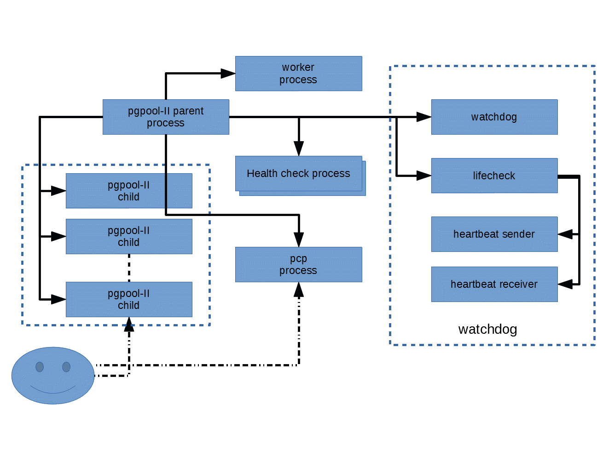

# 第1章 入门

## 1.1. 安装

在本节中，我们假设您已经按照第二部分中描述的说明安装了Pgpool-II。或者，您可以使用pgpool_setup创建pgpool-II和PostgreSQL的临时安装。

## 1.2. 您的首次复制

在本节中，我们将解释如何使用Pgpool-II通过流式复制来管理PostgreSQL集群，这是最常见的设置之一。

在进一步操作之前，您应该使用流式复制模式正确设置pgpool.conf。Pgpool-II提供了示例配置，从源代码默认安装的配置文件位于/usr/local/etc。您可以将pgpool.conf.sample复制为pgpool.conf。

```shell
 cp /usr/local/etc/pgpool.conf.sample pgpool.conf
```

如果您计划使用pgpool_setup，请键入：

```shell
 pgpool_setup
```

这将创建一个Pgpool-II，具有流式复制模式的安装，安装主节点PostgreSQL和异步备用节点PostgreSQL。

从现在开始，我们假设您使用pgpool_setup在当前目录下创建安装。请注意，在执行pgpool_setup之前，当前目录必须为空。

要启动整个系统，请键入：

```shell
./startall
```

系统启动后，您可以通过向任何数据库发出名为“show pool_nodes”的伪SQL命令来检查集群状态。pgpool_setup会自动创建“测试”数据库。我们使用数据库。请注意，端口号为11000，这是pgpool_setup分配给Pgpool-II的默认端口号。

```shell
$ psql -p 11000 -c "show pool_nodes" test
node_id | hostname | port  | status | lb_weight |  role   | select_cnt | load_balance_node | replication_delay | last_status_change
---------+----------+-------+--------+-----------+---------+------------+-------------------+-------------------+---------------------
0       | /tmp     | 11002 | up     | 0.500000  | primary | 0          | false             | 0                 | 2019-01-31 10:23:09
1       | /tmp     | 11003 | up     | 0.500000  | standby | 0          | true              | 0                 | 2019-01-31 10:23:09
(2 rows)
```

结果显示，“status”列为“up”，这意味着PostgreSQL已启动并运行，这很好。

## 1.3. 测试复制

让我们使用标准PostgreSQL安装附带的基准测试工具pgbench来测试复制功能。键入以下内容以创建基准表。

```shell
$ pgbench -i -p 11000 test
```

要查看复制是否正常工作，请直接连接到主服务器和备用服务器，查看它们是否返回相同的结果。

```shell
$ psql -p 11002 test
\dt
List of relations
Schema |       Name       | Type  |  Owner  
--------+------------------+-------+---------
public | pgbench_accounts | table | t-ishii
public | pgbench_branches | table | t-ishii
public | pgbench_history  | table | t-ishii
public | pgbench_tellers  | table | t-ishii
(4 rows)
\q
$ psql -p 11003 test
\dt
List of relations
Schema |       Name       | Type  |  Owner  
--------+------------------+-------+---------
public | pgbench_accounts | table | t-ishii
public | pgbench_branches | table | t-ishii
public | pgbench_history  | table | t-ishii
public | pgbench_tellers  | table | t-ishii
(4 rows)
```

主服务器（端口11002）和备用服务器（端口1100）返回相同的结果。接下来，让我们运行pgbench一段时间并检查结果。

```shell
$ pgbench -p 11000 -T 10 test
starting vacuum...end.
transaction type: <builtin: TPC-B (sort of)>
scaling factor: 1
query mode: simple
number of clients: 1
number of threads: 1
duration: 10 s
number of transactions actually processed: 4276
latency average = 2.339 ms
tps = 427.492167 (including connections establishing)
tps = 427.739078 (excluding connections establishing)

$ psql -p 11002 -c "SELECT sum(abalance) FROM pgbench_accounts" test
sum
--------
216117
(1 row)

$ psql -p 11003 -c "SELECT sum(abalance) FROM pgbench_accounts" test
sum
--------
216117
(1 row)
```

同样，结果是相同的。

## 1.4. 测试负载平衡

Pgpool-II允许读取查询负载平衡。默认情况下，它处于启用状态。要查看效果，让我们使用pgbench -s命令。

```shell
$ ./shutdownall
$ ./startall
$ pgbench -p 11000 -c 10 -j 10 -S -T 60 test
starting vacuum...end.
transaction type: <builtin: select only>
scaling factor: 1
query mode: simple
number of clients: 10
number of threads: 10
duration: 60 s
number of transactions actually processed: 1086766
latency average = 0.552 ms
tps = 18112.487043 (including connections establishing)
tps = 18125.572952 (excluding connections establishing)

$ psql -p 11000 -c "show pool_nodes" test
node_id | hostname | port  | status | lb_weight |  role   | select_cnt | load_balance_node | replication_delay | last_status_change
---------+----------+-------+--------+-----------+---------+------------+-------------------+-------------------+---------------------
0       | /tmp     | 11002 | up     | 0.500000  | primary | 537644     | false             | 0                 | 2019-01-31 11:51:58
1       | /tmp     | 11003 | up     | 0.500000  | standby | 548582     | true              | 0                 | 2019-01-31 11:51:58
(2 rows)
```

“select_cnt”列显示了向每个节点分派了多少select。由于使用默认配置，Pgpool-II试图分派相等数量的SELECT，因此该列显示的数字几乎相同。

Pgpool-II提供了更复杂的负载平衡策略。更多详细信息请参见第5.8节。

## 1.5. 测试故障转移

Pgpool-II允许在PostgreSQL服务器发生故障时自动进行故障转移。在这种情况下，Pgpool-II将服务器的状态设置为“关闭”，并使用剩余的服务器继续数据库操作。

```shell
$ pg_ctl -D data1 stop
waiting for server to shut down.... done
server stopped
$ psql -p 11000 -c "show pool_nodes" test
node_id | hostname | port  | status | lb_weight |  role   | select_cnt | load_balance_node | replication_delay | last_status_change
---------+----------+-------+--------+-----------+---------+------------+-------------------+-------------------+---------------------
0       | /tmp     | 11002 | up     | 0.500000  | primary | 4276       | true              | 0                 | 2019-01-31 12:00:09
1       | /tmp     | 11003 | down   | 0.500000  | standby | 1          | false             | 0                 | 2019-01-31 12:03:07
(2 rows)
```

备用节点已被pg_ctl命令关闭。Pgpool-II检测到它并断开备用节点。“show pool_nodes”命令显示备用节点处于关闭状态。您可以在没有备用节点的情况下继续使用群集：

```shell
$ psql -p 11000 -c "SELECT sum(abalance) FROM pgbench_accounts" test
sum   
--------
216117
(1 row)
```

如果主服务器发生故障，会发生什么？在这种情况下，剩余的备用服务器之一将升级为新的主服务器。对于这个测试，我们从两个节点都启动的状态开始。

```shell
$ psql -p 11000 -c "show pool_nodes" test
node_id | hostname | port  | status | lb_weight |  role   | select_cnt | load_balance_node | replication_delay | last_status_change
---------+----------+-------+--------+-----------+---------+------------+-------------------+-------------------+---------------------
0       | /tmp     | 11002 | up     | 0.500000  | primary | 0          | false             | 0                 | 2019-01-31 12:04:58
1       | /tmp     | 11003 | up     | 0.500000  | standby | 0          | true              | 0                 | 2019-01-31 12:04:58
(2 rows)

$ pg_ctl -D data0 stop
waiting for server to shut down.... done
server stopped
$ psql -p 11000 -c "show pool_nodes" test
node_id | hostname | port  | status | lb_weight |  role   | select_cnt | load_balance_node | replication_delay | last_status_change
---------+----------+-------+--------+-----------+---------+------------+-------------------+-------------------+---------------------
0       | /tmp     | 11002 | down   | 0.500000  | standby | 0          | false             | 0                 | 2019-01-31 12:05:20
1       | /tmp     | 11003 | up     | 0.500000  | primary | 0          | true              | 0                 | 2019-01-31 12:05:20
(2 rows)
```

现在主节点从0更改为1。里面发生了什么？当节点0发生故障时，Pgpool-II会检测到它并执行Pgpool.conf中定义的failover_command。这是文件的内容。

```shell
#! /bin/sh
# Execute command by failover.
# special values:  %d = node id
#                  %h = host name
#                  %p = port number
#                  %D = database cluster path
#                  %m = new main node id
#                  %M = old main node id
#                  %H = new main node host name
#                  %P = old primary node id
#                  %R = new main database cluster path
#                  %r = new main port number
#                  %% = '%' character
failed_node_id=$1
failed_host_name=$2
failed_port=$3
failed_db_cluster=$4
new_main_id=$5
old_main_id=$6
new_main_host_name=$7
old_primary_node_id=$8
new_main_port_number=$9
new_main_db_cluster=${10}
mydir=/home/t-ishii/tmp/Tutorial
log=$mydir/log/failover.log
pg_ctl=/usr/local/pgsql/bin/pg_ctl
cluster0=$mydir/data0
cluster1=$mydir/data1

date >> $log
echo "failed_node_id $failed_node_id failed_host_name $failed_host_name failed_port $failed_port failed_db_cluster $failed_db_cluster new_main_id $new_main_id old_main_id $old_main_id new_main_host_name $new_main_host_name old_primary_node_id $old_primary_node_id new_main_port_number $new_main_port_number new_main_db_cluster $new_main_db_cluster" >> $log

if [ a"$failed_node_id" = a"$old_primary_node_id" ];then	# main failed
! 	new_primary_db_cluster=${mydir}/data"$new_main_id"
echo $pg_ctl -D $new_primary_db_cluster promote >>$log	# let standby take over
$pg_ctl -D $new_primary_db_cluster promote >>$log	# let standby take over
sleep 2
fi
```

该脚本从Pgpool-II接收必要的信息作为参数。如果主服务器发生故障，它将执行“pg_ctl-D data1-promote”，这应该会将备用服务器升级为新的主服务器。

## 1.6. 测试在线恢复

Pgpool-II允许通过称为“在线恢复”的技术恢复宕机节点。这会将数据从主节点复制到备用节点，以便与主节点同步。这可能需要很长时间，并且在此过程中可能会更新数据库。这没问题，因为在流配置中，备用服务器将接收WAL日志并将其应用于追赶主服务器。为了测试在线恢复，让我们从上一个集群开始，其中节点0处于关闭状态。

```shell
$ pcp_recovery_node -p 11001 -n 0
Password: 
pcp_recovery_node -- Command Successful

$ psql -p 11000 -c "show pool_nodes" test
node_id | hostname | port  | status | lb_weight |  role   | select_cnt | load_balance_node | replication_delay | last_status_change
---------+----------+-------+--------+-----------+---------+------------+-------------------+-------------------+---------------------
0       | /tmp     | 11002 | up     | 0.500000  | standby | 0          | false             | 0                 | 2019-01-31 12:06:48
1       | /tmp     | 11003 | up     | 0.500000  | primary | 0          | true              | 0                 | 2019-01-31 12:05:20
(2 rows)
```

pcp_recovery_node是Pgpool-II安装附带的控制命令之一。参数-p用于指定分配给命令的端口号，该端口号由pgpool_setup设置为11001。参数-n用于指定要恢复的节点id。执行命令后，节点0返回到“up”状态。

pcp_recovery_node执行的脚本在pgpool.conf中指定为“recovery_1st_stage_command”。这是pgpool_setup安装的文件。

```shell
#! /bin/sh
psql=/usr/local/pgsql/bin/psql
DATADIR_BASE=/home/t-ishii/tmp/Tutorial
PGSUPERUSER=t-ishii

main_db_cluster=$1
recovery_node_host_name=$2
DEST_CLUSTER=$3
PORT=$4
recovery_node=$5

pg_rewind_failed="true"

log=$DATADIR_BASE/log/recovery.log
echo >> $log
date >> $log
if [ $pg_rewind_failed = "true" ];then

$psql -p $PORT -c "SELECT pg_start_backup('Streaming Replication', true)" postgres

echo "source: $main_db_cluster dest: $DEST_CLUSTER" >> $log

rsync -C -a -c --delete --exclude postgresql.conf --exclude postmaster.pid \
--exclude postmaster.opts --exclude pg_log \
--exclude recovery.conf --exclude recovery.done \
--exclude pg_xlog \
$main_db_cluster/ $DEST_CLUSTER/

rm -fr $DEST_CLUSTER/pg_xlog 
mkdir $DEST_CLUSTER/pg_xlog
chmod 700 $DEST_CLUSTER/pg_xlog
rm $DEST_CLUSTER/recovery.done
fi
cat > $DEST_CLUSTER/recovery.conf $lt;$lt;REOF
standby_mode          = 'on'
primary_conninfo      = 'port=$PORT user=$PGSUPERUSER'
recovery_target_timeline='latest'
restore_command = 'cp $DATADIR_BASE/archivedir/%f "%p" 2> /dev/null'
REOF

if [ $pg_rewind_failed = "true" ];then
$psql -p $PORT -c "SELECT pg_stop_backup()" postgres
fi

if [ $pg_rewind_failed = "false" ];then
cp /tmp/postgresql.conf $DEST_CLUSTER/
fi
```

## 1.7. 基础知识

Pgpool-II是一个位于客户端和PostgreSQL之间的代理服务器。Pgpool-II理解PostgreSQL使用的线路级协议，称为“前端和后端协议”。有关协议的更多详细信息，请参阅PostgreSQL手册。使用Pgpool-II不需要修改PostgreSQL（更确切地说，您需要一些扩展来使用Pgpoo-II的全部功能）。因此，Pgpool-II可以应对各种PostgreSQL版本。理论上，即使是PostgreSQL的最早版本也可以与Pgpool-II一起使用。客户端也一样。只要它遵循协议，Pgpool-II就会愉快地接受来自它的连接，无论它使用什么样的语言或驱动程序。

Pgpool-II由多个进程组成。有一个主进程，它是所有其他进程的父进程。它负责创建子进程，每个子进程都接受来自客户端的连接。还有一些从主进程创建的工作进程，负责检测流复制延迟。还有一个称为“pcp进程”的特殊进程，它仅用于管理Pgpool-II本身。Pgpool-II有一个内置的高可用性功能，称为“看门狗”。看门狗由一些进程组成。有关监视器的更多详细信息，请参阅第4章。

图1-1 Pgpool-II的进程架构

