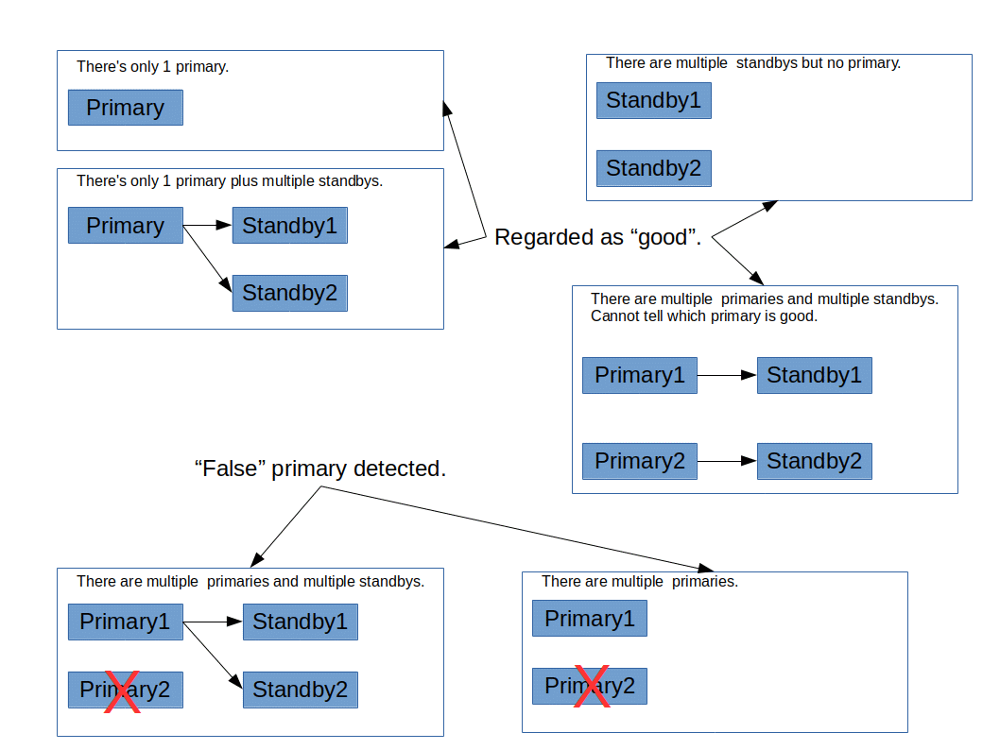

# 第5章 服务器配置

[TOC]

有许多配置参数会影响Pgpool-II的行为。在本章的第一节中，我们将描述如何与配置参数交互。后续章节将详细讨论每个参数。

## 5.1. 设置参数

### 5.1.1. 参数名称和值

所有参数名称都不区分大小写。每个参数都取五种类型之一的值：布尔值、字符串、整数、浮点值或枚举（enum）。类型决定了设置参数的语法：

- 布尔值：值可以写成on、off、true、false、yes、no、1、0（均不区分大小写）或其中之一的任何明确前缀。

- 字符串：通常，将值括在单引号中，将值中的任何单引号加倍。但是，如果值是简单的数字或标识符，通常可以省略引号。

- 数字（整数和浮点）：小数点仅允许用于浮点参数。不要使用千位分隔符。不需要报价。

- 带单位的数字：描述内存或时间量的数字参数具有隐式单位。单位可以是千字节、兆字节、毫秒、秒或分钟。例如：

```shell
search_primary_node_timeout = 6min
memqcache_total_size = 64MB
```

其中一个设置的未修饰数值将使用参数的默认单位。

单位名称区分大小写，数值和单位之间可以有空格。

有效的内存单位为kB（千字节）、MB（兆字节）、GB（千兆字节）和TB（兆兆字节）。

有效的时间单位为ms（毫秒）、s（秒）、min（分钟）、h（小时）和d（天）。

- 枚举：枚举类型参数的编写方式与字符串参数相同，但仅限于具有有限的一组值之一。枚举参数值不区分大小写。

### 5.1.2. 通过配置文件进行参数交互

设置这些参数的最基本方法是编辑pgpool.conf文件，如果它是从源代码安装的，则位于\$prefix/etc/pgpool.conf中。这个文件可能看起来像的一个例子是：

```shell
# This is a comment
listen_addresses = 'localhost'
port = 9999
serialize_accept = off
reset_query_list = 'ABORT; DISCARD ALL'
```

每行指定一个参数。名称和值之间的等号是可选的。空白是不重要的（除非在引用的参数值内），空白行将被忽略。哈希标记（#）将行的其余部分指定为注释。非简单标识符或数字的参数值必须单引号括起来。要在参数值中嵌入单引号，请编写双引号（首选）或反斜杠引号。

以这种方式设置的参数为集群提供默认值。除非被覆盖，否则活动会话看到的设置将是这些值。以下部分描述了管理员或用户可以覆盖这些默认值的方法。

每当主服务器进程接收到SIGHUP信号时，都会重新读取配置文件；从命令行运行pgpool reload最容易发送此信号。主pgpool进程也将此信号传播到其所有子进程，以便下一个会话也采用新值。有些参数只能在服务器启动时设置；在服务器重新启动之前，配置文件中对其条目的任何更改都将被忽略。在SIGHUP处理过程中，配置文件中的无效参数设置同样会被忽略（但会被记录）。

### 5.1.3. 管理配置文件内容

Pgpool-II提供了一个将gpool.conf文件分解为子文件的功能。此功能在管理多个服务器或按功能划分时特别有用。include指令可以这样使用：

```shell
include = 'filename'
```

如果文件名不是绝对路径，则将其视为相对于包含引用配置文件的目录。包含可以嵌套。

### 5.1.4. 通过SQL客户端进行参数交互

Pgpool-II还提供了两个SQL风格的命令来与会话本地配置设置进行交互。

- PGPOOL SHOW命令允许检查所有参数的当前值。

- PGPOOL SET命令允许修改可以在会话本地设置的参数的当前值；它对其他会话没有影响。

## 5.2. 连接和身份验证

### 5.2.1. 连接设置

- listen_addresses (string)

	指定服务器要在其上侦听来自客户端应用程序的连接的TCP/IP地址。该值采用逗号分隔的主机名和/或数字IP地址列表的形式。特殊条目*对应于所有可用的IP接口。条目0.0.0.0允许监听所有IPv4地址，并且：：允许监听所有IPv6地址。如果列表为空，则服务器根本不监听任何IP接口，在这种情况下，只能使用Unix域套接字连接到它。默认值是localhost，它只允许进行本地TCP/IP“环回”连接。虽然客户端身份验证（第6.1节）允许对谁可以访问服务器进行细粒度控制，但listen_addresses控制哪些接口接受连接尝试，这有助于防止在不安全的网络接口上重复恶意连接请求。此参数只能在服务器启动时设置。

	此参数只能在服务器启动时设置。

- port (integer)

	Pgpool-II用于监听连接的端口号。默认值为9999。

	此参数只能在服务器启动时设置。

- unix_socket_directories (string)

	将创建接受Pgpool-II连接的UNIX域套接字的目录。通过列出用逗号分隔的多个目录，可以创建多个套接字。默认值为/tmp。请注意，此套接字可能会被cron作业删除。我们建议将此值设置为/var/run或类似目录。

	此参数只能在服务器启动时设置。

- unix_socket_group (string)

	设置Unix域套接字的所属组。（套接字的拥有者始终是启动服务器的用户。）结合参数unix_socket_permissions，这可以用作unix域连接的额外访问控制机制。默认情况下，这是空字符串，它使用服务器用户的默认组。

	此参数只能在服务器启动时设置。

- unix_socket_permissions (integer)

	设置Unix域套接字的访问权限。Unix域套接字使用通常的Unix文件系统权限集。参数值应该是以chmod和umask系统调用接受的格式指定的数字模式。（要使用习惯的八进制格式，数字必须以0（零）开头。）

	默认权限为0777，这意味着任何人都可以连接。合理的替代方案是0770（仅限用户和组，另见unix_socket_group）和0700（仅限于用户）。（请注意，对于Unix域套接字，只有写权限才重要，因此设置或撤销读或执行权限没有意义。）

	此参数只能在服务器启动时设置。

- pcp_listen_addresses (string)

	指定pcp服务器要在其上侦听来自客户端应用程序的连接的TCP/IP地址。该值采用逗号分隔的主机名和/或数字IP地址列表的形式。特殊条目*对应于所有可用的IP接口。条目0.0.0.0允许监听所有IPv4地址，并且：：允许监听所有IPv6地址。如果列表为空，则服务器根本不监听任何IP接口，在这种情况下，只能使用Unix域套接字连接到它。默认值是localhost，它只允许进行本地TCP/IP“环回”连接。虽然客户端身份验证（第6.1节）允许对谁可以访问服务器进行细粒度控制，但pcp_listen_addresses控制哪些接口接受连接尝试，这有助于防止在不安全的网络接口上重复恶意连接请求。此参数只能在服务器启动时设置。

- pcp_port (integer)

	PCP进程用于侦听连接的端口号。默认值为9898。

	此参数只能在服务器启动时设置。

- pcp_socket_dir (string)

	将在其中创建接受PCP进程连接的UNIX域套接字的目录。通过列出用逗号分隔的多个目录，可以创建多个套接字。默认值为/tmp。请注意，此套接字可能会被cron作业删除。我们建议将此值设置为/var/run或类似目录。

	此参数只能在服务器启动时设置。

- num_init_children (integer)

	预处理的Pgpool-II服务器进程数。默认值为32。num_init_children也是客户端对Pgpool-II的并发连接限制。如果有多个num_init_children客户端尝试连接到Pgpool-II，它们将被阻止（不会像PostgreSQL那样因错误而被拒绝），直到关闭与任何Pgpool-II进程的连接，除非reserved_connections设置为1或更多。最多可以排队listen_backlog_multipler*num_init_children。

	该队列位于内核内部，称为“监听队列”。监听队列的长度称为“积压”。在某些系统中，积压有一个上限，如果num_init_children*listen_backlog_multiplier超过了这个数字，则需要将积压设置得更高。否则，在重载系统中可能会出现以下问题：

- 连接到Pgpool-II失败

- 由于内核中的重试，连接到Pgpool-II的速度变慢。

	您可以使用“netstat-s”命令检查侦听队列是否实际溢出。如果你发现类似的东西：

	```shell
	535 times the listen queue of a socket overflowed
	```

	那么监听队列肯定会溢出。在这种情况下，您应该增加积压（您将需要超级用户权限）。

	```shell
	# sysctl net.core.somaxconn
	net.core.somaxconn = 128
	# sysctl -w net.core.somaxconn = 256
	```

	您可以将以下内容添加到/etc/sysctl.conf中。

	```shell
	net.core.somaxconn = 256
	```

	每个PostgreSQL的连接数大致为max_pool*num_init_children。

	但是，取消查询会创建到后端的另一个连接；因此，如果所有连接都在使用中，则无法取消查询。如果要确保可以取消查询，请将此值设置为预期连接的两倍。

	此外，PostgreSQL允许非超级用户的并发连接，最多可达max_connections-superuser_reserved_connections。

	总之，max_pool、num_init_children、max_connections、superuser_reserved_connections必须满足以下公式：

	```shell
	max_pool*num_init_children <= (max_connections - superuser_reserved_connections) (no query canceling needed)
	max_pool*num_init_children*2 <= (max_connections - superuser_reserved_connections) (query canceling needed)
	```

	此参数只能在服务器启动时设置。

- reserved_connections (integer)

	当此参数设置为1或更大时，如果来自客户端的当前连接数超过（num_init_children-reserved_connections），则不接受来自客户端的传入连接，并显示错误消息“抱歉，已经有太多客户端”，而不是阻止。例如，如果reserved_connections=1，num_init_children=32，则来自客户端的第32个连接将被拒绝。这种行为类似于PostgreSQL，适用于来自客户端的连接数量很大且每个会话可能需要很长时间的系统。在这种情况下，监听队列的长度可能非常长，并可能导致系统不稳定。在这种情况下，将此参数设置为非0是一个好主意，可以防止侦听队列变得很长。

	如果此参数设置为0，则不会拒绝来自客户端的连接。默认值为0。此参数只能在服务器启动时设置。

### 5.2.2. 身份验证设置

- enable_pool_hba (boolean)

	如果为true，Pgpool-II将使用pool_hba.conf进行客户端身份验证。有关如何配置pool_hba.conf进行客户端身份验证的详细信息，请参阅第6.1节。默认值为false。

	可以通过重新加载Pgpool-II配置来更改此参数。

- pool_passwd (string)

	指定用于身份验证的密码文件的路径（绝对或相对）。默认值为“pool_passwd”。相对路径将根据放置配置文件的目录进行解释。指定“”（空）将禁用密码文件的使用。

	密码可以使用三种格式存储在pool_passwd文件中。AES256加密格式、纯文本格式和md5格式。Pgpool-II通过前缀标识密码格式类型，因此pool_passwd中的每个密码条目都必须按照密码格式作为前缀。

	要以纯文本格式存储密码，请使用text前缀。例如。要在pool_passwd中存储明文密码字符串“mypassword”，请在密码字符串前添加text前缀。例如TEXTmypassword

	同样，md5哈希密码必须以md5为前缀，AES256加密密码类型可以使用AES前缀存储。有关使用AES256加密密码的更多详细信息，请参阅第6.4节。

	在没有有效前缀的情况下，Pgpool-II将被视为纯文本密码的字符串。

	此参数只能在服务器启动时设置。

- allow_clear_text_frontend_auth (boolean)

	如果PostgreSQL后端服务器要求对某些用户的身份验证进行md5或SCRAM身份验证，但该用户的密码不在“pool_passwd”文件中，则启用allow_clear_text_front_auth将允许Pgpool-II与前端客户端使用明文密码身份验证，从客户端获取明文形式的密码并将其用于后端身份验证。

	默认值为false。

	可以通过重新加载Pgpool-II配置来更改此参数。

> [!CAUTION]
> 注意：allow_clear_text_front_auth仅在enable_pool_hba未启用时有效

- authentication_timeout (integer)

	指定Pgpool-II身份验证的超时时间（秒）。指定0将禁用超时。默认值为60。

	可以通过重新加载Pgpool-II配置来更改此参数。

## 5.3. 过程管理

- process_management_mode (enum)

	指定Pgpool-II子进程的空闲进程管理方法。有效选项：

	表5-1 可能的流程管理模式

	| static  | All children are pre-forked at startup. Number of child processes is fixed ([num_init_children](https://www.pgpool.net/docs/latest/en/html/runtime-config-connection.html#GUC-NUM-INIT-CHILDREN)). |
	| ------- | ------------------------------------------------------------ |
	| dynamic | child processes are spawned on demand up to [num_init_children](https://www.pgpool.net/docs/latest/en/html/runtime-config-connection.html#GUC-NUM-INIT-CHILDREN). Number of idle child processes at any time depends on min_spare_children and max_spare_children |

	默认设置为static，与V4.4之前的版本兼容。
	
	process_management_mode在Pgpool II V4.4之前不可用。
	
	详见第3.3.3节。

- process_management_strategy (enum)

	指定进程管理策略以满足备用（空闲）进程计数有效选项：

	表5-2 可能的流程管理策略

	| lazy       | With this strategy the scale-down is performed gradually and only gets triggered when excessive spare processes count remains high for more than 5 mins |
	| ---------- | ------------------------------------------------------------ |
	| gentle     | With this strategy the scale-down is performed gradually and only gets triggered when excessive spare processes count remains high for more than 2 mins |
	| aggressive | With this strategy the scale-down is performed aggressively and gets triggered more frequently in case of higher spare processes. This mode uses faster and slightly less smart process selection criteria to identify the child processes that can be serviced to satisfy max_spare_children |

	默认设置是gentle。

	在Pgpool II V4.4之前，process_management_strategy不可用。

- min_spare_children (integer)

	指定要保留的备用（空闲）子进程的最小数量。如果空闲进程计数低于min_spare_children，Pgpool-II将生成新的子进程，除非它达到允许的子进程总数上限（num_init_children）。默认值为5。

	可以通过重新加载Pgpool-II配置来更改此参数。

	此参数仅适用于动态流程管理模式。

- max_spare_children (integer)

	指定要保留的备用（空闲）子进程的最大数量。如果空闲进程计数从max_spare_children开始增加，Pgpool-II将杀死多余的子进程。选择标准是选择具有最小池连接数的进程。默认值为10。

	可以通过重新加载Pgpool-II配置来更改此参数。

	此参数仅适用于动态流程管理模式。

## 5.4. 集群模式

- backend_clustering_mode (enum)

	集群模式是同步PostgreSQL服务器的方法。要设置集群模式，可以使用backend_clustering_mode。在本节中，我们将讨论如何设置集群模式。更多详细信息请参见第2.1.1节。

### 5.4.1. 流式复制模式

此模式是最受欢迎和推荐的集群模式。在这种模式下，PostgreSQL负责复制每个服务器。要启用此模式，请对backend_clustering_mode使用“streaming_replication”。

```shell
backend_clustering_mode = 'streaming_replication'
```

在此模式下，您最多可以拥有127个流式复制备用服务器。此外，也可能根本没有备用服务器。

这种模式的缺点是，在分发读取查询时需要考虑复制延迟。节点之间的可见性一致性也得不到保证。为了缓解这些问题，准备了许多额外的参数，但这可能会使管理任务变得更加困难。此外，当主服务器发生故障并且其中一个备用服务器被升级时，可能需要一些时间来执行故障转移。如果要避免这些问题，请考虑快照隔离模式。

有关流复制模式的其他参数，请参阅第5.12节。

### 5.4.2. 本机复制模式

此模式使Pgpool-II在PostgreSQL后端之间复制数据。要启用此模式，请对backend_clustering_mode使用“native_replication”。

```shell
backend_clustering_mode = 'native_replication'
```

在此模式下，最多可以有127台备用复制服务器。此外，也可能根本没有备用服务器。

负载平衡（见第5.8节）也可以与复制模式一起使用，将负载分配到连接的后端节点。

这种模式的缺点是，无法保证节点之间的可见性一致性。这可能会导致节点之间的不一致，并读取不一致的数据。如果要避免这些问题，请考虑快照隔离模式。

以下选项会影响Pgpool-II在复制模式下的行为。

- replication_stop_on_mismatch (boolean)

	当设置为启用时，如果所有节点对发送到所有PostgreSQL后端节点的查询都没有使用相同的数据包类型进行回复，那么回复与大多数不同的后端节点将被Pgpool-II降级。如果replication_stop_on_mismatch设置为关闭，并且发生了类似的情况，那么Pgpool-II只会终止当前的用户会话，而不会退化后端节点。

	> [!CAUTION]
	> 注意：Pgpool-II不检查后端返回的数据，仅通过比较结果包类型来做出决定。

	启用replication_stop_on_mismatch的一个典型用例是防止后端节点之间的数据不一致。例如，如果UPDATE语句在一个后端节点上失败，而在其他节点上传递，则可能需要降级后端节点。

	默认设置为关闭。

	可以通过重新加载Pgpool-II配置来更改此参数。

- failover_if_affected_tuples_mismatch (boolean)

	当设置为启用时，如果所有节点对INSERT/UPDATE/DELETE查询的受影响元组数量不同，则其回复与大多数不同的后端节点将被Pgpool-II降级。如果将failover_If_affected_tuples_m失配设置为关闭，并且发生类似的情况，则Pgpool-II仅终止当前用户会话，而不会退化后端节点。

	> [!CAUTION]
	> 注意：在平局的情况下，当两个或多个组具有相同数量的节点时，包含主节点的组（具有最年轻节点id的后端节点）将获得优先权。

	默认设置为关闭。

	可以通过重新加载Pgpool-II配置来更改此参数。

- replicate_select (boolean)

	当设置为启用时，Pgpool-II启用SELECT查询复制模式。即，SELECT查询被发送到所有后端节点。

	表5-3 带有load_balance_mode的replicate_select对select路由的影响

	| replicate_select is true                                     | Y    | N    |      |      |      |
	| ------------------------------------------------------------ | ---- | ---- | ---- | ---- | ---- |
	| load_balance_mode is true                                    | ANY  | Y    |      |      | N    |
	| SELECT is inside a transaction block                         | ANY  | Y    |      | N    | ANY  |
	| Transaction isolation level is SERIALIZABLE and the transaction has issued a write query | ANY  | Y    | N    | ANY  | ANY  |
	| results(R:replication, M: send only to main, L: load balance) | R    | M    | L    | L    | M    |

	默认设置为关闭。

	可以通过重新加载Pgpool-II配置来更改此参数。

- insert_lock (boolean)

	当设置为on时，Pgpool-II将在为此发出INSERT语句之前自动锁定PostgreSQL上的表。

	复制具有SERIAL数据类型的表时，SERIAL列值可能会在不同的后端得到不同的值。解决此问题的方法是在发出INSERT之前显式锁定表。

	因此，为了自动锁定表Pgpool-II，请执行以下转换：

	```shell
	INSERT INTO ...
	```

	to

	```shell
	BEGIN;
	LOCK TABLE ...
	INSERT INTO ...
	COMMIT;
	```

	> [!WARNING]
	> 警告：这种方法严重降低了事务的并行性
	
	Pgpool II V2.2或更高版本会自动检测表是否有SERIAL列，因此如果表没有SERIAL列的话，它永远不会锁定表。
	
	Pgpool II V3.0直到Pgpool II V3.0.4对序列关系使用行锁，而不是表锁。这是为了尽量减少与VACUUM（包括自动真空）的锁定冲突。然而，这可能会导致另一个问题。在事务环绕发生后，对序列关系的行锁定会导致PostgreSQL内部错误（更确切地说，是pg_clog上的访问错误，它会保持事务状态）。为了防止这种情况，PostgreSQL核心开发人员决定不允许对序列进行行锁定，这当然破坏了Pgpool-II（PostgreSQL的“固定”版本发布为9.0.5、8.4.9、8.3.16和8.2.22）。
	
	Pgpool-II V3.0.5或更高版本对Pgpool_catalog.insert_lock表使用行锁，因为新的PostgreSQL不允许对序列关系使用行锁。因此，需要在预先通过Pgpool-II访问的所有数据库中创建insert_lock表。更多详细信息请参见第2.8节。如果不存在insert_lock表，Pgpool-II将锁定插入目标表。此行为与Pgpool-II V2.2和V2.3系列相同。
	
	如果要使用与旧版本兼容的insert_lock，可以通过配置脚本指定锁定方法。更多详细信息请参见第2.5节。
	
	对于精细（按报表）控制：
	
	- 将insert_lock设置为true，并在不希望获取表锁的insert语句的开头添加/\*NO insert lock\*/。
	
	- 将insert_lock设置为false，并在要获取表锁的insert语句的开头添加/\*insert lock\*/。
	
	> [!CAUTION]
	> 注意：如果启用了insert_lock，PostgreSQL 8.0的回归测试将在事务、权限、规则和alter_table中失败。
	> 原因是Pgpool-II试图锁定规则测试的VIEW，并产生以下错误消息：
	>
	> ```
	> 错误：当前事务已中止，命令将被忽略，直到交易区块结束
	> ```
	>
	> 
	> 例如，事务测试尝试对不存在的表执行INSERT操作，Pgpool-II使PostgreSQL获取该表的锁。这当然会导致错误。事务将被中止，以下INSERT语句将产生上述错误消息。
	
	默认设置为启用。
	
	可以通过重新加载Pgpool-II配置来更改此参数。

- lobj_lock_table (string)

	指定用于大型对象复制控制的表名。如果指定了，Pgpool-II将锁定lobj_lock_table指定的表，并通过查看pg_largeobject系统目录生成一个大型对象id，然后调用lo_create创建大型对象。此过程保证Pgpool-II在复制模式下在所有DB节点中获得相同的大对象id。

	> [!CAUTION]
	> 注意：PostgreSQL 8.0及更早版本没有lo_create，因此此功能不适用于PostgreSQL 8.0及更低版本。

	调用libpq函数lo_creat（）会触发此功能。此外，通过Java API（JDBC驱动程序）、PHP API（pg_lo_create，或类似的PHP库中的API，如PDO）创建大型对象，以及已知在各种编程语言中使用类似协议的相同API，因此应该可以工作。

	此功能不适用于大型对象的以下操作。

	- 所有使用lo_create、lo_import_with_oid的API。

	- 在SELECT中调用后端的lo_import函数。

	- 后端的lo_create函数在SELECT中调用。

	> [!CAUTION]
	> 注意：所有PostgreSQL用户都必须对lobj_lock_table具有写访问权限，并且可以在任何模式中创建它。

	创建大型对象锁表的示例：

	```shell
	CREATE TABLE public.my_lock_table ();
	GRANT ALL ON public.my_lock_table TO PUBLIC;
	```

	默认值为“”（空），这将禁用该功能。

### 5.4.3. 快照隔离模式

此模式类似于本机复制模式，除了它增加了节点之间的可见性一致性。该实现基于一篇研究论文Pangea：一种在不修改数据库服务器的情况下保证快照隔离的渴望数据库复制中间件。要启用此模式，请对backend_clustering_mode使用“snapshot_isolation”。

```shell
backend_clustering_mode = 'snapshot_isolation'
```

例如，您可以避免因可见性不一致而导致的节点之间的以下不一致。这里S1和S2表示会话，而N1和N2分别表示PostgreSQL服务器1和2。

```shell
S1/N1: BEGIN;
S1/N2: BEGIN;
S1/N1: UPDATE t1 SET i = i + 1;	-- i = 1
S1/N2: UPDATE t1 SET i = i + 1; -- i = 1
S1/N1: COMMIT;
S2/N1: BEGIN;
S2/N2: BEGIN;
S2/N2: DELETE FROM t1 WHERE i = 1; -- delete 1 row since S1/N2 is not committed yet
S2/N1: DELETE FROM t1 WHERE i = 1; -- delete no row since S1/N1 is committed and i is not 1 anymore
S1/N2: COMMIT;
S2/N1: COMMIT;
S2/N2: COMMIT;
```

在快照隔离模式下，结果将是以下任一结果，并且不会损害数据库节点之间的数据一致性。

```shell
S1/N1: BEGIN;
S1/N2: BEGIN;
S1/N1: UPDATE t1 SET i = i + 1;	-- i = 1
S1/N2: UPDATE t1 SET i = i + 1; -- i = 1
S2/N1: BEGIN;
S2/N2: BEGIN;
S1/N1: COMMIT;
S1/N2: COMMIT;
S2/N1: DELETE FROM t1 WHERE i = 1; -- delete no row since S1/N1 is committed and i is not 1 anymore
S2/N2: DELETE FROM t1 WHERE i = 1; -- delete no row since S1/N2 is committed and i is not 1 anymore
S2/N1: COMMIT;
S2/N2: COMMIT;
```

```shell
S1/N1: BEGIN;
S1/N2: BEGIN;
S1/N1: UPDATE t1 SET i = i + 1;	-- i = 1
S1/N2: UPDATE t1 SET i = i + 1; -- i = 1
S2/N1: BEGIN;
S2/N2: BEGIN;
S2/N1: DELETE FROM t1 WHERE i = 1; -- delete 1 row since S1/N1 is not committed yet
S2/N2: DELETE FROM t1 WHERE i = 1; -- delete 1 row since S1/N2 is not committed yet
S1/N1: COMMIT;
S1/N2: COMMIT;
S2/N1: COMMIT;
S2/N2: COMMIT;
```

有必要将事务隔离级别设置为可重复读取。这意味着您需要在postgresql.conf中设置它，如下所示：

```shell
default_transaction_isolation = 'repeatable read'
```

### 5.4.4. 逻辑复制模式

在这种模式下，PostgreSQL负责复制每个服务器。要启用此模式，请对backend_clustering_mode使用“logical_replication”。

```shell
backend_clustering_mode = 'logical_replication'
```

在此模式下，最多可以有127个逻辑复制备用服务器。此外，也可能根本没有备用服务器。

这种模式的缺点是，在分发读取查询时需要考虑复制延迟。节点之间的可见性一致性也得不到保证。此外，某些类型的对象（如DDL和大型对象）也不会被复制。

### 5.4.5. 懒散模式

此模式用于将Pgpool-II与Slony-I耦合。Slony-I负责执行实际的数据复制。要启用此模式，请对backend_clustering_mode使用“slony”。

```shell
backend_clustering_mode = 'slony'
```

在此模式下，您最多可以拥有127个副本服务器。此外，也可能根本没有副本服务器。

这种模式的缺点是，在分发读取查询时需要考虑复制延迟。节点之间的可见性一致性也得不到保证。此外，某些类型的对象（如DDL和大型对象）也不会被复制。

在引入流式复制和逻辑复制后，很少有系统采用Slony-I。如果没有特别的原因，不建议使用此模式。

### 5.4.6. 原始模式

在这种模式下，Pgpool-II不关心数据库同步。让整个系统做一件有意义的事情是用户的责任。在该模式下无法进行负载平衡。要启用此模式，请对backend_clustering_mode使用“raw”。

```shell
backend_clustering_mode = 'raw'
```

## 5.5. 后端设置

### 5.5.1. 后端连接设置
- backend_hostname (string)

	backend_hostname指定要连接的PostgreSQL后端。Pgpool-II使用它与服务器通信。

	对于TCP/IP通信，此参数可以采用主机名或IP地址。如果以斜线（/）开头，则表示Unix域通信，而不是TCP/IP；该值是存储套接字文件的目录的名称。backend_hostname为空（“”）时的默认行为是连接到/tmp中的Unix域套接字。

	可以通过在参数名称末尾添加一个数字来指定多个后端（例如backend_hostname0）。这个数字被称为“DB节点ID”，它从0开始。被赋予DB节点ID 0的后端将被称为“主节点”。当定义了多个后端时，即使主节点关闭，服务也可以继续（在某些模式下不是真的）。在这种情况下，最年轻的DB节点ID将是新的主节点。

	请注意，如果在流复制模式下操作，id为0的DB节点没有特殊含义。相反，您应该关心DB节点是否是“主节点”。更多详细信息请参见第5.8节、第5.10节和第5.12节。

	如果您计划只使用一个PostgreSQL服务器，请通过backend_hostname0指定它。

	可以通过添加参数行和重新加载配置文件来添加新节点。但是，现有值无法更新，因此在这种情况下必须重新启动Pgpool-II。

- backend_port (integer)

	backend_port指定后端的端口号。可以通过在参数名称末尾添加一个数字来指定多个后端（例如backend_port0）。如果您计划只使用一个PostgreSQL服务器，请通过backend_port0指定它。

	可以通过添加参数行和重新加载配置文件来添加新的后端端口。但是，现有值无法更新，因此在这种情况下必须重新启动Pgpool-II。

- backend_weight (floating point)

	backend_weight指定后端的负载平衡比。它可以设置为大于或等于零的任何整数或浮点值。可以通过在参数名称末尾添加一个数字来指定多个后端（例如backend_weight0）。如果您计划只使用一个PostgreSQL服务器，请通过backend_weight0指定它。

	通过重新加载配置文件，可以在此参数中添加新的backend_weight。但是，这仅对新建立的客户端会话生效。Pgpool-II V2.2.6、V2.3或更高版本允许通过重新加载配置文件来更新值。如果您想阻止向备用服务器发送任何查询，以便在流式复制模式、逻辑复制模式和slony模式下执行一些管理工作，这将非常有用。

### 5.5.2. 后端数据设置

- backend_data_directory (string)

	backend_data_directory指定后端的数据库集群目录。可以通过在参数名称末尾添加一个数字来指定多个后端（例如backend_data_directory0）。如果您计划只使用一个PostgreSQL服务器，请通过backend_data_directory0指定它。此参数用于在线恢复。如果不使用联机恢复，则不需要设置它。

	可以通过添加参数行和重新加载配置文件来添加新的后端data_directory。但是，现有值无法更新，因此在这种情况下必须重新启动Pgpool-II。

- backend_flag (string)

	backend_flag控制各种后端行为。可以通过在参数名称末尾添加一个数字来指定多个后端（例如backend_flag0）。如果您计划只使用一个PostgreSQL服务器，请通过backend_flag0指定它。

	可以通过添加参数行和重新加载配置文件来添加新的后端标志。目前允许以下内容。可以使用“|”指定多个标志。

	表5-4 后端标志

	| 标识                   | 说明                                                  |
	| ---------------------- | ------------------------------------------------------------ |
	| ALLOW_TO_FAILOVER    | 允许故障转移或分离后端。这是默认设置。您不能同时使用DISALLOW_TO_FAILOVER进行指定。 |
	| DISALLOW_TO_FAILOVER | 不允许故障转移或分离后端当您使用心跳或起搏器等HA（高可用性）软件保护后端时，这很有用。不能同时使用ALLOW_TO_FAILOVER指定。 |
	| ALWAYS_PRIMARY       | 这仅在流式复制模式下有用。见[第3.3.2节]关于流式复制模式。如果此标志设置为后端之一，Pgpool-II将无法通过检查后端找到主节点。相反，始终将设置标志的节点视为主节点。这对于包括Amazon Aurora for PostgreSQL Compatibility在内的具有固定主服务器名称的系统非常有用。见[第8.5节]例如设置。 |

	可以通过重新加载Pgpool-II配置来更改此参数。

- backend_application_name (string)

	backend_application_name指定从主节点接收WAL日志的walreceiver的应用程序名称。因此，在流式复制模式之外，不需要设置此参数。如果您想在show POOL NODES和pcp_node_info命令中显示“replication_state”和“replication_sync_state”列，则此参数也是必需的。此外，delay_threshold_by_time也需要此参数。

	例如，假设主节点是backend0（其主机名为“host0”），有问题的备用节点是backend 1，backend 1的backend_application_name是“server1”，那么postgresql.conf的primary_conninfo参数应该如下：

	```shell
	primary_conninfo='主机=host0端口=5432用户=postgres应用程序名称='服务器1'
	```

	recovery_1st_stage_command应生成该参数。有关命令的完整示例，请参阅第8.2.7.8节。

	可以通过重新加载Pgpool-II配置来更改此参数。

## 5.6. 连接池

Pgpool-II维护与PostgreSQL服务器的已建立连接，并在出现具有相同属性（即用户名、数据库、协议版本）的新连接时重用它们。它降低了连接开销，提高了系统的整体吞吐量。

### 5.6.1. 连接池设置

- connection_cache (boolean)

	当设置为on时，缓存到后端的连接。默认值为on。但是，即使connection_cache为on，也不会缓存到template0、template1、postgres和回归数据库的连接。

	如果更改此值，则需要重新启动Pgpool-II。

- max_pool (integer)

	每个Pgpool-II子进程中缓存的最大连接数。如果传入连接连接到具有相同用户名和相同运行时参数的同一数据库，Pgpool-II将重用缓存的连接。如果没有，Pgpool-II将创建到后端的新连接。如果缓存的连接数超过max_pool，则最旧的连接将被丢弃，并将该插槽用于新连接。

	默认值为4。请注意，从Pgpool-II进程到后端的连接总数可能达到num_init_children*max_pool。

	此参数只能在服务器启动时设置。

- listen_backlog_multiplier (integer)

	指定从前端到Pgpool-II的连接队列的长度。队列长度（实际上是listen（）系统调用的“backlog”参数）定义为listen_backlog_multipler*num_init_children。

	> [!CAUTION]
	> 注意：有些系统具有listen（）系统调用的backlog参数的上限。有关更多详细信息，请参阅num_init_children。

	默认值为2。

	此参数只能在服务器启动时设置。

- serialize_accept (boolean)

	当设置为启用时，Pgpool-II启用传入客户端连接的序列化。如果不进行序列化，操作系统内核会唤醒所有Pgpool-II子进程以执行accept（），其中一个实际上会获得传入连接。这里的问题是，因为我的子进程在同一时间醒来，会发生严重的上下文切换，性能也会受到影响。

	这种现象是一个众所周知的经典问题，称为“雷鸣般的羊群问题”。这可以通过对accept（）调用进行序列化来解决，这样只有一个Pgpool-II进程会被唤醒，以执行accepte（）的传入连接。

	但是序列化有其自身的开销，建议仅对num_init_children的较大值使用序列化。对于少数num_init_children，序列化接受可能会因为序列化开销而降低性能。

	> [!CAUTION]
	> 注意：建议在决定是否使用serialize_occept之前进行基准测试，因为num_init_children和serialize_oaccept的相关性在不同的环境中可能不同。

	示例5-1。使用pgbench来决定是否应该使用serialize_occept

	要运行pgbench，请使用以下命令。

	```shell
	pgbench -n -S -p 9999 -c 32 -C -S -T 300 test
	```

	这里，-C命令每次执行事务时，pgbench连接到数据库-c32指定了Pgpool-II的并发会话数。您应该根据系统的要求更改此设置。pgbench完成后，检查“包括建立连接”中的数字。

	> [!CAUTION]
	> 注意：启用child_life_time时，serialize_recept无效。如果要打开serialize_occept，请确保将child_life_time设置为0。如果你担心Pgpool-II进程内存泄漏或任何潜在问题，你可以使用child_max_connections。这纯粹是一种实现限制，将来可能会被删除。

	默认设置为关闭。

	此参数只能在服务器启动时设置。

- child_life_time (integer)

	指定Pgpool-II子进程保持空闲时终止的时间（秒）。当Pgpool-II因child_life_time而终止时，它会立即生成新的子进程。child_life_time是一种防止Pgpool-II子级内存泄漏和其他意外错误的措施。

	> [!CAUTION]
	> 注意：child_life_time不适用于尚未接受任何连接的进程。

	> [!CAUTION]
	> 注意：启用child_life_time后，serialize_occept将无效。

	默认值为300（5分钟），将其设置为0将禁用该功能。

	此参数只能在服务器启动时设置。

- client_idle_limit (integer)

	指定客户端自上次查询后保持空闲时断开连接的时间（秒）。这有助于防止Pgpool-II子节点被懒惰的客户端占用，或客户端和Pgpool-II之间的TCP/IP连接中断。

	> [!CAUTION]
	> 注意：在联机恢复的第二阶段中忽略client_idle_limit。

	默认值为0，这将关闭该功能。

	可以通过重新加载Pgpool-II配置来更改此参数。您还可以使用PGPOOL SET命令更改当前会话的此参数的值。

- child_max_connections (integer)

	根据Pgpool-II子进程可以接收的客户端连接数指定其生存期。Pgpool-II将在为child_max_connections客户端连接提供服务后终止子进程，并立即生成一个新的子进程来取代它。

	childmax_connections在非常繁忙的服务器上很有用，在这种服务器上，child_lifetime和connection_lifetime永远不会被触发。防止PostgreSQL服务器变得太大也很有用。

	默认值为0，这将关闭该功能。

	此参数只能在服务器启动时设置。

- connection_life_time (integer)

	指定终止与PostgreSQL后端的缓存连接的时间（秒）。这用作缓存的连接过期时间。

	默认值为0，这意味着缓存的连接不会断开。

	此参数只能在服务器启动时设置。

- reset_query_list (string)

	指定退出用户会话时要发送的用于重置后端连接的SQL命令。通过用“；”分隔每个命令，可以指定多个命令。

	PostgreSQL版本之间的可用命令不同。下面是不同PostgreSQL版本上reset_query_list的一些推荐设置。但是，请注意，应始终包含ABORT命令。

	表5-5 不同PostgreSQL版本上reset_query_list的推荐设置

	| PostgreSQL version | reset_query_list                                        |
	| ------------------ | ------------------------------------------------------- |
	| 7.1 or earlier     | 'ABORT'                                              |
	| 7.2 to 8.2         | 'ABORT; RESET ALL; SET SESSION AUTHORIZATION DEFAULT' |
	| 8.3 or later       | 'ABORT; DISCARD ALL'                                  |

	> [!CAUTION]
	> 注意：对于7.4或更高版本的PostgreSQL，当不在事务块中时，不会发出“ABORT”。

	默认值为'ABORT; DISCARD ALL'。

	可以通过重新加载Pgpool-II配置来更改此参数。

## 5.7. 错误报告和日志记录

### 5.7.1. 日志位置

- log_destination (string)

	Pgpool-II支持记录Pgpool-II消息的两个目标。支持的日志目标是stderr和syslog。如果您希望日志消息位于多个目标上，您还可以将此参数设置为所需日志目标列表，用逗号分隔。

	```shell
	#例如，同时登录syslog和stderr
	log_destination=“syslog，stderr”
	```

	默认设置是仅登录到stderr。

	> [!CAUTION]
	> 注意：在某些系统上，您需要更改系统syslog守护进程的配置，以便使用log_destination的syslog选项。Pgpool-II可以通过LOCAL7记录到syslog设施LOCAL0（请参阅syslog_facility），但大多数平台上的默认syslog配置将丢弃所有此类消息。您需要添加以下内容：
	> ```shell
	> local0.*/var/log/pgpool.log
	> ```
	>访问syslog守护进程的配置文件以使其工作。
	>可以通过重新加载Pgpool-II配置来更改此参数。

- logging_collector (boolean)

	此参数启用日志收集器，这是一个后台进程，用于捕获发送到stderr的日志消息并将其重定向到日志文件中。

	> [!CAUTION]
	> 注意：可以在不使用日志收集器的情况下登录到stderr；日志消息将直接发送到服务器的stderr指向的任何位置。然而，这种方法只适用于低日志量，因为它没有提供旋转日志文件的方便方法。

	此参数只能在Pgpool II启动时设置。

	loging_collector在Pgpool II V4.2之前不可用。

- log_directory (string)

	启用logging_collector时，此参数确定将在其中创建日志文件的目录。

	默认值为/tmp/pgpool_logs。

	此参数只能在Pgpool II启动时设置。

- log_filename (string)

	启用logging_collector时，此参数设置创建的日志文件的文件名。该值被视为strftime模式，因此可以使用%转义来指定时变文件名。支持的%转义与Open Group的strftime规范中列出的类似。

	如果指定不带转义符的文件名，则应计划使用日志轮换实用程序，以避免最终填满整个磁盘。

	默认值为pgpool-%Y-%m-%d_%H%m%S.log。

	此参数只能在Pgpool II启动时设置。

- log_file_mode (integer)

	此参数设置启用logging_collector时日志文件的权限。参数值应该是以chmod和umask系统调用接受的格式指定的数字模式。

	> [!CAUTION]
	> 注意：要使用习惯的八进制格式，数字必须以0（零）开头。

	此参数只能在Pgpool II启动时设置。

- log_rotation_age (integer)

	启用logging_collector时，此参数确定使用单个日志文件的最长时间，之后将创建新的日志文件。如果指定此值时没有单位，则将其视为分钟。默认值为24小时。

	设置为零可禁用基于时间的新日志文件创建。

	此参数只能在Pgpool II启动时设置。

- log_rotation_size (integer)

	启用logging_collector时，此参数决定单个日志文件的最大大小。在将这么多千字节发送到日志文件后，将创建一个新的日志文件。

	设置为零可禁用基于大小的新日志文件创建。

	此参数只能在Pgpool II启动时设置。

- log_truncate_on_rotation (boolean)

	启用logging_collector时，此参数将导致Pgpool-II截断（覆盖）而不是附加到任何同名的现有日志文件。但是，只有在基于时间的旋转打开新文件时才会发生截断，而不是在启动或基于大小的旋转期间。禁用此选项后，在所有情况下都会附加已有的文件。例如，将此设置与pgpool-%H.log等日志文件名结合使用，将导致生成24小时日志文件，然后循环覆盖它们。

	此参数只能在Pgpool II启动时设置。

- syslog_facility (enum)

	另请参阅系统syslog守护进程的文档。启用syslog日志记录时，此参数决定要使用的syslog“工具”。您可以从LOCAL0、LOCAL1、LOCAL2、LOCAL3、LOCAL4、LOCAL5、LOCAL6、LOCAL7中进行选择；默认值为LOCAL0。另请参阅系统syslog守护进程的文档。

	可以通过重新加载Pgpool-II配置来更改此参数。

- syslog_ident (string)

	启用syslog日志记录时，此参数确定用于标识syslog日志中Pgpool-II消息的程序名称。默认值是pgpool。

	可以通过重新加载Pgpool-II配置来更改此参数。

### 5.7.2. 日志时机

- client_min_messages (enum)

	控制向客户端发送的最低消息级别。有效值为调试5、调试4、调试3、调试2、调试1、日志、通知、警告和错误。每个级别都包括其后的所有级别。默认值为“注意”。

	可以通过重新加载Pgpool-II配置来更改此参数。您还可以使用PGPOOL SET命令更改当前会话的此参数的值。

- log_min_messages (enum)

	默认设置为警告。控制向日志发出的最低消息级别。有效值包括调试5、调试4、调试3、调试2、调试1、信息、通知、警告、错误、日志、致命和恐慌。每个级别都包括其后的所有级别。默认值为警告。

	可以通过重新加载Pgpool-II配置来更改此参数。您还可以使用PGPOOL SET命令更改当前会话的此参数的值。

### 5.7.3. 日志内容

- log_statement (boolean)

	设置为启用，将所有SQL语句打印到日志中。

	可以通过重新加载Pgpool-II配置来更改此参数。您还可以使用PGPOOL SET命令更改当前会话的此参数的值。

- log_per_node_statement (boolean)

	与log_statement类似，只是它分别打印每个DB节点的日志。确保复制或负载平衡正常工作可能很有用。

	可以通过重新加载Pgpool-II配置来更改此参数。您还可以使用PGPOOL SET命令更改当前会话的此参数的值。

- notice_per_node_statement (boolean)

	与log_per_node_statement类似，除了它将每个DB节点的语句日志分别打印为NOTICE消息。使用默认的client_min_messages设置（即NOTICE），日志消息也将打印在客户端的终端上。这对客户端来说很方便，因为它不需要访问Pgpool-II日志文件。请注意，与log_per_node_statement不同，notice_per_node _statement不会打印内部查询（例如系统目录查询）。这是因为此功能也设计用于测试。由于内部查询往往是非确定性的，在测试中打印它们是没有帮助的。出于同样的原因，不会打印后端进程id。

	可以通过重新加载Pgpool-II配置来更改此参数。您还可以使用PGPOOL SET命令更改当前会话的此参数的值。

- log_client_messages (boolean)

	设置为打开，将客户端消息打印到日志中。

	可以通过重新加载Pgpool-II配置来更改此参数。您还可以使用PGPOOL SET命令更改当前会话的此参数的值。

- log_hostname (boolean)

	设置为on，将在ps命令结果中打印主机名而不是IP地址，并打印连接日志（当log_connections打开时）。

	可以通过重新加载Pgpool-II配置来更改此参数。

- log_connections (boolean)

	设置为打开时，会将所有客户端连接从打印到日志。

	可以通过重新加载Pgpool-II配置来更改此参数。

- log_disconnections (boolean)

	设置为打开时，将所有客户端连接终止打印到日志中。

	可以通过重新加载Pgpool-II配置来更改此参数。

- log_pcp_processes (boolean)

	设置为打开，启用有关正常PCP进程分叉和退出状态的日志记录。默认设置为启用。

	可以通过重新加载Pgpool-II配置来更改此参数。

- log_error_verbosity (enum)

	控制记录的每条消息的详细信息量。有效值为TERSE、DEFAULT和VERBOSE，每个值都会在显示的消息中添加更多字段。TERSE不记录DETAIL、HINT、QUERY和CONTEXT错误信息。

	可以通过重新加载Pgpool-II配置来更改此参数。您还可以使用PGPOOL SET命令更改当前会话的此参数的值。

- log_line_prefix (string)

	这是一个printf样式的字符串，在每个日志行的开头输出。%字符以“转义序列”开头，替换为下面列出的信息。所有未识别的转义都将被忽略。其他字符直接复制到日志行。默认值为“%m:%a pid%p:”，它打印时间戳、应用程序名称和进程id。

	表5-6 log_line_prefix转义选项

	| Escape | Effect                                                       |
	| ------ | ------------------------------------------------------------ |
	| %a     | Application name. The initial value for child (session process) is "child". If Clients set application name (either in the startup message or by using SET command), application name will be changed accordingly. In other types of process, application name is a hard coded string. see [Table 5-7](https://www.pgpool.net/docs/latest/en/html/runtime-config-logging.html#APPLICATION-NAME-TABLE). |
	| %p     | Process ID (PID)                                             |
	| %P     | Process name                                                 |
	| %t     | Time stamp without milliseconds                              |
	| %m     | Time stamp with milliseconds                                 |
	| %d     | Database name                                                |
	| %u     | User name                                                    |
	| %l     | Log line number for each process                             |
	| %%     | '%' character                                                |

	表5-7 不同进程中的应用程序名称

	| Process type                             | application name                                             |
	| ---------------------------------------- | ------------------------------------------------------------ |
	| main                                     | main                                                         |
	| child                                    | child                                                        |
	| streaming replication delay check worker | sr_check_worker                                              |
	| watchdog heart beat sender               | heart_beat_sender                                            |
	| watchdog heart beat receiver             | heart_beat_receiver                                          |
	| watchdog                                 | watchdog                                                     |
	| watchdog life check                      | life_check                                                   |
	| follow primary child                     | follow_child                                                 |
	| watchdog utility                         | watchdog_utility                                             |
	| pcp main                                 | pcp_main                                                     |
	| pcp child                                | pcp_child                                                    |
	| health check process                     | health_check%d (%d is replaced with backend node id)         |
	| logger process                           | logger (Note that the application name "logger" will not be output to the log file managed by logger process) |

	可以通过重新加载Pgpool-II配置来更改此参数。

## 5.8. 负载平衡

SELECT查询的Pgpool-II负载平衡适用于除原始模式之外的任何集群模式。启用Pgpool-II后，在本机复制模式下将写入查询发送到主节点，在复制模式下的所有后端节点和其他查询在所有后端节点之间实现负载平衡。负载平衡机制向哪个节点发送读取查询是在会话开始时决定的，除非指定了statement_level_load_balance，否则在会话结束之前不会更改。然而，也有一些例外。详见下文。

> [!CAUTION]
> 注意：由于无法平衡而发送到主节点或复制的查询也会在负载平衡算法中得到考虑。

> [!CAUTION]
> 注意：您可以使用SHOW POOL NODES检查哪个DB节点被分配为负载平衡节点。

### 5.8.1. 负载平衡条件

要使查询负载平衡，必须满足以下所有要求：

- PostgreSQL 7.4或更高版本

- 在流式复制模式、本机复制模式或快照隔离模式下

- 查询不能在显式声明的事务中（即不在BEGIN~END块中）

  - 但是，如果满足以下条件，即使在显式事务中，负载平衡也是可能的

    - 事务隔离级别不可串行化

    - 事务尚未发出写查询（在发出写查询之前，可以进行负载平衡。这里的“写查询”是指非SELECT DML或DDL。在Pgpool II 4.1之前，具有写或只读函数列表中指定的写函数的SELECT不被视为写查询。）

    - 如果写和只读函数列表为空，则具有非易失性函数的SELECT被视为只读查询。
- 它不是SELECT INTO

- 它既不是选择更新也不是选择共享

- 它以“SELECT”开头，或者以“COPY TO STDOUT”、“EXPLAIN”、“Expllain ANALYZE SELECT”之一开头。。。ignore_leading_hite_space=true将忽略前导空格。（使用write_function_list或read_only_function_list中指定的写入函数的SELECT除外）

- 在流式复制模式下，除上述条件外，还必须满足以下条件：

  - 不使用临时表（不复制临时表）

  - 不使用未记录表（未记录表不被复制）

  - 不使用系统目录（系统目录信息很重要，希望避免复制延迟）

> [!CAUTION]
> 注意：您可以通过在SELECT查询前面插入任意注释来抑制负载平衡：
> ```shell
> /*复制*/选择。。。
> ```
> 如果你想在不抑制负载平衡的情况下使用注释，你可以将allow_sql_comments设置为on。请同时参阅replicate_select。

> [!CAUTION]
> 注意：JDBC驱动程序有一个自动提交选项。如果自动提交为false，JDBC驱动程序会自行发送“BEGIN”和“COMMIT”。在这种情况下，将应用上述关于负载平衡的相同限制。

### 5.8.2. 编写查询可能会影响负载平衡

一般来说，如果满足某些条件，则读取查询是负载平衡的。但是，编写查询可能会影响负载平衡。这里的“书面查询”是指除以下查询之外的所有查询：

- SELECT/WITH without writing functions. Volatile functions are regarded writing functions. You can define your own writing functions by using [write_function_list](https://www.pgpool.net/docs/latest/en/html/runtime-config-load-balancing.html#GUC-WRITE-FUNCTION-LIST)or [read_only_function_list](https://www.pgpool.net/docs/latest/en/html/runtime-config-load-balancing.html#GUC-READ-ONLY-FUNCTION-LIST).

- SELECT/WITH without FOR UPDATE/SHARE

- WITH without DML statements
- COPY TO STDOUT
- EXPLAIN
- EXPLAIN ANALYZE and the query is SELECT not including writing functions
- SHOW

如果出现写入查询，后续的读取查询可能无法实现负载平衡。即，根据disable_load_balance_onwrite的设置，发送到主节点（在流复制模式下）或主节点（其他模式下）。

### 5.8.3. 流式复制中的负载平衡

在使用流式复制和热备用时，重要的是要确定哪些查询可以发送到主服务器或备用服务器，哪些查询不应该发送到备用服务器。Pgpool-II的流式复制模式小心地处理了这一点。

我们通过查看查询本身来区分应该将哪个查询发送到哪个节点。

- 这些查询应仅发送到主节点

  - INSERT, UPDATE, DELETE, COPY FROM, TRUNCATE, CREATE, DROP, ALTER, COMMENT

  - SELECT ... FOR SHARE | UPDATE

  - SELECT in transaction isolation level SERIALIZABLE

  - LOCK command more strict than ROW EXCLUSIVE MODE

  - DECLARE, FETCH, CLOSE

  - SHOW

  - Some transactional commands:

    - BEGIN READ WRITE, START TRANSACTION READ WRITE
- SET TRANSACTION READ WRITE, SET SESSION CHARACTERISTICS AS TRANSACTION READ WRITE
    - SET transaction_read_only = off

  - Two phase commit commands: PREPARE TRANSACTION, COMMIT PREPARED, ROLLBACK PREPARED
  
  - LISTEN, UNLISTEN, NOTIFY

  - VACUUM

  - Some sequence functions (nextval and setval)

  - Large objects creation commands

  - Multi-statement queries (multiple SQL commands on single line)

- 这些查询可以发送到主节点和备用节点。如果启用了负载平衡，则可以将这些类型的查询发送到备用节点。但是，如果设置了delay_threshold并且复制延迟高于delay_threshort，则查询将发送到主节点。

  - SELECT not listed above
  - COPY TO STDOUT
  - EXPLAIN
  - EXPLAIN ANALYZE and the query is SELECT not including writing functions
  - SHOW

- 这些查询同时发送到主节点和备用节点

  - SET

  - DISCARD

  - DEALLOCATE ALL

  - SAVEPOINT (and related commands such as RELEASE SAVEPOINT)

在显式交易中：

- 事务启动命令（如BEGIN）被发送到主节点和备用节点。

- 在事务中或备用节点上执行SELECT和其他一些可以发送到主节点或备用节点的查询。

- 无法在备用服务器上执行的命令（如INSERT）会发送到主服务器。在其中一个命令之后，即使是SELECT也会被发送到主节点，这是因为这些SELECT可能希望立即看到INSERT的结果。此行为会一直持续到事务关闭或中止。


在扩展协议中，可以在解析查询时确定是否可以在负载平衡模式下将查询发送到待机状态。规则与非扩展协议相同。例如，INSERT被发送到主节点。绑定后，描述和执行也将发送到主节点。

> [!CAUTION]
> 注意：如果由于负载平衡而将SELECT语句的解析发送到备用节点，然后将DML语句（如INSERT）发送到Pgpool-II，则必须在主节点上执行解析的SELECT。因此，我们在主节点上重新解析SELECT。

最后，Pgpool-II的解析器认为是错误的查询被发送到主节点。

### 5.8.4. 负载平衡设置
- load_balance_mode (boolean)

	当设置为启用时，Pgpool-II启用传入SELECT查询的负载平衡。即，来自客户端的SELECT查询被分发到配置的PostgreSQL后端。默认设置为启用。

	此参数只能在服务器启动时设置。

- ignore_leading_white_space (boolean)

	当设置为启用时，Pgpool-II会忽略负载平衡中SQL查询开头的空格。如果与DBI/DBD:Pg等API一起使用，它会很有用，因为DBI/DBD:Pg会违背用户的意图添加空格。

	可以通过重新加载Pgpool-II配置来更改此参数。

- read_only_function_list (string)

	指定一个逗号分隔的不更新数据库的函数名列表。包含未在此列表中指定的函数的SELECT未实现负载平衡。这些在复制模式下在所有DB节点之间复制，仅在其他模式下发送到主节点。

	您可以使用正则表达式来匹配函数名，其中会自动添加^和$。

	示例5-2。使用正则表达式

	如果您在所有只读函数前都添加了“get_”或“select_”，则可以按如下方式设置read_only_function_list：

	```shell
	read_only_function_list='get_.*，select_.*'
	```

	> [!CAUTION]
	> 注意：如果查询可以引用带有和不带有模式限定的函数，那么您必须在列表中添加这两个条目（带有和不带模式名称）。
	> ```shell
	> #例如：
	> #如果查询有时使用“f1（）”，而其他时候使用“public.f1（）”
	> #首先引用函数f1，然后引用read_only_function_list
	> #将按如下方式配置。
	> 
	> read_only_function_list=“f1，公共.f1”
	> ```

	> [!CAUTION]
	> 注意：如果此参数和write_function_list为空字符串，则将检查函数的volatile属性。如果属性是volatile的，则该函数被视为写入函数。这是一种方便和推荐的方式。但是，这需要首次对系统目录进行一次额外的查询（下次使用缓存的查询结果时，不会发送额外的查询）。如果你不想发送这样的查询，你可以继续使用这个参数。

	可以通过重新加载Pgpool-II配置来更改此参数。

- write_function_list (string)

	指定一个逗号分隔的函数名列表，用于更新数据库。包含此列表中指定函数的SELECT未实现负载平衡。这些在复制模式下在所有DB节点之间复制，仅在其他模式下发送到主节点。

	您可以使用正则表达式来匹配函数名，其中会自动添加^和$。

	示例5-3。使用正则表达式

	如果您在所有更新函数前都添加了“set_”、“update_”、”delete_“或”insert_“，则可以按如下方式设置write_function_list：

	```shell
	write_function_list = 'nextval,setval,set_.*,update_.*,delete_.*,insert_.*'
	```

	> [!CAUTION]
	> 注意：如果查询可以引用带有和不带有模式限定的函数，那么您必须在列表中添加这两个条目（带有和不带模式名称）。
	> ```shell
	> #For example:
	> #If the queries sometime use "f1()" and other times "public.f1()"
	> #to refer the function f1 then the write_function_list
	> #would be configured as follows.
	> 
	> write_function_list = "f1,public.f1"
	> ```

	> [!CAUTION]
	> 注意：write_function_list和read_only_function_list是互斥的，在配置中只能设置这两个列表中的一个。

	示例5-4。使用nextval（）和setval（）配置以在适当的后端上着陆

	在Pgpool-IIV3.0之前，nextval（）和setval（）被称为写入数据库的函数。您可以通过设置write_function_list和read_only_function_list来配置它，如下所示

	```shell
	read_only_function_list = ''
	write_function_list = 'nextval,setval,lastval,currval'
	```

	> [!CAUTION]
	> 注意：PostgreSQL除了nextval（）和setval（）之外，还包含lastval（）、currval（）。虽然lastval（）和currval（）不是写函数类型，但建议将lastval（”）和currval（”）视为写函数，以避免这些函数意外负载平衡时发生错误。

	> [!CAUTION]
	> 注意：如果此参数和read_only_function_list为空字符串，则将检查函数的volatile属性。如果属性是volatile的，则该函数被视为写入函数。这是一种方便和推荐的方式。但是，这需要首次对系统目录进行一次额外的查询（下次使用缓存的查询结果时，不会发送额外的查询）。如果你不想发送这样的查询，你可以继续使用这个参数。

	可以通过重新加载Pgpool-II配置来更改此参数。

- primary_routing_query_pattern_list (string)

	指定应发送到主节点的以分号分隔的SQL模式列表。与此列表中指定的模式匹配的SQL没有负载平衡。除了仅支持本机复制模式之外。

	您可以使用正则表达式来匹配SQL模式，其中会自动添加^和$。在SQL模式中的正则表达式中使用特殊字符（如“'”、“；”、“*”、“（”、“）”、“|”、“+”、“.”、“\”、“？”、“^”、“$”、“{”、“}”、“｛”或“}”等）时，需要使用“\”转义它们。此参数中指定的SQL模式不区分大小写。

	示例5-5 使用正则表达式

	如果以下SQL只应发送到主节点，则可以按如下方式设置primary_routing_query_pattern_list：

	- SELECT * FROM table_name1;

	- SELECT col1, col2 FROM table_name2 WHERE col1 LIKE '%a%';

	- SQL including table_name3

	```shell
	primary_routing_query_pattern_list = 'SELECT \* FROM table_name1\;;SELECT col1, col2 FROM table_name2 WHERE col1 LIKE \'%a%\'\;;.*table_name3.*'
	```

	> [!CAUTION]
	> 注意：如果SQL同时匹配write_function_list和read_only_function_list，则忽略read_onle_function_list设置，SQL应仅发送到主节点。

	根据SQL模式的不同，使用此功能时性能可能会降低1-2%。

	可以通过重新加载Pgpool-II配置来更改此参数。

- user_redirect_preference_list (string)

指定“user-name:node id(ratio)”对的列表，以指定的负载平衡比率向特定用户连接的特定后端节点发送SELECT查询。负载平衡比指定了一个介于0和1之间的值。默认值为1.0。

例如，通过指定“user1:1（0.5）”，Pgpool-II将50%的SELECT查询重定向到ID为1的后端节点，以连接用户user1。

您可以通过使用逗号（，）分隔多个“user-name:node id(ratio)”对来指定它们。

用户名也接受正则表达式。您可以使用特殊关键字作为节点id。如果指定“primary”，则查询将发送到主节点，如果指定“standby”，则根据负载平衡率随机选择其中一个备用节点。

示例5-6 使用user_redirect_preference_list

如果要配置以下SELECT查询路由规则：

- 使用用户postgres将所有SELECT查询从连接路由到主后端节点。

- 将30%的SELECT查询从使用用户user0或user1的连接路由到ID为1的后端节点。其余70%的SELECT查询将被发送到其他后端节点。

- 使用用户user2将所有SELECT查询从连接路由到备用后端节点。

则user_redirect_preference_list将配置如下：

```shell
user_redirect_preference_list = 'postgres:primary,user[01]:1(0.3),user2:standby'
```

可以通过重新加载Pgpool-II配置来更改此参数。

- database_redirect_preference_list (string)

指定“database-name:node id(ratio)”对的列表，以指定的负载平衡比率向特定数据库连接的特定后端节点发送SELECT查询。负载平衡比指定了一个介于0和1之间的值。默认值为1.0。

例如，通过指定“test:1（0.5）”，Pgpool-II将50%的SELECT查询重定向到ID为1的后端节点，以连接到测试数据库。

您可以通过使用逗号（，）分隔多个“database-name:node id(ratio)”对来指定它们。

数据库名称也接受正则表达式。您可以使用特殊关键字作为节点id。如果指定“主”，则查询将发送到主节点，如果指定“备用”，则根据负载平衡率随机选择其中一个备用节点。

示例5-7。使用数据库_redirect_preference_list

如果要配置以下SELECT查询路由规则：

- 将postgres数据库上的所有SELECT查询路由到主后端节点。

- 将mydb0或mydb1数据库上的30%SELECT查询路由到ID为1的后端节点。其余70%的SELECT查询将被发送到其他后端节点。

- 将mydb2数据库上的所有SELECT查询路由到备用后端节点。

则database_redirect_preference_list将配置如下：

```shell
database_redirect_preference_list = 'postgres:primary,mydb[01]:1(0.3),mydb2:standby'
```

可以通过重新加载Pgpool-II配置来更改此参数。

- app_name_redirect_preference_list (string)

指定“application-name:node id(ratio)”对的列表，以指定的负载平衡比率向特定客户端应用程序连接的特定后端节点发送SELECT查询。负载平衡比指定了一个介于0和1之间的值。默认值为1.0。您可以通过使用逗号（，）分隔多个“application-name:node id(ratio)”对来指定它们。

> [!CAUTION]
> 注意：在PostgreSQL V9.0或更高版本中，“应用程序名称”是客户端连接到数据库时指定的名称。

例如，psql命令的应用程序名称是“psql”。

> [!CAUTION]
> 注意：Pgpool-II仅识别启动包中指定的应用程序名称。虽然客户端可以在会话后期提供应用程序名称，但Pgpool-II不会考虑查询路由。

数据库名称也接受正则表达式。您可以使用特殊关键字作为节点id。如果指定“主”，则查询将发送到主节点，如果指定“备用”，则根据负载平衡率随机选择其中一个备用节点。

示例5-8。使用应用程序名称_redirect_preference_list

如果要配置以下SELECT查询路由规则：

- 将所有SELECT从psql客户端路由到主后端节点。

- 将30%的SELECT查询从myapp1客户端路由到ID为1的后端节点。其余70%的SELECT查询将被发送到其他后端节点。

- 将所有SELECT查询从myapp2客户端路由到备用后端节点。

则appname_redirect_preference_list将配置如下：

```shell
app_name_redirect_preference_list = 'psql:primary,myapp1:1(0.3),myapp2:standby'
```

> [!CAUTION]
> 注意：user_redirect_preference_list、database_redirect_peference_list和app_name_redirect_preference_list的优先级为：
> ```shell
> app_name_redirect_preference_list > database_redirect_preference_list > user_redirect_preference_list
> ```
> 例如，如果您设置database_redirect_preference_list='postgres:substandby（1.0）'和app_name_redirect_peference_list='myapp1:primary（1.0）‘，则postgres数据库上应用程序myapp1的所有SELECT都将被发送到主后端节点。

> [!CAUTION]
> 注意：通过指定user_redirect_preference_list、database_redirect_peference_list和app_name_redirect_preference_list，当多个数据库名称和应用程序名称匹配时，将使用第一个设置。
> 例如，如果您设置database_redirect_preference_list='postgres:priminal，postgres:substandby'，则将使用“postgres:pprimary”。

> [!CAUTION]
> 即使使用JDBC驱动程序选项“ApplicationName”和“assumeMinServerVersion=9.0”指定了应用程序名称，JDBC驱动程序PostgreSQL-9.3和早期版本也不会在启动数据包中发送应用程序名称。因此，如果您想通过JDBC使用app_name_redirect_preference_list功能，请使用PostgreSQL-9.4或更高版本的驱动程序。

可以通过重新加载Pgpool-II配置来更改此参数。

- allow_sql_comments (boolean)

当设置为启用时，Pgpool-II在识别查询上是否可以进行负载平衡或查询缓存时会忽略SQL注释。当此参数设置为关闭时，查询上的SQL注释可以有效地防止查询被负载平衡或缓存（Pgpool II V3.4之前的行为）。

可以通过重新加载Pgpool-II配置来更改此参数。您还可以使用PGPOOL SET命令更改当前会话的此参数的值。

- disable_load_balance_on_write (string)

指定写入查询出现后的负载平衡行为。此参数在流式复制模式下特别有用。当向主服务器发送写查询时，更改会应用于备用服务器，但会有时间延迟。因此，如果客户端在写查询后立即读取同一行，则客户端可能看不到该行的最新值。如果这是问题所在，客户端应该始终从主服务器读取数据。然而，这实际上禁用了负载平衡，从而导致性能下降。此参数允许对不支持集群的应用程序兼容性和性能之间的权衡进行微调。

如果此参数设置为关闭，则即使出现写查询，读查询也会进行负载平衡。这提供了最佳的负载平衡性能，但客户端可能会看到较旧的数据。这对于PostgreSQL参数synchronous_commit='remote_apply'的环境或在本机复制模式下非常有用，因为在这种环境中没有复制延迟。

如果此参数设置为事务，并且写查询出现在显式事务中，则后续的读查询在事务结束之前不会进行负载平衡。请注意，不在显式事务中的读取查询不受该参数的影响。在大多数情况下，此设置提供了最佳平衡，您应该从这里开始。这是Pgpool-II 3.7或之前版本中的默认行为。

如果此参数设置为trans_transaction，并且写查询出现在显式事务中，则在会话结束之前，后续的读查询在事务和后续显式事务中将不会进行负载平衡。因此，此参数对于较旧的应用程序更安全，但性能不如事务。请注意，不在显式事务中的读取查询不受该参数的影响。

如果此参数设置为始终并出现写查询，则后续的读查询在会话结束之前不会进行负载平衡，无论它们是否处于显式事务中。这与不支持集群的应用程序具有最高的兼容性，但性能最低。

如果此参数设置为dml_adaptive Pgpool II，则跟踪显式事务中WRITE语句中引用的每个TABLE，如果它们正在读取的TABLE之前在同一事务中被修改，则不会对后续的READ查询进行负载平衡。可以使用dml_adaptive_object_relationship_list配置表上的依赖函数、触发器和视图

- dml_adaptive_object_relationship_list (string)

为了防止READ依赖对象的负载平衡，您可以指定对象名称，后跟冒号（：），然后是逗号（，）分隔的依赖对象名称列表。“[object]：[依赖对象]”在WRITE语句出现问题后的显式事务块中，这将阻止任何包含依赖对象引用的READ语句的负载平衡。

示例5-9 配置dml自适应对象关系

如果您在table_1上安装了一个触发器，该触发器在table_1的每次INSERT操作中都会在table_2中执行INSERT操作。然后，您需要确保在插入table_1后，table_2上的读取不能在同一事务中实现负载平衡。对于此配置，您可以设置

```shell
dml_adaptive_object_relationship_list = 'table_1:table_2'
```

此参数仅对disable_load_balance_on_write='dml_adaptive有效

> [!CAUTION]
> 注意：要配置对函数的依赖关系，该函数必须存在于write_function_list中

- statement_level_load_balance (boolean)

当设置为on并且load_balance_mode设置为on时，将为每个读取查询确定负载平衡节点。当设置为关闭时，负载平衡节点在会话开始时决定，在会话结束之前不会更改。例如，在使用连接池的应用程序中，后端服务器的连接保持打开状态，因为会话可能会保持很长时间，负载平衡节点在会话结束之前不会改变。在这种应用程序中，当启用statement_level_load_balance时，可以为每个查询而不是每个会话决定负载平衡节点。默认设置为关闭。

> [!CAUTION]
> 注意：在流式复制模式下，某些类型的查询，如BEGIN/END/COMMIT/ABORT/SET/SAVEPINT/RELEASE SAVELINT/DEALLOCATE ALL/DISCARD，会被发送到主节点和负载平衡节点。如果启用了statement_level_load_balance，则此类查询也会发送到所有备用节点。这通常不是问题。但是，当其中一个备用服务器位于远程网络中时，在发生此类查询时，网络延迟可能会导致速度显著减慢。

可以通过重新加载Pgpool-II配置来更改此参数。

## 5.9. 健康检查

Pgpool-II定期连接到配置的PostgreSQL后端，以检测服务器或网络上的任何错误。此错误检查程序称为“健康检查”。

如果启用了SSL，健康检查过程可能会使用SSL连接。

如果检测到错误，Pgpool-II将根据配置执行故障转移或降级。

> [!CAUTION]
> 健康检查要求每个后端节点都有一个额外的连接，因此postgresql.conf中的max_connections需要相应地调整。

健康检查过程收集各种统计数据，如健康检查总数。要检查统计数据，请使用SHOW POOL_HEALTH_CHECK_STATS命令。请注意，数据存储在共享内存区域中，将在Pgpool-II启动时进行初始化。

以下参数名称也可以在每个名称的末尾有数字后缀。后缀对应于后端id，该id在后端信息中定义，例如backend_hostname。例如，health_check_timeout0被应用于后端0的health_ccheck_timeout值。

如果没有带后缀的参数，则后端的值取自没有后缀的参数名称。从这个意义上讲，没有后缀的参数名就像“全局变量”一样。

- health_check_timeout (integer)

指定如果TCP连接在此时间内未成功，则放弃连接到后端PostgreSQL的超时时间（秒）。

此参数用于防止在拔下网线时长时间等待健康检查。默认值为20。将其设置为0，禁用超时（等待TCP/IP超时）。

可以通过重新加载Pgpool-II配置来更改此参数。

- health_check_period (integer)

指定健康检查之间的间隔（秒）。默认值为0，这意味着健康检查已禁用。

可以通过重新加载Pgpool-II配置来更改此参数。

- health_check_user (string)

指定要执行健康检查的PostgreSQL用户名。同一用户必须存在于所有PostgreSQL后端中。否则，健康检查会导致错误。

可以通过重新加载Pgpool-II配置来更改此参数。

- health_check_password (string)

指定在health_check_user中配置的PostgreSQL用户名的密码，以执行健康检查。所有PostgreSQL后端的用户和密码必须相同。否则，健康检查将导致错误。

如果health_check_password为空，Pgpool II将首先尝试从pool_password文件中获取health_ccheck_user的密码，然后再使用空密码。

Pgpool-II在health_check_password或pool_passwd文件中接受以下形式的密码：

	AES256-CBC encrypted password
	
	最安全和推荐的密码存储方式。密码字符串必须以AES作为前缀。您可以使用pg_enc实用程序创建格式正确的AES加密密码字符串。Pgpool-II在启动时需要有效的解密密钥才能使用加密密码。有关向Pgpool-II提供解密密钥的更多详细信息，请参阅第6.4.2节
	
	MD5 hashed password
	
	不如AES256安全，但仍优于明文密码。密码字符串必须以MD5作为前缀。请注意，后端也必须设置MD5身份验证。您可以使用pg_md5实用程序创建格式正确的md5哈希密码字符串。
	
	Plain text password
	
	未加密的明文密码。如果可能的话，你应该避免使用它。密码字符串必须以TEXT作为前缀。例如，如果要将mypass设置为密码，则应在密码字段中指定TEXTmypass。在没有有效前缀的情况下，Pgpool-II将把该字符串视为纯文本密码。

- health_check_database (string)

指定要执行健康检查的PostgreSQL数据库名称。默认值为“”（空），它首先尝试“postgres”数据库，然后尝试“template1”数据库，直到成功

health_check_database是在Pgpool-II V3.5中引入的。

可以通过重新加载Pgpool-II配置来更改此参数。

- health_check_max_retries (integer)

指定在健康检查失败时放弃并启动故障转移之前要重试的最大次数。

> [!NOTE]
> 提示：此设置在不稳定的网络中非常有用，即使主节点正常，健康检查也会偶尔失败。

> [!NOTE]
> 提示：如果要启用health_check_max_retrys，建议必须禁用failover_on_backend_error。

默认值为0，这意味着不要重试。
可以通过重新加载Pgpool-II配置来更改此参数。

- health_check_retry_delay (integer)

指定失败的健康检查重试之间的睡眠时间（秒）（除非health_check_max_retrys大于0，否则不使用）。如果为0，则立即重试，没有延迟。

可以通过重新加载Pgpool-II配置来更改此参数。

- connect_timeout (integer)

指定使用connect（）系统调用放弃连接到后端之前的时间量（毫秒）。默认值为10000毫秒（10秒）。网络用户可能想增加价值。0表示没有超时。

> [!CAUTION]
> 注意：connect_timeout值不仅用于健康检查，还用于创建普通连接池。

可以通过重新加载Pgpool-II配置来更改此参数。

## 5.10. 故障切换和回切

故障转移意味着自动分离Pgpool-II无法访问的PostgresQL后端节点。无论配置参数设置如何，这都会自动发生，即所谓的自动故障转移过程。Pgpool-II通过以下方法确认PostgreSQL后端节点无法访问：

- 定期健康检查流程（详见第5.9节）。健康检查过程试图从Pgpool-II连接到PostgreSQL节点，以确认其健康状况。如果它无法连接，则可能是Pgpool-II和PostgreSQL之间的网络连接有问题，和/或PostgreSQL无法正常工作。Pgpool-II不区分每种情况，只是在健康检查失败时决定特定的PostgreSQL节点不可用。
- 连接到PostgreSQL时发生错误，或者在与PostgreSQL通信时发生网络级错误。在这种情况下，如果failover_on_backend_error关闭，Pgpool-II只会断开与客户端的会话。但是。

- 在客户端已经连接到Pgpool II并且PostgreSQL关闭的情况下（请注意，如果根本没有客户端连接到Pgpool-II，关闭PostgreSQL不会触发故障转移）。


此外，在流式复制模式下，如果节点是备用节点并且不是负载平衡节点，即使failover_on_backend_shutdown处于打开状态，PostgreSQL的关闭也不会触发故障转移。

如果配置了failover_command并且发生了故障转移，则执行failover_comand。failover_command应由用户提供。从4.1开始，故障转移命令的示例脚本作为failover.sh.sample提供，这对您来说是一个很好的起点。

例如，故障转移命令的主要作用是从现有的备用服务器中选择新的主服务器并对其进行升级。另一个例子是通过发送邮件让管理员知道发生了故障转移。

虽然故障发生时可能会发生故障转移，但也可以手动触发。这被称为切换。例如，切换PostgreSQL进行备份是可能的。请注意，切换只会将状态设置为关闭，而不会使PostgreSQL关闭。可以使用pcp_deach_node命令触发切换。

在默认设置下，通过故障转移或切换分离的PostgreSQL节点永远不会自动返回到之前的状态（连接状态）。使用-D选项重新启动Pgpool-II或运行pcp_tach_node会使其再次进入连接状态。建议在执行此操作之前确认SHOW POOL节点的replication_state为“流式”。该状态表示备用服务器已通过流式复制正确连接到主服务器，并且两个数据库都处于同步状态。

从4.1开始，可以使用新的参数auto_failback自动执行上述操作。有关更多详细信息，请参阅auto_failback。

### 5.10.1. 故障切换和回切设置

- failover_command (string)

指定PostgreSQL后端节点分离时要运行的用户命令。Pgpool-II将以下特殊字符替换为后端特定信息。

表5-8 故障转移命令选项

| Special character | Description                                                  |
| ----------------- | ------------------------------------------------------------ |
| %d                | DB node ID of the detached node                              |
| %h                | Hostname of the detached node                                |
| %p                | Port number of the detached node                             |
| %D                | Database cluster directory of the detached node              |
| %m                | New main node ID                                             |
| %H                | Hostname of the new main node                                |
| %M                | Old main node ID                                             |
| %P                | Old primary node ID                                          |
| %r                | Port number of the new main node                             |
| %R                | Database cluster directory of the new main node              |
| %N                | Hostname of the old primary node (Pgpool-II 4.1 or after)    |
| %S                | Port number of the old primary node (Pgpool-II 4.1 or after) |
| %%                | '%' character                                                |

> [!CAUTION]
> 注意：“主节点”是指在所有实时数据库节点中具有“最年轻（或最小）节点id”的节点。在流式复制模式下，这可能与主节点不同。在表5-8中，%m是Pgpool-II选择的新主节点。它是被分配了最年轻（最小）节点id的节点。例如，如果您有3个节点，即节点0、1、2。假设节点1是主节点，并且所有节点都是健康的（没有故障节点）。如果节点1失败，则调用failover_command，%m=0。而且，如果所有备用节点都停机，并且主节点发生故障转移，则调用failover_command，其中%m=-1，%H、%R、$R=“”。

> [!CAUTION]
> 注意：执行故障转移时，Pgpool-II基本上会杀死其所有子进程，这反过来会终止Pgpool-II的所有活动会话。之后，Pgpool-II调用failover_command，命令完成后，PgpoolII启动新的子进程，使其再次准备好接受客户端连接。
> 然而，从Pgpool II 3.6开始，在流式复制模式下，如果会话不使用发生故障的备用服务器，则在发生故障转移时，客户端会话将不再断开连接。请注意，如果在处理故障转移时发送查询，会话将断开连接。如果主服务器发生故障，所有会话仍将断开连接。健康检查超时情况也会导致整个会话断开连接。其他健康检查错误，包括跳过案例重试，不会触发完全会话断开连接。

> [!CAUTION]
> 注意：您可以对后端运行psql（或任何命令）以检索脚本中的某些信息，但您不能对Pgpool-II本身运行psql，因为该脚本是从Pgpool-II调用的，并且需要在Pgpool-II进行故障转移时运行。

完整的故障转移命令示例见第8.2节。

可以通过重新加载Pgpool-II配置来更改此参数。

- failback_command (string)

指定PostgreSQL后端节点连接到Pgpool-II时要运行的用户命令。Pgpool-II将以下特殊字符替换为后端特定信息。在执行命令之前。

表5-9 故障回复命令选项

| Special character | Description                                                  |
| ----------------- | ------------------------------------------------------------ |
| %d                | DB node ID of the attached node                              |
| %h                | Hostname of the attached node                                |
| %p                | Port number of the attached node                             |
| %D                | Database cluster directory of the attached node              |
| %m                | New main node ID                                             |
| %H                | Hostname of the new main node                                |
| %M                | Old main node ID                                             |
| %P                | Old primary node ID                                          |
| %r                | Port number of the new main node                             |
| %R                | Database cluster directory of the new main node              |
| %N                | Hostname of the old primary node (Pgpool-II 4.1 or after)    |
| %S                | Port number of the old primary node (Pgpool-II 4.1 or after) |
| %%                | '%' character                                                |

> [!CAUTION]
> 注意：您可以对后端运行psql（或任何命令）以检索脚本中的某些信息，但您不能对Pgpool-II本身运行psql，因为该脚本是从Pgpool-II调用的，并且需要在Pgpool-II进行故障回复时运行。

可以通过重新加载Pgpool-II配置来更改此参数。

- follow_primary_command (string)

指定在主节点故障转移后运行的用户命令。在备用节点故障转移的情况下，将不会执行该命令。如果pcp_ppromote_node命令发出节点升级请求，此命令也会运行。这仅在流式复制模式下有效。

由于该命令在故障转移完成后在Pgpool-II分叉的子进程中执行，因此执行后续主命令不会阻止Pgpool-II的服务。以下是一段伪代码，用于说明如何执行命令：

```shell
for each backend node
{
    if (the node is not the new primary)
        set down node status to shared memory status
        memorize that follow primary command is needed to execute
}
if (we need to executed follow primary command)
{
    fork a child process
    (within the child process)

    for each backend node
    {
        if (the node status in shared memory is down)
            execute follow primary command
    }
}
```

Pgpool-II在执行命令之前用后端特定信息替换以下特殊字符。

表5-10 遵循主要命令选项

| Special character | Description                                                  |
| ----------------- | ------------------------------------------------------------ |
| %d                | DB node ID of the detached node                              |
| %h                | Hostname of the detached node                                |
| %p                | Port number of the detached node                             |
| %D                | Database cluster directory of the detached node              |
| %m                | New primary node ID                                          |
| %H                | Hostname of the new primary node                             |
| %M                | Old main node ID                                             |
| %P                | Old primary node ID                                          |
| %r                | Port number of the new primary node                          |
| %R                | Database cluster directory of the new primary node           |
| %N                | Hostname of the old primary node (Pgpool-II 4.1 or after)    |
| %S                | Port number of the old primary node (Pgpool-II 4.1 or after) |
| %%                | '%' character                                                |

> [!CAUTION]
> 注意：如果follow_primary_command不为空，则在主节点上的故障转移以流式复制的本机复制模式完成后，Pgpool-II会降级除新主节点之外的所有节点，并启动新的子进程，以便再次准备好接受来自客户端的连接。在此之后，Pgpool-II对每个退化的后端节点执行以下_primary_command中配置的命令。

通常，follow_primary_command命令用于通过调用pcp_recovery_node命令从新的主服务器恢复备用服务器。在下面的_primary_command中，建议检查目标PostgreSQL节点是否正在使用pg_ctl运行，因为已经停止的节点通常有停止的原因：例如，它因硬件问题而损坏或管理员正在维护节点。如果节点已停止，请跳过该节点。如果节点正在运行，请先停止节点并恢复它。虽然可以通过直接执行pg_basebackup或其他命令而不是pcp_recovery_node来恢复，但您需要执行pcp_attach_node来通知Pgpool-II备用服务器已准备好使用。否则，备用服务器将保持关闭状态。（由于pcp_recovery_node在内部执行pcp_tach_node，因此恢复后不需要执行pcp_attach_node。完整的以下_primary_command示例可以在第8.2节中找到。

可以通过重新加载Pgpool-II配置来更改此参数。

- failover_on_backend_shutdown (boolean)

当设置为打开时，Pgpool-II通过检查客户端和后端之间建立的会话上的特定错误代码57P01和57P02来检测后端关闭事件。如果检测到这些错误代码，则会在该节点上触发故障转移。当此设置为关闭时，Pgpool-II仅报告错误，并在出现此类错误时断开会话连接。默认设置为关闭。

如果没有连接客户端，即使参数打开，Pgpool-II也不会检测到该事件。

此外，在流式复制模式下，如果该节点是备用节点并且不是负载平衡节点，即使failover_on_backend_shutdown处于打开状态，PostgreSQL的关闭也不会触发故障转移。为了找到哪个节点是负载平衡节点，您可以使用SHOW POOL NODES或pcp_proc_info。

请注意，57P01不仅在关机事件时发送，而且在当前连接的后端被pg_terminate_backend或SIGTERM信号杀死时发送。这很烦人，因为它会导致不必要的故障转移。为了避免这种情况，请关闭此参数。

> [!CAUTION]
> 注意：当failover_on_backend_shutdown设置为关闭时，建议打开后端健康检查（见第5.9节）。

此参数在Pgpool II 4.3或更高版本中可用。可以通过重新加载Pgpool-II配置来更改此参数。

- failover_on_backend_error (boolean)

当设置为启用时，Pgpool-II将PostgreSQL后端连接上的读/写错误视为后端节点故障，并在断开当前会话后触发该节点上的故障转移。当此设置为关闭时，Pgpool-II仅报告错误，并在出现此类错误时断开会话连接。

> [!CAUTION]
> 注意：当failover_on_backend_error设置为关闭时，建议打开后端健康检查（见第5.9节）。

可以通过重新加载Pgpool-II配置来更改此参数。

> [!CAUTION]
> 注意：在Pgpool II V4.0之前，此配置参数名称为fail_over_on_backend_error。

- search_primary_node_timeout (integer)

指定发生故障转移情况时搜索主节点的最长时间（秒）。如果在此配置时间内未找到主节点，Pgpool-II将放弃查找。默认值为300，将此参数设置为0意味着永远尝试。

此参数仅适用于流式复制模式。

可以通过重新加载Pgpool-II配置来更改此参数。

- detach_false_primary (boolean)

如果设置为启用，则分离假主节点。默认设置为关闭。此参数仅在流式复制模式和PostgreSQL 9.6或更高版本中有效，因为此功能使用pg_stat_wal_receiver。如果使用PostgreSQL 9.5.x或更早版本，则不会引发任何错误，只会忽略该功能。

如果没有主节点，则不会执行检查。

如果没有备用节点，并且只有一个主节点，则不会执行检查。

如果没有备用节点，并且有多个主节点，则保留具有最年轻节点id的主节点，并分离其余主节点。

如果有一个或多个主节点和一个或更多备用节点，如果PostgreSQL 9.6或更高版本，请使用pg_stat_wal_receiver检查主节点和备用节点之间的连接。在这种情况下，如果主节点连接到所有备用节点，则主节点被视为“真正的”主节点。其他初选被视为“假”初选，如果detach_false_maprimary为真，则假初选将被分离。如果没有找到“真正的”初选，什么都不会发生。

当Pgpool-II启动时，在Pgpool-II主进程中只执行一次错误初选的检查。如果sr_check_period大于0，则将在流式复制延迟检查的同一时间执行假主检查。

> [!CAUTION]
> 注意：sr_check_user必须是PostgreSQL超级用户或在“pg_monitor”组中才能使用此功能。要在pg_monitor组中创建sr_check_user，请由PostgreSQL超级用户执行以下SQL命令（将“sr_check-user”替换为sr_check.user的设置）：
> ```shell
> GRANT pg_monitor TO sr_check_user;
> ```
> 对于PostgreSQL 9.6，没有pg_monitor组，sr_check_user必须是PostgreSQL超级用户。

此参数仅适用于流式复制模式。

可以通过重新加载Pgpool-II配置来更改此参数。

图5-1 检测假初选



- auto_failback (boolean)

当设置为启用时，如果节点状态为关闭但流式复制正常工作，备用节点将自动回切。当备用节点因临时网络故障而被pgpool降级时，这很有用。

要使用此功能，必须启用流式复制检查（有关更多详细信息，请参阅第5.12节），并且需要PostgreSQL 9.1或更高版本作为后端节点。此功能在主节点上使用pg_stat_replication。自动回切仅在备用节点上执行。请注意，如果failback_command不为空，也将执行failback_comand。如果计划分离备用节点进行维护，请事先将此参数设置为关闭。否则，备用节点可能会违背您的意图重新连接。

默认设置为关闭。可以通过重新加载Pgpool-II配置来更改此参数。

> [!CAUTION]
> 注意：使用复制槽时，auto_failback可能不起作用。流式复制可能会停止，因为执行了failover_command，并且该命令删除了复制槽。

- auto_failback_interval (integer)

指定自动回切执行间隔的最小时间量（秒）。在上一次自动回切后的指定时间过去之前，不会执行下一次自动回复。例如，当Pgpool-II经常检测到后端因网络错误而关闭时，您可以通过将此参数设置为足够大的值来避免重复故障转移和回切。默认值为60。将此参数设置为0意味着自动回切不会等待。

### 5.10.2. 原始模式下的故障切换

如果定义了多个后端服务器，则可以在原始模式下执行故障转移。Pgpool-II通常在正常运行期间访问backend_hostname0指定的后端。如果backend_hostname0因某种原因失败，Pgpool-II会尝试访问backend_host name1指定的后端。如果失败，Pgpool-II会尝试backend_hostname2、3等。

## 5.11. 在线恢复

Pgpool-II可以同步数据库节点并连接节点，而无需停止服务。此功能称为“在线恢复”。可以使用pcp_recovery_node命令执行在线恢复。

对于联机恢复，恢复目标节点必须处于分离状态。这意味着节点必须由pcp_deach_node手动分离，或者由Pgpool-II自动分离，作为故障转移的结果。

如果您希望动态添加PostgreSQL服务器节点，请在添加backend_hostname及其相关参数后重新加载pgpool.conf。这将把新服务器作为分离的后端节点注册到Pgpool-II，然后执行pcp_recovery_node命令，添加服务器。

> [!CAUTION]
> 注意：执行在线恢复时，恢复目标PostgreSQL服务器不得运行。如果目标PostgreSQL服务器已经启动，则必须在开始在线恢复之前将其关闭。

在线恢复分两个阶段进行。第一阶段叫做“第一阶段”，第二阶段叫做“第二阶段”。只有本机复制模式和快照隔离模式需要第二阶段。对于包括流式复制模式在内的其他模式，不执行第二阶段，也不需要在recovery_2nd_stage_command中为该阶段提供脚本。也就是说，您可以放心地将其保留为空字符串。

在第一阶段，备用（副本）节点是通过使用PostgreSQL的pg_basebackup创建的，例如，从主（主）节点的备份创建。执行第一阶段时的更新数据将记录到PostgreSQL的事务日志中。

在第二阶段，启动目标恢复节点。事务日志将被重放，副本节点将与主节点完全同步。

您需要为每个阶段提供脚本。完整的示例脚本在/etc/pgpool-II/recovery_1st_stage.sample和/etc/pgpool-II/recovery_2nd_stage.sample中提供。使用这些脚本的示例安装可以在第8.2.7.8节中找到。

仅在第二阶段不允许来自客户端的连接，而在第一阶段可以更新或检索数据。

Pgpool-II在联机恢复中执行以下步骤：

- CHECKPOINT。

- 执行在线恢复的第一阶段。

- 等待所有客户端连接断开连接（仅在本机复制模式和快照隔离模式下）。

- CHECKPOINT（仅在本机复制模式和快照隔离模式下）。

- 执行第二阶段的在线恢复（仅在本机复制模式和快照隔离模式下）。

- 启动postmaster（执行pgpool_remote_Start）

  pgpool_remote_start是启动恢复目标的PostgreSQL节点的脚本。pgpool_remote_start接收以下2个参数：

  - 要恢复的后端节点的主机名。

  - 主（主）节点的数据库群集的路径。

  脚本示例见第8.2.7.8节。

> [!CAUTION]
> 注意：脚本路径和文件名是硬编码的，$PGDATA/pgpool_remote_start在主节点上执行。

- 节点连接

> [!CAUTION]
> 注意：在本机复制模式和快照隔离模式下，在线恢复受到限制。如果Pgpool-II本身安装在多个主机上而没有启用监视程序，则在线恢复无法正常工作，因为Pgpool-II必须在在线恢复的第二阶段停止所有客户端。如果有多个Pgpool-II主机，则只有一个主机收到了联机恢复命令，并将阻止来自客户端的连接。

- recovery_user (string)

指定要执行在线恢复的PostgreSQL用户名。

可以通过重新加载Pgpool-II配置来更改此参数。

- recovery_password (string)

指定在recovery_user中配置的PostgreSQL用户名的密码，以执行在线恢复。

如果recovery_password为空，Pgpool II将首先尝试从pool_passwd文件中获取recovery_user的密码，然后再使用空密码。

您还可以在recovery_password字段中指定AES256-CBC加密密码。要指定AES加密密码，密码字符串必须在加密（使用AES-256-cbc算法）和编码为base64后以AES作为前缀。

要指定未加密的明文密码，请在密码字符串前加上text。例如，如果要将mypass设置为密码，则应在密码字段中指定TEXTmypass。在没有有效前缀的情况下，Pgpool-II将把该字符串视为纯文本密码。

您还可以使用pg_enc实用程序创建格式正确的AES加密密码字符串。

> [!CAUTION]
> 注意：Pgpool-II在启动时需要有效的解密密钥才能使用加密密码。有关向Pgpool-II提供解密密钥的更多详细信息，请参阅第6.4.2节

可以通过重新加载Pgpool-II配置来更改此参数。

- recovery_1st_stage_command (string)

指定在联机恢复的第一阶段由主（主）节点运行的命令。出于安全原因，命令文件必须放置在数据库群集目录中。例如，如果recovery_1st_stage_command=“sync command”，则Pgpool II将在$PGDATA目录中查找命令脚本，并尝试执行$PGDATA/sync命令。

recovery_1st_stage_command接收以下7个参数：

- 主（主）节点的数据库群集的路径。

- 要恢复的后端节点的主机名。

- 要恢复的节点的数据库群集的路径。

- 主（主）节点的端口号（Pgpool-II 3.4或更高版本）。

- 要恢复的节点号（Pgpool-II 4.0或更高版本）

- 要恢复的端口号（Pgpool-II 4.1或更高版本）

- 主（主）节点的主机名（Pgpool-II 4.3或更高版本）


在使用hostname命令获取主（主）节点的主机名之前。这基本上是可以的，因为脚本无论如何都在主（主）节点上运行。但是，在某些系统中，通过hostname命令获得的主机名与backend_hostname配置参数中定义的主机名不同。这可能会导致detach_false_primary出现问题，因为它通过使用recovery_1st_stage_command生成的primary_conninfo参数中的host参数来检查主节点和备用节点之间的连接。因此，强烈建议在recovery_1st_stage_command中使用此参数而不是使用hostname命令来获取主节点的主机名。

> [!CAUTION]
> 注意：Pgpool-II在执行recovery_1st_stage命令时接受连接和查询，因此您可以检索和更新数据。

> [!CAUTION]
> 从PostgreSQL的角度来看，recovery_1st_stage命令作为SQL命令运行。因此，如果PostgreSQL的statement_time_out配置的值小于recovery_1st_stage_command完成所需的时间，那么recovery_1st.stage命令可能会被PostgreSQL提前终止。

这种情况下的典型错误是

```shell
rsync used in the command is killed by signal 2 for example.
```

可以通过重新加载Pgpool-II配置来更改此参数。

- recovery_2nd_stage_command (string)

指定在联机恢复的第二阶段由主节点运行的命令。此命令仅在本机复制模式下是必需的，因此对于其他模式，不需要提供命令文件。出于安全原因，命令文件必须放置在数据库群集目录中。例如，如果recovery_2nd_stage_command=“sync command”，则Pgpool II将在$PGDATA目录中查找命令脚本，并尝试执行$PGDATA/sync命令。

recovery2nd_stage_command接收以下7个参数：

- 主（主）节点的数据库群集的路径。

- 要恢复的后端节点的主机名。

- 要恢复的节点的数据库群集的路径。

- 主（主）节点的端口号（Pgpool-II 3.4或更高版本）。

- 要恢复的节点号（Pgpool-II 4.0或更高版本）

- 要恢复的端口号（Pgpool-II 4.1或更高版本）

- 主（主）节点的主机名（Pgpool-II 4.3或更高版本）

> [!CAUTION]
> 注意：Pgpool-II在执行recovery_2nd_stage_command命令期间不接受客户端连接和查询，并在执行命令之前等待现有客户端关闭连接。因此，如果客户端长时间保持连接，recovery_2nd_stage_command可能不会执行。

> [!CAUTION]
> 从PostgreSQL的角度来看，recovery_2nd_stage命令作为SQL命令运行。因此，如果PostgreSQL的statement_time_out配置的值小于recovery_2nd_stage_command完成所需的时间，那么recovery_2nd _stage命令可能会被PostgreSQL提前终止。

可以通过重新加载Pgpool-II配置来更改此参数。

- recovery_timeout (integer)

指定如果联机恢复未在此时间内完成，则取消联机恢复的超时时间（秒）。由于Pgpool-II在联机恢复的第二阶段不接受连接，因此可以使用此参数取消联机恢复，以管理联机恢复期间的服务停机时间。

可以通过重新加载Pgpool-II配置来更改此参数。

- client_idle_limit_in_recovery (integer)

指定在联机恢复期间，如果客户端自上次查询以来一直处于空闲状态，则断开连接的时间（秒）。client_idle_limit_in_recovery类似于client_idle-limit，但仅在在线恢复的第二阶段生效。

这有助于防止Pgpool-II恢复受到懒惰客户端的干扰，或者客户端和Pgpool-II之间的TCP/IP连接意外中断（例如电缆被切断）。

> [!CAUTION]
> 注意：client_idle_limit_in_recovery必须小于recovery_timeout。否则，recovery_timeout将首先出现，在执行在线恢复时，您将看到以下错误：
> ```shell
> ERROR:  node recovery failed, waiting connection closed in the other pgpools timeout
> ```

如果设置为-1，则当联机恢复的第二阶段开始时，所有客户端都会立即断开连接。默认值为0，这将关闭该功能。

可以通过重新加载Pgpool-II配置来更改此参数。您还可以使用PGPOOL SET命令更改当前会话的此参数的值。

## 5.12. 流复制检查

Pgpool-II可以与PostgreSQL原生流式复制一起工作，该复制自PostgreSQL 9.0以来就可用。要使用流式复制配置Pgpool-II，请将backend_clustering_mode设置为“流式复制”。

Pgpool-II假设流复制在PostgreSQL上配置了热备用，这意味着备用数据库可以处理只读查询。

- sr_check_period (integer)

指定检查流式复制延迟的时间间隔（秒）。默认值为10。

可以通过重新加载Pgpool-II配置来更改此参数。

- sr_check_user (string)

指定PostgreSQL用户名以执行流式复制检查。用户必须具有登录权限，并且存在于所有PostgreSQL后端。

如果启用了SSL，流式复制检查过程可能会使用SSL连接。

> [!CAUTION]
> 注意：即使将sr_check_period设置为0（禁用）以标识主服务器，也会使用sr_check_user和sr_check_password。

可以通过重新加载Pgpool-II配置来更改此参数。

- sr_check_password (string)

指定执行流式复制检查的sr_check_user PostgreSQL用户的密码。如果用户不需要密码，请使用“”（空字符串）。

如果sr_check_password为空，Pgpool II将首先尝试从pool_password文件中获取sr_check_user的密码，然后再使用空密码。

Pgpool-II在sr_check_password或pool_passwd文件中接受以下形式的密码：

	AES256-CBC encrypted password
	
	最安全和推荐的密码存储方式。密码字符串必须以AES作为前缀。您可以使用pg_enc实用程序创建格式正确的AES加密密码字符串。Pgpool-II在启动时需要有效的解密密钥才能使用加密密码。有关向Pgpool-II提供解密密钥的更多详细信息，请参阅第6.4.2节
	
	MD5 hashed password
	
	不如AES256安全，但仍优于明文密码。密码字符串必须以MD5作为前缀。请注意，后端也必须设置MD5身份验证。您可以使用pg_md5实用程序创建格式正确的md5哈希密码字符串。
	
	Plain text password
	
	未加密的明文密码。如果可能的话，你应该避免使用它。密码字符串必须以TEXT作为前缀。例如，如果要将mypass设置为密码，则应在密码字段中指定TEXTmypass。在没有有效前缀的情况下，Pgpool-II将把该字符串视为纯文本密码。

可以通过重新加载Pgpool-II配置来更改此参数。

- sr_check_database (string)

指定要执行流式复制延迟检查的数据库。默认值是“postgres”。

可以通过重新加载Pgpool-II配置来更改此参数。

- delay_threshold (integer)

指定备用服务器上相对于主服务器的复制延迟的最大容忍级别（以WAL字节为单位）。如果延迟超过此配置级别，即使启用了load_balance_mode，Pgpool-II也会停止向备用服务器发送SELECT查询，并开始将所有内容路由到主服务器，直到备用服务器赶上主服务器。将此参数设置为0将禁用延迟检查。每个sr_check_period都会执行此延迟阈值检查。默认值为0。

可以通过重新加载Pgpool-II配置来更改此参数。

- delay_threshold_by_time (integer)

指定备用服务器上相对于主服务器的复制延迟的最大容忍级别。如果指定此值时没有单位，则将其视为毫秒。如果指定的值大于0，则忽略delay_threshold。如果延迟超过此配置级别，即使启用了load_balance_mode，Pgpool-II也会停止向备用服务器发送SELECT查询，并开始将所有内容路由到主服务器，直到备用服务器赶上主服务器。将此参数设置为0将禁用延迟检查。每个sr_check_period都会执行此延迟阈值检查。默认值为0。

复制延迟取自PostgreSQL的系统视图pg_stat_Replication.replay_lag。该视图在PostgreSQL 10或更高版本中可用。如果使用早期版本的PostgreSQL，Pgpool-II会自动回退到delay_threshold，delay_threshold_by_time会被忽略。

此参数依赖于正确设置backend_application_name，并与PostgreSQL备用的primary_conninfo中的application_name匹配。

如果启用此参数，SHOW POOL NODES和pcp_node_info将以秒为单位显示复制延迟，而不是以字节为单位。

可以通过重新加载Pgpool-II配置来更改此参数。

- prefer_lower_delay_standby (boolean)

仅当delay_threshold或delay_threshold_by_time设置为大于0时，此参数才有效。当设置为启用时，如果负载平衡节点的延迟大于delay_threshold或delay_threshold_by_time，Pgpool-II不会向主节点发送读取查询，而是将backend_weight设置为大于0的最小延迟备用节点。如果所有备用节点的延迟都大于首先选择作为负载平衡节点的主节点的delay_threshold或delay_threshold_by_time，则Pgpool-II会向主节点发送。默认设置为关闭。

可以通过重新加载Pgpool-II配置来更改此参数。

- log_standby_delay (string)

指定何时记录复制延迟。下表列出了该参数的所有有效值。

表5-11 记录待机延迟选项

| Value                 | Description                                                  |
| --------------------- | ------------------------------------------------------------ |
| 'none'              | Never log the standby delay                                  |
| 'always'            | Log the standby delay if it's greater than 0, every time the replication delay is checked |
| 'if_over_threshold' | Only log the standby delay, when it exceeds [delay_threshold](https://www.pgpool.net/docs/latest/en/html/runtime-streaming-replication-check.html#GUC-DELAY-THRESHOLD) or [delay_threshold_by_time](https://www.pgpool.net/docs/latest/en/html/runtime-streaming-replication-check.html#GUC-DELAY-THRESHOLD-BY-TIME) value (the default) |

可以通过重新加载Pgpool-II配置来更改此参数。

## 5.13. 内存查询缓存

内存中的查询缓存可以与Pgpool-II的所有模式一起使用。内存中的查询缓存保存SELECT结果，并重用这些结果。当基础表更新时，相应的缓存条目会被删除（如果memqcache_auto_cache_invalidation处于启用状态。默认情况下，此参数处于启用状态），因此不需要重新启动Pgpool-II。

内存缓存保存用户名、数据库名、SELECT语句及其结果（如果SELECT是扩展查询，则还保存Bind参数）。如果输入相同的用户名、数据库名和SELECT，Pgpool-II将从缓存中返回值。由于不涉及SQL解析或对PostgreSQL的访问，因此从内存缓存中提供结果的速度非常快。

> [!CAUTION]
> 注意：基本上以下SELECT不会被缓存：
> ```shell
> SELECTs including non immutable functions
> SELECTs including temp tables, unlogged tables
> SELECTs including TIMESTAMP WITH TIMEZONE or TIME WITH TIMEZONE
> SELECTs including CAST to TIMESTAMP WITH TIMEZONE or TIME WITH TIMEZONE
> SELECTs including SQLValueFunction (CURRENT_TIME, CURRENT_USER etc.)
> SELECT result is too large (memqcache_maxcache)
> SELECT FOR SHARE/UPDATE
> SELECT starting with "/*NO QUERY CACHE*/" comment
> SELECT including system catalogs
> SELECT uses TABLESAMPLE
> SELECT uses row security enabled tables
> ```
> 但是，通过在cache_safe_mqcache_table_list中指定，可以缓存访问未记录表的VIEW和SELECT。

> [!CAUTION]
> 注意：由于以下命令可能会丢失查询缓存和数据库内容之间的一致性，因此如果执行这些命令，查询缓存将全部删除：
> ```shell
> ALTER DATABASE
> ALTER ROLE
> ALTER TABLE
> REVOKE
> ```
> 此外，如果执行SET ROLE或SET SESSION AUTHORIZATION，则不会使用查询缓存，也不会在会话中创建新的缓存。Pgpool-II假设如果两个查询缓存的会话用户不同，则它们是不同的。另一方面，PostgreSQL根据当前用户管理访问控制。因此，这些命令可能会破坏这两种访问控制之间的一致性。但是，通过更新命令执行缓存无效化的方式与不使用这些命令的方式相同。

另一方面，在某些情况下，它可能比正常路径慢，因为它给存储缓存增加了一些开销。此外，当表被更新时，Pgpool-II会自动删除与该表相关的所有缓存。因此，具有大量更新的系统会降低性能。如果查询缓存命中率（可以使用SHOW POOL_cache检查）低于70%，则可能需要禁用内存缓存。

当SELECT正常完成时，基本上会注册SELECT结果。如果正在执行显式事务，则在提交事务之前不会注册SELECT结果。同样在扩展查询模式下，缓存注册的时间也因集群模式而异。在流式复制模式和逻辑复制模式下，当从前端发送同步消息时，会注册缓存，并从后端返回响应（准备查询消息）。因此，即使命令是从前端发送的，第二个Execute（SELECT 1）也不会使用查询缓存。

```shell
Parse (SELECT 1)
Bind (SELECT 1)
Execute (SELECT 1)
Parse (SELECT 1)
Bind (SELECT 1)
Execute (SELECT 1)
Sync
```

另一方面，在其他集群模式下，由于第一次执行（SELECT 1）的结果被注册，第二次执行（SELECT1）将使用查询缓存。

5.13.1. 启用内存中的查询缓存

- memory_cache_enabled (boolean)

设置为启用内存缓存。默认设置为关闭。

此参数只能在服务器启动时设置。

> [!CAUTION]
> 注意：如果enable_shared_relcache设置为on，则查询缓存也将被共享关系缓存使用。此外，即使memory_cache_enabled参数设置为off，查询缓存也会被使用。有关关系缓存的更多详细信息，请参阅第5.16节。

### 5.13.2. 选择缓存存储

- memqcache_method (string)

指定要用于缓存的存储类型。下表列出了该参数的所有有效值。

表5-12 Memqcache方法选项

| Value         | Description                            |
| ------------- | -------------------------------------- |
| 'shmem'     | Use shared memory                      |
| 'memcached' | Use [memcached](http://memcached.org/) |

一般来说，shmem比memcached快，因为前者不涉及任何网络访问。然而，memqcache_total_size的上限大小受到系统定义的总共享内存大小的限制。在现代Linux系统中，大小足够大，但在其他系统中，可能存在较小的上限。在这种情况下，您需要更改有关最大共享内存大小的系统设置。PostgreSQL文档中对共享内存有很好的解释。

如果您不确定要使用哪种memqcache_method，请从shmem开始。

默认值为“shmem”。

此参数只能在服务器启动时设置。

### 5.13.3. 常见配置

以下参数对shmem和memcached类型的查询缓存都有效。

- memqcache_expire (integer)

指定查询缓存的生存时间（秒）。默认值为0。这意味着没有缓存过期，并且缓存在表更新之前仍然有效。

此参数只能在服务器启动时设置。

> [!CAUTION]
> 注意：memqcache_expire和memqcache_auto_cache_invalidation是相互正交的。

- memqcache_auto_cache_invalidation (boolean)

设置为启用时，会自动删除与更新表相关的缓存。禁用此选项后，缓存不会被删除。

默认设置为启用。

> [!CAUTION]
> 注意：此参数memqcache_auto_cache_invalidation和memqcache_expire彼此正交。

可以通过重新加载Pgpool-II配置来更改此参数。

- memqcache_maxcache (integer)

指定要缓存的SELECT查询结果的最大字节数。Pgpool-II不会缓存数据大小大于此值的结果。当数据缓存因大小限制而被拒绝时，将显示以下消息。

```shell
LOG:   pid 13756: pool_add_temp_query_cache: data size exceeds memqcache_maxcache. current:4095 requested:111 memq_maxcache:4096
```

> [!CAUTION]
> 注意：对于共享内存查询（'shmem'）缓存，memqcache_maxcache必须设置为低于memqcache_cache_block_size，对于'memcached'它必须低于slab的大小（默认值为1 MB）。

此参数只能在服务器启动时设置。

- cache_safe_memqcache_table_list (string)

指定一个逗号分隔的表名列表，其SELECT结果应由Pgpool-II缓存。此参数仅适用于访问未记录表的VIEW和SELECT。除非cache_unsafemeqcache_table_list指定，否则可以缓存常规表。

您可以在列表中使用正则表达式来匹配表名（其中会自动添加^和$）。

> [!CAUTION]
> 注意：如果查询可以引用带有和不带有模式限定的表，则必须在列表中添加这两个条目（带有和不带模式名称）。
> ```shell
> #For example:
> #If the queries sometime use "table1" and other times "public.table1"
> #to refer the table1 then the cache_safe_memqcache_table_list
> #would be configured as follows.
> 
> cache_safe_memqcache_table_list = "table1,public.table1"

可以通过重新加载Pgpool-II配置来更改此参数。

- cache_unsafe_memqcache_table_list (string)

指定一个逗号分隔的表名列表，其SELECT结果不应由Pgpool-II缓存。

您可以在列表中使用正则表达式来匹配表名（其中会自动添加^和$），

> [!CAUTION]
> 注意：如果查询可以引用带有和不带有模式限定的表，则必须在列表中添加这两个条目（带有和不带模式名称）。
> #For example:
> #If the queries sometime use "table1" and other times "public.table1"
> #to refer the table1 then the cache_unsafe_memqcache_table_list
> #would be configured as follows.
> 
> cache_unsafe_memqcache_table_list = "table1,public.table1"

可以通过重新加载Pgpool-II配置来更改此参数。

> [!CAUTION]
> 注意：cache_unsafemeqcache_table_list的优先级高于cache_safe_memqcache_table_liist

- memqcache_oiddir (string)

指定用于存储SELECT查询所用表的oid的目录的完整路径。

memqcache_oiddir目录包含数据库的子目录。目录名是数据库的OID。此外，每个数据库目录都包含SELECT语句使用的每个表的文件。同样，文件的名称是表的OID。这些文件包含指向查询缓存的指针，这些指针用作删除缓存的键。

> [!CAUTION]
> 注意：Pgpool-II的正常重启不会清除memqcache_oiddir的内容。

可以通过重新加载Pgpool-II配置来更改此参数。

### 5.13.4. 使用共享内存的配置

这些是用于共享内存作为缓存存储的参数。

- memqcache_total_size (integer)

指定共享内存缓存大小。默认值为64MB。

每个缓存都存储在由memqcache_cache_block_size指定的固定大小的块中。块的数量可以通过memqcache_total_size/memqcache_cache_block_size来计算。任何小数位都会被截断，因此块的数量是一个整数。如果该数字变为0，则会引发错误。也就是说，memqcache_total_size必须大于memqcache_cache_block_size。查询结果及其管理数据不会跨多个块存储，因此如果查询结果数据长度+64字节大于memqcache_cache_block_size，则无法存储在块中，也不会被缓存。

当一个块被缓存填满时，将使用下一个块。当所有块都已满时，最旧的块会被刷新并重新使用（请注意，最老的块不一定包含最旧的缓存数据，因为只要找到第一个拟合空间，就会注册新的缓存数据）。虽然较小的memqcache_total_size不会引发错误，但由于缓存命中率降低，性能会降低。通过查询SHOW POOL_cache的cache_hit_ratio可以检查缓存命中率。

此参数只能在服务器启动时设置。

- memqcache_max_num_cache (integer)

指定缓存条目数。默认值为1000000。

如果您尝试注册多个memqcache_max_num_cache缓存，则包含缓存数据的块将被刷新并重用。虽然较小的memqcache_max_num_cache不会引发错误，但由于缓存命中率降低，性能会降低。通过查询SHOW POOL_cache的cache_hit_ratio可以检查缓存命中率。

> [!CAUTION]
> 注意：缓存由共享内存中的哈希表管理，以实现快速访问。哈希表空间大小可以通过以下公式计算：memqcache_max_num_cache*64字节。哈希条目的数量可以在SHOW POOL_CACHE的used_hash_entrys中找到。哈希表条目的数量通常与memqcache_max_num_cache匹配，但如果memqcache-max_num_cache不是2的幂，则可能不匹配。在这种情况下，它被四舍五入为memqcache_max_num_cache的2次幂。在used_hash_entries中可以找到正在使用的哈希条目数。

此参数只能在服务器启动时设置。

- memqcache_cache_block_size (integer)

指定缓存块大小。默认值为1MB。

查询结果及其管理数据不会跨多个块存储，因此如果查询结果数据长度+64字节大于memqcache_cache_block_size，则无法存储在块中，也不会被缓存。

memqcache_cache_block_size必须至少设置为512。

此参数只能在服务器启动时设置。

### 5.13.5. 使用memcached的配置

这些是用于memcached作为缓存存储的参数。

- memqcache_memcached_host (string)

指定memcached工作的主机名或IP地址。如果memcached和Pgpool-II位于同一服务器上，则可以使用“localhost”。

此参数只能在服务器启动时设置。

- memqcache_memcached_port (integer)

指定memcached的端口号。默认值为11211。

此参数只能在服务器启动时设置。

## 5.14. Secure Socket Layer (SSL)
### 5.14.1. SSL 设置

- ssl (boolean)

当设置为打开时，Pgpool-II为前端和后端通信启用SSL。默认设置为关闭。

> [!CAUTION]
> 注意：还必须配置ssl_key和ssl_cert，以便ssl与前端连接一起工作。

> [!CAUTION]
> 注意：要使SSL工作，Pgpool-II必须使用OpenSSL支持构建。关于建造Pgpool II的详细信息，请参见第2.5节。

此参数只能在服务器启动时设置。

- ssl_key (string)

指定用于传入前端连接的私钥文件。相对路径是相对于Pgpool-II配置目录的。此选项没有默认值，如果未设置SSL，则将对传入的前端连接禁用SSL。

此参数只能在服务器启动时设置。

- ssl_cert (string)

指定用于传入前端连接的公共x509证书文件。相对路径是相对于Pgpool-II配置目录的。此选项没有默认值，如果未设置SSL，则将对传入的前端连接禁用SSL。

此参数只能在服务器启动时设置。

- ssl_ca_cert (string)

指定PEM格式的CA证书文件，可用于验证后端服务器证书。相对路径是相对于Pgpool-II配置目录的。这类似于OpenSSL verify（1）命令的-CApath选项。

此参数只能在服务器启动时设置。

- ssl_ca_cert_dir (string)

指定包含PEM格式CA证书文件的目录的路径，该文件可用于验证后端服务器证书。这类似于OpenSSL verify（1）命令的-CApath选项。

此选项的默认值为未设置，这意味着不进行验证。如果未设置此选项，但为ssl_ca_cert提供了值，则仍将进行验证。

此参数只能在服务器启动时设置。

- ssl_crl_file (string)

指定包含SSL服务器证书吊销列表（CRL）的文件。相对路径是相对于Pgpool-II配置目录的。默认值为空，表示未加载CRL文件。

此参数只能在服务器启动时设置。

- ssl_ciphers (string)

指定允许SSL连接使用的SSL密码套件列表。有关此设置的语法和支持值的列表，请参阅OpenSSL包中的密码手册页。只有使用TLS 1.2及更低版本的连接才会受到影响。目前没有设置控制TLS 1.3版本连接使用的密码选择。默认值为HIGH:MEDIUM:+3DES:!aNULL，与PostgreSQL相同。请参阅PostgreSQL手册，了解选择该值的原因。

此参数只能在服务器启动时设置。

- ssl_prefer_server_ciphers (boolean)

指定是否使用服务器的SSL密码首选项，而不是客户端的。默认值为false。

此参数只能在服务器启动时设置。

- ssl_ecdh_curve (string)

指定要在ECDH密钥交换中使用的曲线的名称。它需要得到所有连接的客户端的支持。它不需要与服务器的椭圆曲线密钥使用的曲线相同。默认值为prime256v1。

最常见曲线的OpenSSL名称是：prime256v1（NIST P-256）、secp384r1（NIST P-384）、secp521r1（NIST-P-521）。可用曲线的完整列表可以使用命令openssl ecparam-list_curves显示。然而，并非所有这些都可以在TLS中使用。

此参数只能在服务器启动时设置。

- ssl_dh_params_file (string)

指定包含用于所谓的临时DH系列SSL密码的Diffie-Hellman参数的文件的名称。默认值为空。在这种情况下，使用默认的DH参数进行编译。如果攻击者设法破解众所周知的DH编译参数，使用自定义DH参数可以减少暴露。您可以使用命令openssl-out dhparams.pem 2048创建自己的DH参数文件。

此参数只能在服务器启动时设置。

- ssl_passphrase_command (string)

设置在需要获取用于解密SSL文件（如私钥）的密码时调用的外部命令。默认情况下，此参数为空，这意味着如果需要密码，则不会加载SSL文件。

该命令必须将密码打印到标准输出，然后以代码0退出。在参数值中，%p被提示字符串替换。（为文字%写%%。）请注意，提示字符串可能包含空格，因此请确保充分引用。如果存在，则从输出末尾删除单个换行符。

该命令实际上不必提示用户输入密码。它可以从文件中读取它，从钥匙链工具或类似工具中获取它。用户有责任确保所选机制足够安全。

此参数只能在服务器启动时设置。

### 5.14.2. 生成SSL证书

证书处理不在本文档的范围内。postgresql.org上的“使用SSL的安全TCP/IP连接”页面有指针，其中包含如何生成自签名证书的示例命令。

## 5.15. 看门狗
pgpool.conf中描述了看门狗配置参数。pgpool.conf.sample文件的Watchdog部分有示例配置。以下所有选项都需要在看门狗进程中指定。

### 5.15.1. 启用监视器

- use_watchdog (boolean)

如果启用，则激活监视器。默认设置为关闭

此参数只能在服务器启动时设置。

Pgpool-II 4.1或更早版本，因为需要指定自己的Pgpool节点信息和目标Pgpool-notes信息，所以每个Pgpool节点的设置都不同。自Pgpool-II 4.2以来，所有主机上的所有配置参数都是相同的。如果启用了看门狗功能，为了区分哪个主机是哪个主机，需要一个pgpool_node_id文件。您需要创建一个pgpool_node_id文件，并指定pgpool（看门狗）节点号（例如0、1、2…）来标识pgpool（监视器）主机。

示例5-10。pgpool_node_id配置

如果您有3个主机名为server1、server2和server3的pgpool节点，请在每个主机上创建pgpool_node_id文件，如下所示。使用RPM安装Pgpool-II时，Pgpool.conf安装在/etc/Pgpool-II/下。

- server1

```shell
[server1]# cat /etc/pgpool-II/pgpool_node_id
0
```

- server2

```shell
[server2]# cat /etc/pgpool-II/pgpool_node_id
1
```

- server3

```shell
[server3]# cat /etc/pgpool-II/pgpool_node_id
2
```

### 5.15.2. 看门狗通信

- hostnameX (string)

指定Pgpool-II服务器的主机名或IP地址。这用于发送/接收查询和数据包，也用作看门狗节点的标识符。参数名称末尾的数字称为“pgpool-node id”，它从0开始（例如hostname0）。

此参数只能在服务器启动时设置。

- wd_portX (integer)

指定监视器进程用于侦听连接的端口号。默认值为9000。参数名称末尾的数字称为“pgpool-node id”，它从0开始（例如wd_port0）。

此参数只能在服务器启动时设置。

- pgpool_portX (integer)

指定Pgpool-II端口号。默认值为9999。参数名称末尾的数字称为“pgpool-node id”，它从0开始（例如pgpool_port0）。

此参数只能在服务器启动时设置。

示例5-11。监视器配置

如果您有3个pgpool节点，其主机名为server1、server2和server3，则可以按如下方式配置hostname、wd_port和pgpool_port：

```shell
hostname0 = 'server1'
wd_port0 = 9000
pgpool_port0 = 9999

hostname1 = 'server2'
wd_port1 = 9000
pgpool_port1 = 9999

hostname2 = 'server3'
wd_port2 = 9000
pgpool_port2 = 9999
```

- wd_authkey (string)

指定用于所有监视程序通信的身份验证密钥。所有Pgpool-II必须具有相同的密钥。来自监视器的具有不同密钥的数据包将被拒绝。当心跳模式用作生命检查方法时，此身份验证也应用于心跳信号。

由于在Pgpool-IIV3.5或更高版本中，wd_authkey也用于对看门狗IPC客户端进行身份验证，因此与Pgpool-II看门狗进程通信的所有客户端都需要在命令的JSON数据中为“IPCAuthKey”密钥提供此wd_authkey值。

默认值为“”（空），表示禁用看门狗身份验证。

此参数只能在服务器启动时设置。

### 5.15.3. 上游服务器连接

上游服务器是Pgpool-II服务的客户端（DB客户端）。即使Pgpool-II是活的并且连接到PostgreSQL，如果与上游服务器的链接断开，Pgpool-II也无法提供服务。因此，监视器还监视从Pgpool-II到上游服务器的连接。

- trusted_servers (string)

指定用于检查上游连接的受信任服务器列表。例如，Pgpool-II和上游服务器之间的上游服务器或路由器列表。列表中的每个服务器都需要响应ping。指定以逗号分隔的服务器列表，如“hostA、hostB、hostC”。若所有服务器都无法访问，监视器将认为这是Pgpool-II的故障。因此，建议指定多个服务器。请注意，您不应该将PostgreSQL服务器分配给此参数。

此参数只能在服务器启动时设置。

- trusted_server_command (string)

指定在Pgpool-II检查受信任的服务器是否响应ping时运行的用户命令。字符串中的任何%h都将被指定的trusted_servers的每个主机名替换。默认值为ping-q-c3%h。

此参数只能在服务器启动时设置。

### 5.15.4. 虚拟IP控制

- delegate_ip (string)

指定从客户端服务器（应用程序服务器等）连接的Pgpool-II的虚拟IP地址（VIP）。当Pgpool-II从待机状态切换到活动状态时，Pgpool-II会接管此VIP。若法定人数不足，VIP将不会被提及。默认值为“”（空）：这意味着虚拟IP永远不会被打开。

此参数只能在服务器启动时设置。

- if_cmd_path (string)

指定Pgpool-II将用于切换系统上虚拟IP的命令的路径。仅设置包含二进制文件的目录的路径，例如“/sbin”或此类目录。如果If_up_cmd或If_down_cmd以“/”开头，则此参数将被忽略。默认值为/sbin。

此参数只能在服务器启动时设置。

- if_up_cmd (string)

指定启动虚拟IP的命令。设置命令和参数，如“ip addr add \$_ip_\$/24 dev eth0 label eth0:0”。由于执行此命令需要root权限，请在ip命令上使用setuid或允许Pgpool-II启动用户（默认为postgres用户）在没有密码的情况下运行sudo命令，并将其指定为“/usr/bin/sudo /sbin/ip addr add \$_IP_\$/24 dev eth0 label eth0:0". \$_IP_\$将被delegate_IP中指定的IP地址替换。

默认值为/usr/bin/sudo /sbin/ip addr add \$_IP_\$/24 dev eth0 label eth0:0。

此参数只能在服务器启动时设置。

- if_down_cmd (string)

指定关闭虚拟IP的命令。设置命令和参数，如“ip addr del \$_ip_\$/24 dev eth0”。由于执行此命令需要root权限，请在ip命令上使用setuid或允许Pgpool-II启动用户（默认为postgres用户）在没有密码的情况下运行sudo命令，并指定它，如"/usr/bin/sudo /sbin/ip addr del \$_IP_\$/24 dev eth0". \$_IP\_$将被delegate_IP中指定的IP地址替换。

默认值为/usr/bin/sudo /sbin/ip addr del \$_IP_\$/24 dev eth0。

此参数只能在服务器启动时设置。

- arping_path (string)

指定Pgpool-II在虚拟IP交换后用于发送ARP请求的命令的路径。仅设置包含二进制文件的目录的路径，例如“/usr/sbin”或此类目录。如果arping_cmd以“/”开头，则此参数将被忽略。默认值为/usr/sbin。

此参数只能在服务器启动时设置。

- arping_cmd (string)

指定用于在虚拟IP切换后发送ARP请求的命令。设置命令和参数，如"arping -U \$_IP_\$ -w 1 -I eth0"。由于执行此命令需要root权限，请在ip命令上使用setuid或允许Pgpool-II启动用户（默认为postgres用户）在没有密码的情况下运行sudo命令，并将其指定为"/usr/bin/sudo /usr/sbin/arping -U \$_IP_\$ -w 1 -I eth0". \$_IP_\$将被delegate_IP中指定的IP地址替换。

默认值为/usr/bin/sudo /usr/sbin/arping -U \$_IP_\$ -w 1 -I eth0。

此参数只能在服务器启动时设置。

- ping_path (string)

指定ping命令的路径，以检查虚拟IP的启动。设置包含ping实用程序的目录的唯一路径，例如“/bin”或此类目录。默认值为/bin。

此参数只能在服务器启动时设置。

### 5.15.5. 升级和降级行为

Pgpool-II升级为活动（虚拟IP持有者）时的行为配置

- clear_memqcache_on_escalation (boolean)

当设置为启用时，当pgpool-II升级为活动时，看门狗会清除共享内存中的所有查询缓存。这可以防止新的活动Pgpool-II使用与旧活动不一致的旧查询缓存。

默认设置为启用。

只有当memqcache_method是“shmem”时，这才有效。

此参数只能在服务器启动时设置。

- wd_escalation_command (string)

监视器在升级到leader监视器的节点上执行此命令。

如果节点上配置了虚拟IP，则会在启动虚拟IP之前执行此命令。

此参数只能在服务器启动时设置。

- wd_de_escalation_command (string)

当领导Pgpool-II监视节点退出领导节点职责时，监视器在该节点上执行此命令。当领导节点Pgpool-II关闭、检测到网络中断或检测到法定人数丢失时，领导监视节点可以退出领导节点。

如果在看门狗节点上配置了虚拟/浮动IP地址，则在关闭该地址之前执行此命令。

wd_de_scalation_command在Pgpool II V3.5之前不可用。

此参数只能在服务器启动时设置。

### 5.15.6. 控制故障转移行为

这些设置用于控制启用监视程序时后端节点故障转移的行为。这些配置的效果仅限于Pgpool-II内部发起的故障转移/退化请求，而用户发起的分离后端请求（使用PCP命令）绕过这些配置设置。

- failover_when_quorum_exists (boolean)

启用后，Pgpool-II在后端节点上执行退化/故障转移时将考虑仲裁。

如果活动监视节点的数量（即Pgpool-II节点的数量）可以占监视节点总数的多数，我们可以说“存在法定人数”。例如，假设看门狗节点的数量为5。如果活动节点的数量大于或等于3，则存在仲裁。另一方面，如果活动节点的数量为2或更低，则不存在法定人数，因为它从来不是多数。

如果存在仲裁，Pgpool-II在故障检测方面可以更好地工作，因为即使一个看门狗节点错误地检测到后端节点的故障，它也会被其他主要看门狗节点拒绝。Pgpool-II在failover_require_sensus打开时以这种方式工作（默认设置），但您可以更改它，以便在检测到故障时立即进行故障转移。错误检测后端节点故障的Pgpool-II节点将隔离后端节点。

可以通过调用带有--verbose选项的pcp_watchdog_info命令来显示仲裁的存在。如果法定人数状态为“现有法定人数”或“边缘法定人数”，则法定人数存在。如果法定人数状态为“未达到法定人数”，则法定人数不存在。

在没有仲裁的情况下，检测到后端故障的Pgpool-II节点将隔离故障的后端节点，直到仲裁再次存在。

虽然可以使用pcp_deach_node命令强制分离隔离节点，但无法使用pcp_tach_node命令再次附加节点。

隔离节点的行为与分离的后端节点相似，但与故障/退化的后端不同，隔离状态不会传播到看门狗集群中的其他Pgpool-II节点。因此，即使后端节点在一个Pgpool-II节点上处于隔离状态，其他PgpoolII节点仍可能继续使用该后端。

虽然隔离和故障转移操作有很多相似之处，但它们都有一个非常根本的区别。隔离操作不执行故障转移命令，并静默地分离有问题的节点，因此在主后端节点被隔离的情况下，Pgpool-II不会提升备用节点来接管主节点的职责，在主节点被隔离之前，PgpoolII将没有任何可用的主后端节点。

此外，与故障节点不同，Pgpool-II使健康检查在隔离节点上运行，一旦隔离节点再次可访问，它就会自动重新连接。请注意，这仅适用于Pgpool II V4.1或更高版本。如果您使用的是以前的版本，则需要在解决连接问题后使用pcp_tach_node重新连接隔离的节点。

从Pgpool II V4.1开始，如果看门狗领导者节点未能为主后端节点故障转移建立共识，并且主后端节点进入隔离状态，则它将辞去领导者/协调员的职责，降低其下一次领导者选举的wd_priority，并让集群选举一些不同的新领导者。

> [!CAUTION]
> 注意：当leader节点未能建立备用后端节点故障的共识时，它不会采取任何行动，并且看门狗leader上类似隔离的备用后端节点不会触发新的leader选举。

如果此参数关闭，即使仲裁不存在，也会触发故障转移。

默认设置为启用。

在Pgpool II V3.7之前，failover_when_quorum exists不可用。

此参数只能在服务器启动时设置。

> [!CAUTION]
> 注意：在本机复制模式下，不允许启用failover_when_quorum exists。

- failover_require_consensus (boolean)

启用后，如果存在监视程序仲裁，并且至少有仲裁投票所需的最小节点数，Pgpool-II将在后端节点上执行降级/故障转移。

例如，在三节点看门狗集群中，只有在至少有两个节点要求在特定后端节点上执行故障转移时，才会执行故障转移。

如果此参数关闭，即使没有共识，也会触发故障转移。

默认设置为启用。

> [!CAUTION]
> 启用failover_require_sensus后，Pgpool-II在从其他Pgpool-II节点获得足够的投票之前不会执行故障转移。因此，强烈建议在所有Pgpool-II节点上启用后端健康检查，以确保正确检测后端节点故障。有关健康检查的更多详细信息，请参阅第5.9节。

> [!CAUTION]
> 注意：在本机复制模式下不允许启用failover_require_sensus。

在Pgpool II V3.7之前，failover_require_sensus不可用。仅当启用failoverwhen_quorum存在时才有效

此参数只能在服务器启动时设置。

- allow_multiple_failover_requests_from_node (boolean)

此参数与failover_require_sensus结合使用。启用后，单个Pgpool-II节点可以为故障转移投多个票。

例如，在三节点看门狗集群中，如果一个Pgpool-II节点为特定后端节点故障转移发送两个故障转移请求，则这两个请求都将被视为支持故障转移的单独投票，Pgpool-II将执行故障转移，即使它没有从任何其他Pgpool-II节点获得投票。

例如，如果在健康检查轮中发现的错误没有得到足够的选票，并且错误仍然存在，下一轮健康检查将再投一票。如果您想检测其他监视节点可能找不到的持久错误，此参数非常有用。

默认设置为关闭。

allow_multiple_failover_requests_from_node在Pgpool II V3.7之前不可用。并且只有当故障转移when_quorum存在和故障转移require_consensus都启用时，它才有效

此参数只能在服务器启动时设置。

- enable_consensus_with_half_votes (boolean)

此参数配置Pgpool-II如何进行多数规则计算，以计算仲裁和解决故障转移的共识。

> [!CAUTION]
> 注意：此参数不仅影响后端的故障转移行为，还影响Pgpool-II本身的仲裁和故障转移行为。

启用后，故障转移的仲裁和共识只需要群集中配置的投票总数的一半。否则，这两项决定都需要至少比总票数的一半多一票。对于故障转移，此参数与failover_require_sensus结合使用。在这两种情况下，无论是决定是否存在仲裁还是就故障转移达成共识，只有当看门狗集群配置为偶数个Pgpool-II节点时，此参数才会发挥作用。监督集群中的多数决定，参与者人数为奇数。它不受此配置参数值的影响。

例如，当在双节点监视器集群中启用此参数时，需要一个Pgpool-II节点处于活动状态才能使仲裁存在。如果参数关闭，则需要两个节点处于活动状态才能使仲裁存在。

当在四节点监视器集群中启用此参数时，需要两个Pgpool-II节点处于活动状态才能使仲裁存在。如果参数关闭，则需要三个节点处于活动状态才能使仲裁存在。

通过启用此参数，您应该意识到您冒着造成大脑分裂的风险。例如，在由节点A、B、C和D组成的四节点集群中，集群可能进入两个独立的网络（A、B）和（C、D）。对于（A，B）和（C，D），法定人数仍然存在，因为这两个组在4个节点中都有两个活动节点。这两个小组选择了自己的领导者监督机构，这是一个分裂的大脑。

默认设置为关闭。

在Pgpool II V4.1之前，enable_consensus_with_half_votes不可用。早期版本的工作方式与参数打开时一样。

此参数只能在服务器启动时设置。

### 5.15.7. 控制看门狗集群成员资格

默认情况下，看门狗集群由pgpool.conf文件中定义的所有看门狗节点组成，而不管节点的当前状态如何。无论节点是丢失、关闭还是从未启动，只要在配置文件中配置，该节点就被视为看门狗集群定义的成员。用于识别是否存在法定人数和解决共识的所有多数规则计算都是基于组成看门狗集群的看门狗节点的数量进行的。

Pgpool-II V4.3通过引入成员和非成员的概念实现了动态集群定义。如果节点的成员资格从看门狗集群中被撤销，那么集群会动态地重新校准自己，以调整所有后续的多数规则计算。

所有多数规则计算都是基于成员监视节点的数量而不是配置节点的总数完成的。

例如：在一个五节点集群中（pgpool.conf定义了五个看门狗节点），至少需要三个节点处于活动状态才能进行仲裁。通过动态集群成员资格机制，集群可以重新调整自己，只计算MEMBER节点（成员节点不一定需要处于活动状态）。这意味着，如果在某个时间点集群只有一个或两个成员节点，则单个活动节点也可以满足仲裁要求（取决于成员资格标准设置）。

> [!CAUTION]
> 使用动态集群成员资格具有导致大脑分裂的相关风险。因此，强烈建议仔细检查设置是否需要动态集群成员资格，并考虑对相关设置使用保守值。

当节点标记为非成员时，这些设置会进行配置。将所有这些设置保留为默认值将保留V4.3之前的行为。

- wd_remove_shutdown_nodes (boolean)

启用后，SHUTDOWN节点会立即标记为非成员并从群集中删除。如果之前关闭的节点再次启动，它将自动添加到集群中。

默认设置为关闭。

- wd_lost_node_removal_timeout (integer)

将LOST监视节点标记为非成员并从群集中删除的超时时间（秒）。当LOST节点重新连接到集群时，其集群成员身份将恢复。

将超时设置为0将禁用从群集中删除LOST节点。

默认值为0。

- wd_no_show_node_removal_timeout (integer)

如果节点在集群初始化时未显示，则标记为非成员的超时时间（秒）。非成员节点一旦启动并连接到集群，就会成为集群成员。

将超时设置为0将禁用从群集中删除NO-SHOW节点。

默认值为0。

### 5.15.8. 生命检查Pgpool II

看门狗定期检查pgpool-II状态。这被称为“life check”。

- wd_lifecheck_method (string)

指定寿命检查的方法。这可以是“heartbeat”（默认）、“query”或“external”。

heartbeat：在这种模式下，看门狗会定期向其他Pgpool-II发送心跳信号（UDP数据包）。同样，看门狗也接收来自其他Pgpool-II的信号。若在一段时间内没有信号，监视器将认为Pgpool-II出现故障。

query：在此模式下，看门狗将监控查询发送到其他Pgpool-II并检查响应。当Pgpool-II服务器之间的安装位置很远时，查询可能很有用。

> [!CAUTION]
> 在查询模式下，如果你打算使用看门狗，你需要将num_init_children设置得足够大。这是因为看门狗进程作为客户端连接到Pgpool-II。

external：此模式禁用Pgpool-II看门狗的内置生命检查，并依赖外部系统提供本地和远程看门狗节点的节点健康检查。

external模式在Pgpool II V3.5之前的版本中不可用。

此参数只能在服务器启动时设置。

- wd_monitoring_interfaces_list (string)

指定一个逗号分隔的网络设备名称列表，由监视进程监视网络链接状态。如果列表中的所有网络接口都处于非活动状态（禁用或电缆拔出），监视器将认为这是一个完全的网络故障，Pgpool-II节点将自杀。指定“”（空）列表将禁用网络接口监视。将其设置为“any”将启用对除环回之外的所有可用网络接口的监视。默认值为“”空列表（禁用监视）。

wd_monitoring_interfaces_list在Pgpool II V3.5之前的版本中不可用。

此参数只能在服务器启动时设置。

- wd_interval (integer)

指定Pgpool-II的寿命检查间隔（秒）。（大于或等于1的数字）默认值为10。

此参数只能在服务器启动时设置。

- wd_priority (integer)

此参数可用于在选择领导者监视节点的选举中提升本地监视节点的优先级。当集群在旧的领导者监视节点发生故障时选择其新的领导者节点时，具有较高wd_priority值的节点将被选为领导者监视节点。wdpriority在集群启动时也是有效的。当一些看门狗节点同时启动时，选择具有较高wd_priority值的节点作为领导者节点。因此，我们应该按照wd_priority优先级的顺序启动监视节点，以防止意外的节点被选为领导者。如果每个节点的wd_priority具有相同的值，则将根据看门狗的启动时间来确定领导者节点。

wd_priority在Pgpool II V3.5之前的版本中不可用。

此参数只能在服务器启动时设置。

- wd_ipc_socket_dir (string)

将创建接受Pgpool-II监视器IPC连接的UNIX域套接字的目录。默认值为“/tmp”。请注意，此套接字可能会被cron作业删除。我们建议将此值设置为“/var/run”或类似目录。

wd_ipc_socket_dir在Pgpool II V3.5之前的版本中不可用。

此参数只能在服务器启动时设置。

### 5.15.9. Lifecheck心跳模式配置

- heartbeat_hostnameX (string)

指定用于发送和接收心跳信号的IP地址或主机名。参数名称末尾的数字称为“pgpool节点id”，它从0开始（例如hearteat_hostname0）。您可以通过使用分号（；）分隔多个IP地址或主机名来指定它们。

heartbeat_hostnameX仅在wd_lifecheck_method设置为“heartbeat”时适用

此参数只能在服务器启动时设置。

- heartbeat_portX (integer)

指定用于发送和接收心跳信号的端口号。在此处仅指定一个端口号。默认值为9694。参数名称末尾的数字称为“pgpool-node id”，它从0开始（例如heartbeat_port0）。

heartbeat_portX仅在wd_lifecheck_method设置为“heartbeat”时适用

此参数只能在服务器启动时设置。

- heartbeat_deviceX (string)

指定用于发送和接收心跳信号的网络设备名称。参数名称末尾的数字称为“pgpool-node id”，它从0开始（例如heartbeat_vice0）。您可以通过使用分号（；）分隔多个网络设备来指定它们。

heartbeat_viceX仅适用于以root权限启动Pgpool-II的情况。如果没有，请将其保留为空字符串（''）。

heartbeat_viceX仅在wd_lifecheck_method设置为“heartbeat”时适用

此参数只能在服务器启动时设置。

示例5-12 心跳配置

如果您有3个pgpool节点，其主机名为server1、server2和server3，则可以按如下方式配置heartbeat_hostname、heartbead_port和heartbeat_device：

```shell
heartbeat_hostname0 = 'server1'
heartbeat_port0 = 9694
heartbeat_device0 = ''

heartbeat_hostname1 = 'server2'
heartbeat_port1 = 9694
heartbeat_device1 = ''

heartbeat_hostname2 = 'server3'
heartbeat_port2 = 9694
heartbeat_device2 = ''
```

- wd_heartbeat_keepalive (integer)

指定发送心跳信号之间的间隔时间（秒）。默认值为2。wd_heartbeat_keepalive仅在wd_lifecheck_method设置为“heartbeat”时适用

此参数只能在服务器启动时设置。

- wd_heartbeat_deadtime (integer)

如果在该时间内没有收到心跳信号，则指定将远程监视节点标记为故障/死亡节点之前的时间（秒）。默认值为30 wd_heartbeat_deadtime，仅当wd_lifecheck_method设置为“heartbeat”时才适用

此参数只能在服务器启动时设置。

### 5.15.10. Lifecheck查询模式配置

- wd_life_point (integer)

指定重试pgpool-II失败的生命周期检查的次数。有效值可以是大于或等于1的数字。默认值为3。

wd_life-point仅在wd_lifecheck_method设置为“query”时适用

此参数只能在服务器启动时设置。

- wd_lifecheck_query (string)

指定用于远程Pgpool-II生命检查的查询。默认值为“SELECT 1”。

wd_lifecheck_query仅在wd_lifeccheck_method设置为“query”时适用

此参数只能在服务器启动时设置。

- wd_lifecheck_dbname (string)

指定用于远程Pgpool-II生命周期检查的连接的数据库名称。默认值为“template1”。

wd_lifecheck_dbname仅在wd_lifeccheck_method设置为“query”时适用

此参数只能在服务器启动时设置。

- wd_lifecheck_user (string)

指定用于远程Pgpool-II生命周期检查的连接的用户名。默认值为“nobody”。

wd_lifecheck_user仅在wd_lifeccheck_method设置为“query”时适用

此参数只能在服务器启动时设置。

- wd_lifecheck_password (string)

指定用于远程Pgpool-II生命检查的用户的密码。

如果wd_lifecheck_password为空，Pgpool II将首先尝试从pool_passwd文件中获取wd_lifeccheck_user的密码，然后再使用空密码。

您还可以在wd_lifecheck_password字段中指定AES256-CBC加密密码。要指定AES加密密码，密码字符串必须在加密（使用AES-256-cbc算法）和编码为base64后以AES作为前缀。

要指定未加密的明文密码，请在密码字符串前加上text。例如，如果要将mypass设置为密码，则应在密码字段中指定TEXTmypass。在没有有效前缀的情况下，Pgpool-II将把该字符串视为纯文本密码。

您还可以使用pg_enc实用程序创建格式正确的AES加密密码字符串。

> [!CAUTION]
> 注意：Pgpool-II在启动时需要有效的解密密钥才能使用加密密码。有关向Pgpool-II提供解密密钥的更多详细信息，请参阅第6.4.2节

wd_lifecheck_password仅在wd_lifeccheck_method设置为“query”时适用

此参数只能在服务器启动时设置。

默认值为“”（空）。

## 5.16. 其他配置参数

- relcache_expire (integer)

指定关系缓存过期时间（秒）。关系缓存用于缓存PostgreSQL系统目录的查询结果，Pgpool-II使用该目录获取各种信息，包括表结构和检查表类型（例如，检查引用的表是否是临时表）。缓存保存在Pgpool-II子进程的本地内存空间中，其生存期与子进程相同。如果启用enable_shared_relcache，缓存也会保存在共享内存中，以便在子进程之间共享。因此，如果使用ALTER table或其他方式修改表，则relcache将变得不一致。为此，relcache_expire控制缓存的生命周期。默认值为0，这意味着缓存永远不会过期。

此参数只能在服务器启动时设置。

- relcache_size (integer)

指定重新缓存条目数。默认值为256。每个表大约创建10个条目。因此，您可以在“使用表的数量*10”处估计所需的关系缓存数量。

> [!CAUTION]
> 注意：如果Pgpool-II日志中经常出现以下消息，您可能需要增加relcache_size以获得更好的性能。

```shell
"pool_search_relcache: cache replacement happened"
```

此参数只能在服务器启动时设置。

- enable_shared_relcache (boolean)

通过设置为on，关系缓存在Pgpool-II子进程之间使用内存中的查询缓存共享（有关更多详细信息，请参阅第5.13.1节）。默认设置为打开。每个子进程都需要从PostgreSQL访问系统目录。通过启用此功能，其他进程可以从查询缓存中提取目录查找结果，这应该会降低查询的频率。即使修改了系统目录，缓存也不会失效。因此，强烈建议使用relcache_expire参数设置超时基本缓存无效。

即使memry_cache_enabled处于关闭状态，也可以使用此参数。在这种情况下，一些查询缓存参数（memqcache_method、memqcache_maxcache和每个缓存存储参数）会一起使用。

Pgpool-II首先搜索本地关系缓存。如果在缓存中找不到它，则在启用此功能的情况下搜索共享关系查询缓存。如果在查询缓存中找到它，则将其复制到本地关系缓存中。如果在任何地方都找不到缓存条目，Pgpool-II将对PostgreSQL执行查询，并将结果存储在共享关系缓存和本地缓存中。

此参数只能在服务器启动时设置。

- relcache_query_target (enum)

发送查询以创建关系缓存条目的目标节点。如果设置为主节点，查询将被发送到主节点。这是默认设置，建议大多数用户使用，因为查询可以获取最新信息。如果要降低主节点的负载，可以将参数设置为load_balance_node，这将向负载平衡节点发送查询。这对于这样一个系统特别有用，即Pgpool II/主服务器位于大陆a，而另一台PgpoolII/备用服务器位于其他大陆B。B上的客户端希望从备用服务器读取数据，因为它在地理上更近。在这种情况下，您可以将backend_weight0（表示主）设置为0，将backend_weight1设置为1（表示备用），并将relcache_query_target设置为load_balance_node。

但是请注意，如果将查询发送到备用节点，由于复制延迟，最近创建的表和行可能在备用服务器上尚不可用。因此，对于数据修改活动频繁的系统，不建议使用这种配置。

可以通过重新加载Pgpool-II配置来更改此参数。

- check_temp_table (enum)

设置为编目或跟踪，启用SELECT语句中的临时表检查。要检查临时表，如果指定了目录，Pgpool-II会查询主/主PostgreSQL后端的系统目录，这会增加主/主服务器的负载。

如果设置了跟踪，Pgpool-II会跟踪临时表的创建和删除，以获取临时表信息。因此，无需访问系统目录。但是，如果临时表创建对Pgpool-II不可见（例如在函数或触发器中完成），Pgpool-II将无法识别临时表的创建。

如果你绝对确定你的系统从不使用临时表，那么你可以安全地设置为无。

> [!CAUTION]
> 注意：为了4.0或更早版本的向后兼容性，Pgpool-II接受on，这与catalog相同，接受off，这与none相同，它们可能会在未来的版本中被删除。

默认值为catalog。

可以通过重新加载Pgpool-II配置来更改此参数。您还可以使用PGPOOL SET命令更改当前会话的此参数的值。

- check_unlogged_table (boolean)

设置为on，启用SELECT语句中的未记录表检查。为了检查未记录的表，Pgpool-II查询主/主PostgreSQL后端的系统目录，这增加了主/主服务器的负载。如果你绝对确定你的系统从不使用未记录的表（例如，你使用的是9.0或更早版本的PostgreSQL），那么你可以安全地关闭check_unlogged_table。默认设置为启用。

可以通过重新加载Pgpool-II配置来更改此参数。您还可以使用PGPOOL SET命令更改当前会话的此参数的值。

- pid_file_name (string)

指定存储Pgpool-II进程id的文件的完整路径。pid_file_name路径可以指定为相对于Pgpool.conf文件的位置，也可以指定为绝对路径。默认路径为“/var/run/Pgpool/pgpool.pid”。

此参数只能在服务器启动时设置。

- logdir (string)

指定存储pgpool_status的目录的完整路径。默认值为“/tmp”。

此参数只能在服务器启动时设置。

- health_check_test (boolean)

> [!CAUTION]
> 请勿在生产环境中将此参数设置为启用。此功能纯粹用于测试目的。

设置为打开，启用健康检查的测试设施。在这种情况下，健康检查过程会查看logdir下的backend_down_request。文件可能包含多行，每行对应每个后端。文件中的一行以后端id（必须是从零开始的十进制数）开头，然后是一个制表符，最后以“down”结尾。后端处于关闭状态，Pgpool-II将启动故障转移。一旦故障转移完成，健康检查过程会将“down”重写为“already_down”，以防止重复故障转移。

此功能对于测试failover_require_sensus特别有用。假设我们有3个看门狗节点。每个监视器检查后端0的健康状况。通过仅在看门狗0下的文件中设置“0 down”，其他看门狗不同意后端0的不健康，因此不会发生故障转移。这种局部网络故障可以使用此功能进行模拟。

默认设置为关闭。

此参数只能在服务器启动时设置。

