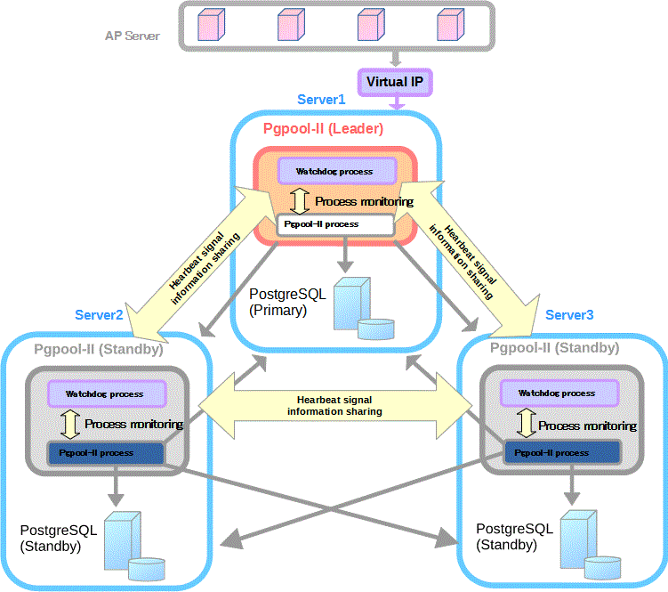

# 第8章 配置示例

[TOC]

## 8.1. 基本配置示例

### 8.1.1. 开始吧！

首先，在使用复制之前，我们必须学习如何安装和配置Pgpool-II和数据库节点。

#### 8.1.1.1. 安装Pgpool-II

安装Pgpool-II非常简单。在提取源tar ball的目录中，执行以下命令。

```shell
$ ./configure
$ make
$ make install
```

configure脚本收集您的系统信息并将其用于编译过程。您可以传递命令行参数来配置脚本以更改默认行为，例如安装目录。默认情况下，Pgpool-II将安装到/usr/local目录。

make命令编译源代码，make install将安装可执行文件。您必须具有安装目录的写入权限。在本教程中，我们将在默认的/usr/local目录中安装Pgpool-II。

> [!CAUTION]
> 注意：Pgpool-II需要PostgreSQL 7.4或更高版本（版本3协议）中的libpq库。

如果配置脚本显示以下错误消息，则libpq库可能未安装，或者它不是版本3

```shell
configure: error: libpq is not installed or libpq is old
```

如果库是版本3，但仍显示上述消息，则配置脚本可能无法识别您的libpq库。configure脚本在/usr/local/pgsql下搜索libpq库。如果您将PostgreSQL安装在/usr/local/pgsql以外的目录中，请在执行configure时使用--with-pgsql，或--with-pgsql-includedir和--with-p2sql-libdir命令行选项。

#### 8.1.1.2. 配置文件

Pgpool-II配置参数保存在Pgpool.conf文件中。文件采用“parameter=value”每行格式。安装Pgpool-II时，会自动创建Pgpool.conf.sample。我们建议将其复制并重命名为pgpool.conf，然后根据需要进行编辑。

```shell
$ cp /usr/local/etc/pgpool.conf.sample /usr/local/etc/pgpool.conf
```

默认情况下，Pgpool-II只接受使用端口9999的本地主机连接。如果您希望接收来自其他主机的连接，请将listen_addresses设置为“*”。

```shell
listen_addresses = 'localhost'
port = 9999
```

在本教程中，我们将使用默认参数。

#### 8.1.1.3. 配置PCP命令

Pgpool-II有一个用于管理目的的接口，可以通过网络检索数据库节点上的信息、关闭Pgpool-II等。要使用PCP命令，需要用户身份验证。这种身份验证不同于PostgreSQL的用户身份验证。需要在pcp.conf文件中定义用户名和密码。在该文件中，用户名和密码在每一行上成对列出，并用冒号（：）分隔。密码以md5哈希格式加密。

```shell
postgres:e8a48653851e28c69d0506508fb27fc5
```

安装Pgpool-II时，会自动创建pcp.conf.sample。我们建议将其复制并重命名为pcp.conf，然后进行编辑。

```shell
$ cp /usr/local/etc/pcp.conf.sample /usr/local/etc/pcp.conf
```

要将密码加密为md5哈希格式，请使用pg_md5命令，该命令作为Pgpool-II的可执行文件之一安装。pg_md5将文本作为命令行参数，并显示其md5哈希文本。例如，将“postgres”作为命令行参数，pg_md5在其标准输出上显示md5哈希文本。

```shell
$ /usr/local/bin/pg_md5 postgres
e8a48653851e28c69d0506508fb27fc5
```

PCP命令是通过网络执行的，因此必须在pgpool.conf文件中使用PCP_port参数配置端口号。在本教程中，我们将使用pcp_port的默认值9898。

```shell
pcp_port = 9898
```

#### 8.1.1.4. 准备数据库节点

现在，我们需要为Pgpool-II设置后端PostgreSQL服务器。这些服务器可以放置在与Pgpool-II相同的主机中，也可以放置在单独的机器上。如果决定将服务器放置在同一台主机上，则必须为每台服务器分配不同的端口号。如果服务器放置在单独的机器上，则必须正确配置，以便它们可以接受来自Pgpool-II的网络连接。在这个例子中，我们创建了3个PostgreSQL服务器，并在以下参数中指定PostgreSQL信息。

```shell
backend_hostname0 = 'localhost'
backend_port0 = 5432
backend_weight0 = 1
backend_hostname1 = 'localhost'
backend_port1 = 5433
backend_weight1 = 1
backend_hostname2 = 'localhost'
backend_port2 = 5434
backend_weight2 = 1
```

对于backend_hostname、backend_port、backend_weight，设置节点的主机名、端口号和负载平衡比率。在每个参数字符串的末尾，必须通过添加以0开头的正整数（即0、1、2……）来指定节点ID。

> [!CAUTION]
> 注意：所有节点的backend_weight参数都设置为1，这意味着SELECT查询在三个服务器之间平均分布。

#### 8.1.1.5. 启动/停止Pgpool II

要启动Pgpool-II，请在终端上执行以下命令。

```shell
$ pgpool
```

然而，上述命令不会打印日志消息，因为Pgpool-II会分离终端。如果你想显示Pgpool-II日志消息，你可以将-n选项传递给Pgpool命令，这样Pgpool-II就会作为非守护进程执行，终端也不会被分离。

```shell
$ pgpool -n &
```

日志消息打印在终端上，因此建议使用以下选项。

```shell
$ pgpool -n -d > /tmp/pgpool.log 2>&1 &
```

-d选项允许生成调试消息。上述命令不断将日志消息附加到/tmp/pgpool.log。如果需要旋转日志文件，请将日志传递给具有日志旋转功能的外部命令。例如，您可以使用Apache2中的rotatelog：

```shell
$ pgpool -n 2>&1 | /usr/local/apache2/bin/rotatelogs \
-l -f /var/log/pgpool/pgpool.log.%A 86400 &
```

这将生成一个名为“pgpool.log.Thursday”的日志文件，然后将其旋转到午夜00:00。Rotatelogs会将日志添加到已存在的文件中。要在轮换之前删除旧日志文件，可以使用cron：

```shell
55 23 * * * /usr/bin/find /var/log/pgpool -type f -mtime +5 -exec /bin/rm -f '{}' \;
```

请注意，在某些发行版中，rotatelog可能以/usr/sbin/rotatelogs2的形式存在-f选项在rotatelog启动后立即生成日志文件，在apache2.2.9或更高版本中可用。也可以使用cronolog。

```shell
$ pgpool -n 2>&1 | /usr/sbin/cronolog \
--hardlink=/var/log/pgsql/pgpool.log \
'/var/log/pgsql/%Y-%m-%d-pgpool.log' &
```

要停止Pgpool-II，请执行以下命令。

```shell
$ pgpool stop
```

如果任何客户端仍然连接，Pgpool-II会等待它断开连接，然后自行终止。如果要强制关闭Pgpool-II，请运行以下命令。

```shell
$ pgpool -m fast stop
```

### 8.1.2. 您的首次复制

复制（请参阅本机复制模式）允许将相同的数据复制到多个数据库节点。在本节中，我们将使用我们在第8.1.1节中已经设置的三个数据库节点，并逐步引导您创建数据库复制系统。待复制的样本数据将由pgbench基准测试程序生成。

#### 8.1.2.1. 配置复制

要启用数据库复制功能，请在pgpool.conf文件中将本机复制模式设置为打开。

```shell
replication_mode = true
```

当本机复制模式打开时，Pgpool-II将向所有数据库节点发送接收到的查询的副本。此外，当load_balance_mode设置为true时，Pgpool-II将在数据库节点之间分发SELECT查询。

```shell
load_balance_mode = true
```

在本节中，我们将启用本机复制模式和load_balance_mode。

#### 8.1.2.2. 正在检查复制

为了在pgpool.conf中反映上述更改，必须重新启动pgpool-II。请参阅第8.1.1.5节“启动/停止Pgpool II”。配置pgpool.conf并重新启动pgpool-II后，让我们尝试实际的复制，看看一切是否正常。首先，我们需要创建一个要复制的数据库。我们将其命名为“bench_replication”。需要在所有节点上创建此数据库。通过Pgpool-II使用createdb命令，数据库将在所有节点上创建。

```shell
$ createdb -p 9999 bench_replication
```

然后，我们将使用-i选项执行pgbench-i选项使用预定义的表和数据初始化数据库。

```shell
$ pgbench -i -p 9999 bench_replication
```

下表是表和数据的摘要，将由pgbench-i创建。如果在所有节点上创建了列出的表和数据，则复制工作正常。

表8-1 数据摘要

| Table Name       | Number of Rows |
| ---------------- | -------------- |
| pgbench_branches | 1              |
| pgbench_tellers  | 10             |
| pgbench_accounts | 100000         |
| pgbench_history  | 0              |

让我们使用一个简单的shell脚本在所有节点上检查上述内容。以下脚本将显示所有节点（5432、5433、5434）上pgbench_branches、pgbench_teller、pgbench _accounts和pgbench_history表中的行数。

```shell
$ for port in 5432 5433 5434; do
>     echo $port
>     for table_name in pgbench_branches pgbench_tellers pgbench_accounts pgbench_history; do
>         echo $table_name
>         psql -c "SELECT count(*) FROM $table_name" -p $port bench_replication
>     done
> done
```

## 8.2. Pgpool II+监视器设置示例

本节显示了使用Pgpool-II进行流式复制配置的示例。在这个例子中，我们使用3台Pgpool-II服务器来管理PostgreSQL服务器，以创建一个强大的集群系统，避免单点故障或分裂大脑。

本配置示例中使用PostgreSQL 16。所有脚本都已经用PostgreSQL 10和更高版本进行了测试。

### 8.2.1. 要求

我们假设所有Pgpool-II服务器和PostgreSQL服务器都在同一个子网中。

### 8.2.2. 集群系统配置

我们使用安装了Rocky Linux 8的三台服务器，这三台服务器的主机名分别是server1、server2和server3。我们在每台服务器上安装PostgreSQL和Pgpool-II。

图8-1 集群系统配置



> [!CAUTION]
> 注意：Leader、Standby、Primary、Standby的角色不是固定的，可能会因进一步的操作而改变。

表8-2 主机名和IP地址

| Hostname | IP Address     | Virtual IP     |
| -------- | -------------- | -------------- |
| server1  | 192.168.100.51 | 192.168.100.50 |
| server2  | 192.168.100.52 | 192.168.100.50 |
| server3  | 192.168.100.53 | 192.168.100.50 |

表8-3 PostgreSQL版本和配置

| Item                   | Value                  | Detail                                                       |
| ---------------------- | ---------------------- | ------------------------------------------------------------ |
| PostgreSQL Version     | 16.0                   | -                                                            |
| port                   | 5432                   | -                                                            |
| $PGDATA                | /var/lib/pgsql/16/data | -                                                            |
| Archive mode           | on                     | /var/lib/pgsql/archivedir                                    |
| Replication Slots      | Enabled                | 在此配置示例中，复制槽在故障转移或在线恢复期间执行的脚本中自动创建或删除。这些脚本使用backend_hostnameX中指定的主机名作为复制插槽名称。见[表8-5]以获取有关脚本的更多信息。 |
| Async/Sync Replication | Async                  | -                                                            |

表8-4 Pgpool-II版本和配置

| Item                   | Value                                              | Detail                                                       |
| ---------------------- | -------------------------------------------------- | ------------------------------------------------------------ |
| Pgpool-II Version      | 4.5.0                                              | -                                                            |
| port                   | 9999                                               | Pgpool-II accepts connections                                |
| 9898                   | PCP process accepts connections                    |                                                              |
| 9000                   | watchdog accepts connections                       |                                                              |
| 9694                   | UDP port for receiving Watchdog's heartbeat signal |                                                              |
| Config file            | /etc/pgpool-II/pgpool.conf                         | Pgpool-II config file                                        |
| User running Pgpool-II | postgres (Pgpool-II 4.1 or later)                  | Pgpool-II 4.0 or before, the default user running Pgpool-II is root |
| Running mode           | streaming replication mode                         | -                                                            |
| Watchdog               | on                                                 | Life check method: heartbeat                                 |

表8-5 rpm包中包含各种示例脚本

| Feature         | Script                                                   | Detail                                                       |
| --------------- | -------------------------------------------------------- | ------------------------------------------------------------ |
| Failover        | /etc/pgpool-II/sample_scripts/failover.sh.sample         | Run by [failover_command](https://www.pgpool.net/docs/latest/en/html/runtime-config-failover.html#GUC-FAILOVER-COMMAND) to perform failover |
| Failover        | /etc/pgpool-II/sample_scripts/follow_primary.sh.sample   | Run by [follow_primary_command](https://www.pgpool.net/docs/latest/en/html/runtime-config-failover.html#GUC-FOLLOW-PRIMARY-COMMAND) to synchronize the Standby with the new Primary after failover. |
| Online recovery | /etc/pgpool-II/sample_scripts/recovery_1st_stage.sample  | Run by [recovery_1st_stage_command](https://www.pgpool.net/docs/latest/en/html/runtime-online-recovery.html#GUC-RECOVERY-1ST-STAGE-COMMAND) to recovery a Standby node |
| Online recovery | /etc/pgpool-II/sample_scripts/pgpool_remote_start.sample | Run after [recovery_1st_stage_command](https://www.pgpool.net/docs/latest/en/html/runtime-online-recovery.html#GUC-RECOVERY-1ST-STAGE-COMMAND) to start the Standby node |
| Watchdog        | /etc/pgpool-II/sample_scripts/escalation.sh.sample       | Optional Configuration. Run by [wd_escalation_command](https://www.pgpool.net/docs/latest/en/html/runtime-watchdog-config.html#GUC-WD-ESCALATION-COMMAND) to switch the Leader/Standby Pgpool-II safely |

上述脚本包含在RPM包中，可以根据需要进行自定义。

### 8.2.3. 安装

在这个例子中，我们使用YUM安装Pgpool-II和PostgreSQL RPM包。

从PostgreSQL YUM存储库安装PostgreSQL。

```shell
[all servers]# dnf install -y https://download.postgresql.org/pub/repos/yum/reporpms/EL-8-x86_64/pgdg-redhat-repo-latest.noarch.rpm
[all servers]# dnf -qy module disable postgresql
[all servers]# dnf install -y postgresql16-server
```

由于PostgreSQL YUM存储库中也包含了与Pgpool-II相关的包，请将“排除”设置添加到/etc/YUM.repos.d/pgdg-redhat-all.repo中，这样Pgpool-II就不会从PostgreSQL YUM仓库安装。

```shell
[all servers]# vi /etc/yum.repos.d/pgdg-redhat-all.repo
```

以下是/etc/yum.repos.d/pgdg-redhat-all.repo的设置示例。

```shell
[pgdg-common]
...
exclude=pgpool*

[pgdg16]
...
exclude=pgpool*

[pgdg15]
...
exclude=pgpool*

[pgdg14]
...
exclude=pgpool*

[pgdg13]
...
exclude=pgpool*

[pgdg12]
...
exclude=pgpool*

[pgdg11]
...
exclude=pgpool*
```

Install Pgpool-II from Pgpool-II YUM repository.

```shell
[all servers]# dnf install -y https://www.pgpool.net/yum/rpms/4.5/redhat/rhel-8-x86_64/pgpool-II-release-4.5-1.noarch.rpm
[all servers]# dnf install -y pgpool-II-pg16-*
```

### 8.2.4. 开始前

在开始配置过程之前，请检查以下先决条件。

#### 8.2.4.1. 在主服务器上设置流式复制

在主服务器上设置PostgreSQL流式复制。在这个例子中，我们使用WAL归档。

首先，我们创建目录/var/lib/pgsql/archivedir，以在所有服务器上存储WAL段。在此示例中，只有主节点在本地存档WAL。

```shell
[all servers]# su - postgres
[all servers]$ mkdir /var/lib/pgsql/archivedir
```

Initialize PostgreSQL on the primary server.

```shell
[server1]# su - postgres
[server1]$ /usr/pgsql-16/bin/initdb -D $PGDATA
```

然后，我们按如下方式编辑服务器1（主）上的配置文件$PGDATA/postgresql.conf。启用wal_log_hints以使用pg_rewind。由于主服务器稍后可能会变为备用服务器，我们将hot_Standby设置为on。

```shell
listen_addresses = '*'
archive_mode = on
archive_command = 'cp "%p" "/var/lib/pgsql/archivedir/%f"'
max_wal_senders = 10
max_replication_slots = 10
wal_level = replica
hot_standby = on
wal_log_hints = on
```

Start PostgreSQL primary server on `server1`.

```shell
[server1]# su - postgres
[server1]$ /usr/pgsql-16/bin/pg_ctl start -D $PGDATA
```

#### 8.2.4.2. 在待机状态下设置流式复制

有多种方法可以设置备用服务器，例如：

- 使用pg_basebackup从备用备份主数据目录。

- 使用Pgpool-II的在线恢复功能（第5.11节）自动设置备用服务器。


在这个例子中，我们使用Pgpool-II的在线恢复在Pgpool-II配置完成后，在第8.2.8.2节中设置备用服务器。

#### 8.2.4.3. 设置PostgreSQL用户

PostgreSQL用户需要使用Pgpool-II的健康检查和复制延迟检查功能。出于安全原因，我们创建了一个名为pgpool的专用用户，用于流式复制延迟检查和健康检查。并创建一个名为repl的专用用户进行复制。因为在线恢复功能需要超级用户权限，所以我们在这里使用postgres用户。

自Pgpool-II 4.0以来，支持scram-sha-256身份验证。此配置示例使用scram-sha-256身份验证方法。首先，设置password_encryption='scram-sha-256'，然后创建用户。

表8-6 用户

| User Name | Password | Detail                                                       |
| --------- | -------- | ------------------------------------------------------------ |
| repl      | repl     | PostgreSQL replication user                                  |
| pgpool    | pgpool   | Pgpool-II health check ([health_check_user](https://www.pgpool.net/docs/latest/en/html/runtime-config-health-check.html#GUC-HEALTH-CHECK-USER)) and replication delay check ([sr_check_user](https://www.pgpool.net/docs/latest/en/html/runtime-streaming-replication-check.html#GUC-SR-CHECK-USER)) user |
| postgres  | postgres | User running online recovery                                 |

```shell
[server1]# psql -U postgres -p 5432
postgres=# SET password_encryption = 'scram-sha-256';
postgres=# CREATE ROLE pgpool WITH LOGIN;
postgres=# CREATE ROLE repl WITH REPLICATION LOGIN;
postgres=# \password pgpool
postgres=# \password repl
postgres=# \password postgres
```

要在show POOL NODES命令结果中显示replication_state和replication_sync_state列，角色pgpool需要是PostgreSQL超级用户或pg_monitor组中（pgpool II 4.1或更高版本）。将pg_monitor授予pgpool：

```shell
GRANT pg_monitor TO pgpool;
```

> [!CAUTION]
> 注意：如果您计划使用detach_false_maprimary（Pgpool-II 4.0或更高版本），角色“pgpool”需要是PostgreSQL超级用户或pg_monitor组中的角色才能使用此功能。

假设所有Pgpool-II服务器和PostgreSQL服务器都在同一个子网中，编辑pg_hba.conf以启用scram-sha-256身份验证方法。

```shell
host    all             pgpool             samenet                 scram-sha-256
host    all             postgres           samenet                 scram-sha-256
host    replication     repl               samenet                 scram-sha-256
```

#### 8.2.4.4. 设置SSH公钥身份验证

要使用Pgpool II的自动故障转移和在线恢复，需要使用postgres用户（默认用户Pgpool II以.Pgpool II 4.0或更早版本运行，默认用户为root）对所有后端服务器配置SSH公钥身份验证（无密码SSH登录）。

在所有服务器上执行以下命令，使用RSA算法生成密钥对。在这个例子中，我们假设生成的密钥文件名是id_rsa_pgpool。

```shell
[all servers]# su - postgres
[all servers]$ mkdir ~/.ssh
[all servers]$ chmod 700 ~/.ssh
[all servers]$ cd ~/.ssh
[all servers]$ ssh-keygen -t rsa -f id_rsa_pgpool
```

然后将公钥id_rsa_pgpool.pub添加到每台服务器上的/var/lib/pgsql/.ssh/authorized_keys文件中。

设置SSH后，确保可以运行ssh postgres@serverX -i ~/.ssh/id_rsa_pgpool命令作为postgres用户登录到每台服务器，无需输入密码。

> [!CAUTION]
> 注意：如果您使用SSH公钥身份验证登录失败，请检查以下内容：

> - 确保/etc/ssh/sshd_config中允许使用公钥身份验证选项PubkeyAuthentication：
> ```shell
> PubkeyAuthentication yes
> ```

> - 如果启用了SELinux，SSH公钥身份验证（无密码SSH）可能会失败。您需要在所有服务器上运行以下命令。

> ```shell
> [all servers]# su - postgres
> [all servers]$ restorecon -Rv ~/.ssh
> ```

#### 8.2.4.5. 创建.pgpass

为了允许repl用户不指定流式复制和在线恢复的密码，并使用postgres执行pg_rewind，我们在postgres-user的主目录中创建.pgpass文件，并将每个PostgreSQL服务器上的权限更改为600。此文件允许repl用户和postgres用户使用，而无需为流式复制和故障转移提供密码。

```shell
[all servers]# su - postgres
[all servers]$ vi /var/lib/pgsql/.pgpass
server1:5432:replication:repl:<repl user password>
server2:5432:replication:repl:<repl user password>
server3:5432:replication:repl:<repl user password>
server1:5432:postgres:postgres:<postgres user password>
server2:5432:postgres:postgres:<postgres user password>
server3:5432:postgres:postgres:<postgres user password>
[all servers]$ chmod 600 /var/lib/pgsql/.pgpass
```

#### 8.2.4.6. 设置防火墙

当连接到Pgpool-II和PostgreSQL服务器时，必须通过启用防火墙管理软件来访问目标端口。以下是Rocky Linux 8/RHEL 8的示例。

```shell
[all servers]# firewall-cmd --permanent --zone=public --add-service=postgresql
[all servers]# firewall-cmd --permanent --zone=public --add-port=9999/tcp --add-port=9898/tcp --add-port=9000/tcp  --add-port=9694/udp
[all servers]# firewall-cmd --reload
```

### 8.2.5. 创建pgpool_node_id

从Pgpool-II 4.2开始，现在所有主机上的所有配置参数都是相同的。如果启用了看门狗功能，为了区分哪个主机是哪个主机，需要一个pgpool_node_id文件。您需要创建一个pgpool_node_id文件，并指定pgpool（看门狗）节点号（例如0、1、2…）来标识pgpool（监视器）主机。

- server1

	```shell
	[server1]# cat /etc/pgpool-II/pgpool_node_id
	0
	```

- server2

	```shell
	[server2]# cat /etc/pgpool-II/pgpool_node_id
	1
	```

- server3

	```shell
	[server3]# cat /etc/pgpool-II/pgpool_node_id
	2
	```

### 8.2.6. PCP连接身份验证

要使用PCP命令，必须在PCP.conf中以“username:encrypted password”的格式声明PCP用户名和md5加密密码。

在这个例子中，我们将PCP用户名设置为“pgpool”，密码设置为“pgpool_password”。使用pg_md5为pgpool用户创建加密密码条目，如下所示：

```shell
[all servers]# echo 'pgpool:'`pg_md5 pgpool_password` >> /etc/pgpool-II/pcp.conf

[all servers]# cat /etc/pgpool-II/pcp.conf
# USERID:MD5PASSWD
pgpool:4aa0cb9673e84b06d4c8a848c80eb5d0
```

### 8.2.7. Pgpool-II配置

使用YUM安装Pgpool-II时，Pgpool-II配置文件pgpool.conf安装在/etc/pgpool-II中。

由于从Pgpool II 4.2开始，所有主机上的所有配置参数都是相同的，因此您可以在任何Pgpool节点上编辑pgpool.conf，并将编辑后的pgpool.conf文件复制到其他pgpool节点。

#### 8.2.7.1. 集群模式

Pgpool-II有几种集群模式。要设置集群模式，可以使用backend_clustering_mode。在此配置示例中，使用流式复制模式。

```shell
backend_clustering_mode = 'streaming_replication'
```

#### 8.2.7.2. 监听地址

要允许Pgpool-II和PCP接受所有传入连接，请将以下参数设置为“*”。

```shell
listen_addresses = '*'
pcp_listen_addresses = '*'
```

#### 8.2.7.3. 港口

指定端口号Pgpool-II侦听。

```shell
port = 9999
```

#### 8.2.7.4. 流复制检查

在sr_check_user和sr_check_password中指定复制延迟检查用户和密码。在这个例子中，我们将sr_check_password留空，并在pool_passwd中创建条目。关于如何在pool_passwd中创建条目，请参阅第8.2.7.9节。从Pgpool-II 4.0开始，如果这些参数为空，Pgpool-II将首先尝试从pool_passwd文件中获取该特定用户的密码，然后再使用空密码。

```shell
sr_check_user = 'pgpool'
sr_check_password = ''
```

#### 8.2.7.5. 健康检查

启用健康检查，以便Pgpool-II执行故障转移。此外，如果网络不稳定，即使后端运行正常，健康检查也会失败，可能会发生故障转移或退化操作。为了防止这种健康检查的错误检测，我们设置health_check_max_retrys=3。以与sr_check_user和sr_check_password相同的方式指定health_check_user和health_check_password。

```shell
health_check_period = 5
health_check_timeout = 30
health_check_user = 'pgpool'
health_check_password = ''
health_check_max_retries = 3
```

#### 8.2.7.6. 后端设置

指定PostgreSQL后端信息。通过在参数名称末尾添加一个数字，可以指定多个后端。

```shell
# - Backend Connection Settings -

backend_hostname0 = 'server1'
backend_port0 = 5432
backend_weight0 = 1
backend_data_directory0 = '/var/lib/pgsql/16/data'
backend_flag0 = 'ALLOW_TO_FAILOVER'

backend_hostname1 = 'server2'
backend_port1 = 5432
backend_weight1 = 1
backend_data_directory1 = '/var/lib/pgsql/16/data'
backend_flag1 = 'ALLOW_TO_FAILOVER'

backend_hostname2 = 'server3'
backend_port2 = 5432
backend_weight2 = 1
backend_data_directory2 = '/var/lib/pgsql/16/data'
backend_flag2 = 'ALLOW_TO_FAILOVER'
```

要在SHOW POOL NODES命令结果中显示replication_state和replication_sync_state列，需要backend_application_name参数。在这里，我们在这些参数中指定每个后端的主机名（Pgpool-II 4.1或更高版本）。确保backend_application_nameX中的值与primary_conninfo的application_name中的值匹配。

```shell
...
backend_application_name0 = 'server1'
...
backend_application_name1 = 'server2'
...
backend_application_name2 = 'server3'
```

#### 8.2.7.7. 故障转移配置

指定在failover_command中发生故障转移时将执行的脚本。当使用三个或更多PostgreSQL服务器时，需要指定follow_primary_command以将备用服务器与新的主服务器同步。如果有两个PostgreSQL服务器，则不需要设置follow_primary_command。

> [!CAUTION]
> 注意：使用Pgpool II 4.3中添加了切换选项的pcp_promate_node执行切换时，如果要自动将前一个主服务器转换为备用服务器，即使有两个PostgreSQL服务器，也需要设置follow_primary_command。

Pgpool-II在执行脚本时用后端特定信息替换以下特殊字符。有关每个字符的更多详细信息，请参阅failover_command和follow_primary_command。

```shell
failover_command = '/etc/pgpool-II/failover.sh %d %h %p %D %m %H %M %P %r %R %N %S'
follow_primary_command = '/etc/pgpool-II/follow_primary.sh %d %h %p %D %m %H %M %P %r %R'
```

> [!CAUTION]
> 注意：在Pgpool II 4.1中添加了%N和%S。请注意，如果使用Pgpool II 4.0或更早版本，则无法指定这些字符。

示例脚本failover.sh和follow_primary.sh安装在/etc/pgpool-II/中。使用这些示例文件创建故障转移脚本。

```shell
[all servers]# cp -p /etc/pgpool-II/sample_scripts/failover.sh.sample /etc/pgpool-II/failover.sh
[all servers]# cp -p /etc/pgpool-II/sample_scripts/follow_primary.sh.sample /etc/pgpool-II/follow_primary.sh
[all servers]# chown postgres:postgres /etc/pgpool-II/{failover.sh,follow_primary.sh}
```

基本上，如果您根据PostgreSQL安装目录更改PGHOME，它应该可以工作。

```shell
[all servers]# vi /etc/pgpool-II/failover.sh
...
PGHOME=/usr/pgsql-16
...

[all servers]# vi /etc/pgpool-II/follow_primary.sh
...
PGHOME=/usr/pgsql-16
...
```

确保在PCP.conf中创建了follow_primary.sh中PCP_user中指定的PCP用户条目。在本例中，我们在第8.2.6节中创建了

```shell
# cat /etc/pgpool-II/follow_primary.sh
...
PCP_USER=pgpool
...
```

由于follow_primary.sh脚本必须在不输入密码的情况下执行PCP命令，因此我们需要在每台服务器上postgres用户的主目录中创建.pcppass（用户Pgpool-II的主目录正在运行）。.pcpass的格式为“hostname:port:username:password”。

在这个例子中，我们假设PCP用户是pgpool，密码是pgpool_password。

```shell
[all servers]# su - postgres
[all servers]$ echo 'localhost:9898:pgpool:pgpool_password' > ~/.pcppass
[all servers]$ chmod 600 ~/.pcppass
```

> [!CAUTION]
> 注意：以下_primary.sh脚本不支持表空间。如果您正在使用表空间，则需要修改脚本以支持表空间。

#### 8.2.7.8. Pgpool II在线恢复配置

接下来，配置执行在线恢复所需的参数。因为PostgreSQL中的超级用户权限是执行在线恢复所必需的，所以我们在recovery_user中指定postgres用户。在这个例子中，我们将recovery_password留空，并在pool_passwd中创建条目。关于如何在pool_passwd中创建条目，请参阅第8.2.7.9节。

```shell
recovery_user = 'postgres'
recovery_password = ''
recovery_1st_stage_command = 'recovery_1st_stage'
```

然后，我们在PostgreSQL主服务器（server1）的数据库集群目录中创建recovery_1st_stage和pgpool_remote_start。

在线恢复recovery_1st_stage和pgpool_remote_start的示例脚本安装在/etc/pgpool-II/中。将这些文件复制到主服务器（server1）的数据目录中。

```shell
[server1]# cp -p /etc/pgpool-II/sample_scripts/recovery_1st_stage.sample /var/lib/pgsql/16/data/recovery_1st_stage
[server1]# cp -p /etc/pgpool-II/sample_scripts/pgpool_remote_start.sample /var/lib/pgsql/16/data/pgpool_remote_start
[server1]# chown postgres:postgres /var/lib/pgsql/16/data/{recovery_1st_stage,pgpool_remote_start}
```

基本上，如果您根据PostgreSQL安装目录更改PGHOME，它应该可以工作。

```shell
[server1]# vi /var/lib/pgsql/16/data/recovery_1st_stage
...
PGHOME=/usr/pgsql-16
...

[server1]# vi /var/lib/pgsql/16/data/pgpool_remote_start
...
PGHOME=/usr/pgsql-16
...
```

为了使用在线恢复功能，需要pgpool_recovery、pgpool_remote_start、pgpool_switch_xlog函数，因此我们需要在PostgreSQL服务器server1的template1上安装pgpool_rerecovery。

```shell
[server1]# su - postgres
[server1]$ psql template1 -c "CREATE EXTENSION pgpool_recovery"
```


> [!CAUTION]
> 注意：recovery_1st_stage脚本不支持表空间。如果您正在使用表空间，则需要修改脚本以支持表空间。

#### 8.2.7.9. 客户端身份验证配置

因为在启动前一节中，我们已经将PostgreSQL身份验证方法设置为scram-sha-256，所以有必要通过Pgpool-II设置客户端身份验证以连接到后端节点。使用RPM安装时，Pgpool-II配置文件pool_hba.conf位于/etc/Pgpool-II中。默认情况下，pool_hba身份验证被禁用，将enable_pool_hba=on设置为启用它。

```shell
enable_pool_hba = on
```

pool_hba.conf文件的格式非常接近PostgreSQL的pg_hba.conf格式。将pgpool和postgres用户的身份验证方法设置为scram-sha-256。在此示例中，假设连接到Pgpool-II的应用程序位于同一子网中。

```shell
host    all         pgpool           samenet          scram-sha-256
host    all         postgres         samenet          scram-sha-256
```

> [!CAUTION]
> 注意：请注意，在Pgpool-II 4.0中，只能在Pgpool.conf中的health_check_password、sr_check_pawsword、wd_lifecheck_passwords、recovery_password中指定AES加密密码或明文密码。

身份验证的默认密码文件名为pool_passwd。要使用scram-sha-256身份验证，需要解密密码的解密密钥。我们在postgres用户的主目录中创建.pgpoolkey文件（用户Pgpool-II以.Pgpool-II 4.0或更早版本运行，默认情况下Pgpool-II作为root运行）

```shell
[all servers]# su - postgres
[all servers]$ echo 'some string' > ~/.pgpoolkey
[all servers]$ chmod 600 ~/.pgpoolkey
```

执行命令pg_enc -m -k /path/to/.pgpoolkey -u username -p，在文件pool_passwd中注册用户名和AES加密密码。如果pool_passwd还不存在，它将在pgpool.conf的同一目录中创建。

```shell
[all servers]# su - postgres
[all servers]$ pg_enc -m -k ~/.pgpoolkey -u pgpool -p
db password: [pgpool user's password]
[all servers]$ pg_enc -m -k ~/.pgpoolkey -u postgres -p
db password: [postgres user's password]

# cat /etc/pgpool-II/pool_passwd
pgpool:AESheq2ZMZjynddMWk5sKP/Rw==
postgres:AESHs/pWL5rtXy2IwuzroHfqg==
```

#### 8.2.7.10. 监视器配置

在服务器1、服务器2、服务器3上启用监视器功能。

```shell
use_watchdog = on
```

将虚拟IP地址设置为delegate_IP。确保IP地址尚未使用。

```shell
delegate_ip = '192.168.100.50'
```

为了启动/关闭虚拟IP并发送ARP请求，我们设置了if_up_cmd、if_down_cmd和arping_cmd。本例中使用的网络接口是“enp0s8”。由于执行if_up/down_cmd或arping_cmd命令需要root权限，请在这些命令上使用setuid，或允许postgres用户（用户Pgpool-II正在以其身份运行）在没有密码的情况下运行sudo命令。

> [!CAUTION]
> 注意：如果使用RPM安装Pgpool-II，则postgres用户已配置为通过sudo运行ip/arping，无需密码。
> ```shell
> postgres ALL=NOPASSWD: /sbin/ip
> postgres ALL=NOPASSWD: /usr/sbin/arping
> ```

在这里，我们配置以下参数，使用sudo运行if_up/down_cmd或arping_cmd。

```shell
if_up_cmd = '/usr/bin/sudo /sbin/ip addr add $_IP_$/24 dev enp0s8 label enp0s8:0'
if_down_cmd = '/usr/bin/sudo /sbin/ip addr del $_IP_$/24 dev enp0s8'
arping_cmd = '/usr/bin/sudo /usr/sbin/arping -U $_IP_$ -w 1 -I enp0s8'
```

> [!CAUTION]
> 注意：如果在/etc/sudoers中设置了“Defaults requiretty”，请确保运行Pgpool II的用户可以在没有tty的情况下执行If_up_cmd、If_down_cmd和arping_cmd命令。

根据命令路径设置if_cmd_path和arping_path。如果If_up/down_cmd或arping_cmd以“/”开头，则这些参数将被忽略。

```shell
if_cmd_path = '/sbin'
arping_path = '/usr/sbin'
```

指定所有Pgpool-II节点信息以配置监视器。使用第8.2.7.3节中端口中指定的端口号指定pgpool_portX。

```shell
hostname0 = 'server1'
wd_port0 = 9000
pgpool_port0 = 9999

hostname1 = 'server2'
wd_port1 = 9000
pgpool_port1 = 9999

hostname2 = 'server3'
wd_port2 = 9000
pgpool_port2 = 9999
```

配置生命检查方法wd_lifecheck_method和生命检查间隔wd_interval。在这里，我们使用心跳方法来执行看门狗生命检查。

```shell
wd_lifecheck_method = 'heartbeat'
wd_interval = 10
```

指定用于发送和接收心跳信号的所有Pgpool-II节点信息。

```shell
heartbeat_hostname0 = 'server1'
heartbeat_port0 = 9694
heartbeat_device0 = ''
heartbeat_hostname1 = 'server2'
heartbeat_port1 = 9694
heartbeat_device1 = ''
heartbeat_hostname2 = 'server3'
heartbeat_port2 = 9694
heartbeat_device2 = ''
```

如果wd_lifecheck_method设置为heartbeat，请指定检测故障的时间wd_heartbeat_deadtime和发送心跳信号的间隔wd_heartbeat_deadtime。

```shell
wd_heartbeat_keepalive = 2
wd_heartbeat_deadtime = 30
```

此设置是可选的。当看门狗进程异常终止时，新旧活动pgpool节点上的虚拟IP都可能“启动”。为防止这种情况，请配置wd_scalation_command，在新的领导者Pgpool-II节点上启动虚拟IP之前，先关闭其他PgpoolII节点上的虚拟IP。

```shell
wd_escalation_command = '/etc/pgpool-II/escalation.sh'
```

示例脚本escalation.sh安装在/etc/pgpool-II/中。

```shell
[all servers]# cp -p /etc/pgpool-II/sample_scripts/escalation.sh.sample /etc/pgpool-II/escalation.sh
[all servers]# chown postgres:postgres /etc/pgpool-II/escalation.sh
```

基本上，如果您根据环境更改以下变量，它应该会起作用。PGPOOLS是运行Pgpool-II的主机名列表。VIP是设置为delegate_IP的虚拟IP地址。DEVICE是虚拟IP的网络接口。

```shell
[all servers]# vi /etc/pgpool-II/escalation.sh
...
PGPOOLS=(server1 server2 server3)
VIP=192.168.100.50
DEVICE=enp0s8
...
```

> [!CAUTION]
> 注意：如果你有偶数个看门狗节点，你需要打开enable_consensus_with_half_votes参数。

> [!CAUTION]
> 注意：如果use_watchdog=on，请确保在pgpool_node_id文件中指定了pgpool节点号。详见第8.2.5节。

#### 8.2.7.11. 日志

自Pgpool-II 4.2以来，日志收集器进程已经实现。在这个例子中，我们启用了日志收集器。

```shell
log_destination = 'stderr'
logging_collector = on
log_directory = '/var/log/pgpool_log'
log_filename = 'pgpool-%a.log'
log_truncate_on_rotation = on
log_rotation_age = 1d
log_rotation_size = 10MB
```

在所有服务器上创建日志目录。

```shell
[all servers]# mkdir /var/log/pgpool_log/
[all servers]# chown postgres:postgres /var/log/pgpool_log/
```

服务器1上的pgpool.conf配置已完成。将pgpool.conf复制到其他pgpool-II节点（服务器2和服务器3）。

```shell
[server1]# scp -p /etc/pgpool-II/pgpool.conf root@server2:/etc/pgpool-II/pgpool.conf
[server1]# scp -p /etc/pgpool-II/pgpool.conf root@server3:/etc/pgpool-II/pgpool.conf
```

### 8.2.8. 如何使用

让我们开始使用Pgpool-II。

#### 8.2.8.1. 启动/停止Pgpool II

- 启动Pgpool II

	首先，让我们开始Pgpool II。

	在启动Pgpool-II之前，PostgreSQL主服务器必须已经在运行。如果PostgreSQL主服务器没有运行，请先使用以下命令启动它。

	```shell
	[server1]# su - postgres
	[server1]$ /usr/pgsql-16/bin/pg_ctl start -D $PGDATA
	```

	使用以下命令在服务器1、服务器2、服务器3上启动Pgpool-II。

	```shell
	[all servers]# systemctl start pgpool.service
	```

- 停止Pgpool II

	停止PostgreSQL时，必须先停止Pgpool-II。

	```shell
	[all servers]# systemctl stop pgpool.service
	```

#### 8.2.8.2. 设置PostgreSQL备用服务器

首先，我们应该使用Pgpool-II在线恢复功能设置PostgreSQL备用服务器。

通过虚拟IP连接到Pgpool-II以检查后端节点的状态。如结果所示，主服务器在服务器1上运行，服务器2和服务器3上的备用服务器处于“关闭”状态。

```shell
[any server]# psql -h 192.168.100.50 -p 9999 -U pgpool postgres -c "show pool_nodes"
Password for user pgpool: 
 node_id | hostname | port | status | pg_status | lb_weight |  role   | pg_role | select_cnt | load_balance_node | replication_delay | replication_state | replication_sync_state | last_status_change  
---------+----------+------+--------+-----------+-----------+---------+---------+------------+-------------------+-------------------+-------------------+------------------------+---------------------
 0       | server1  | 5432 | up     | up        | 0.333333  | primary | primary | 0          | true              | 0                 |                   |                        | 2023-11-10 15:30:14
 1       | server2  | 5432 | down   | down      | 0.333333  | standby | unknown | 0          | false             | 0                 |                   |                        | 2023-11-10 15:30:14
 2       | server3  | 5432 | down   | down      | 0.333333  | standby | unknown | 0          | false             | 0                 |                   |                        | 2023-11-10 15:30:14
(3 rows)
```

在运行pcp_recovery_node命令之前，请确保PostgreSQL主服务器（server1）的数据目录中存在recovery_1st_stage和pgpool_remote_start脚本。

```shell
[any server]# pcp_recovery_node -h 192.168.100.50 -p 9898 -U pgpool -n 1 -W
Password:
pcp_recovery_node -- Command Successful

[any server]# pcp_recovery_node -h 192.168.100.50 -p 9898 -U pgpool -n 2 -W
Password:
pcp_recovery_node -- Command Successful
```

执行pcp_recovery_node命令后，验证PostgreSQL备用服务器是否正在服务器2和服务器3上运行。

```shell
[any server]# psql -h 192.168.100.50 -p 9999 -U pgpool postgres -c "show pool_nodes"
Password for user pgpool
 node_id | hostname | port | status | pg_status | lb_weight |  role   | pg_role | select_cnt | load_balance_node | replication_delay | replication_state | replication_sync_state | last_status_change
---------+----------+------+--------+-----------+-----------+---------+---------+------------+-------------------+-------------------+-------------------+------------------------+---------------------
 0       | server1  | 5432 | up     | up        | 0.333333  | primary | primary | 0          | false             | 0                 |                   |                        | 2023-11-10 15:30:14
 1       | server2  | 5432 | up     | up        | 0.333333  | standby | standby | 0          | true              | 0                 | streaming         | async                  | 2023-11-10 16:32:33
 2       | server3  | 5432 | up     | up        | 0.333333  | standby | standby | 0          | false             | 0                 | streaming         | async                  | 2023-11-10 16:33:08
(3 rows)
```

#### 8.2.8.3. 切换主/备用监视器

使用pcp_watchdog_info确认监视器状态。首先启动的Pgpool-II服务器作为LEADER运行。

```shell
[any server]# pcp_watchdog_info -h 192.168.100.50 -p 9898 -U pgpool -W
Password:
3 3 YES server1:9999 Linux server1 server1

server1:9999 Linux server1 server1 9999 9000 4 LEADER 0 MEMBER  # The Pgpool-II server started first becomes "LEADER".
server2:9999 Linux server2 server2 9999 9000 7 STANDBY 0 MEMBER # running as STANDBY
server3:9999 Linux server3 server3 9999 9000 7 STANDBY 0 MEMBER # running as STANDBY
```

如果服务器1上的LEADER Pgpool II发生故障，服务器2或服务器3上的备用Pgpool II将成为新的LEADER。

要验证此行为，您可以停止Pgpool-II服务或关闭整个系统。在这里，我们停止Pgpool-II服务。

```shell
[server1]# systemctl stop pgpool.service

[server1]# pcp_watchdog_info -p 9898 -h 192.168.100.50 -U pgpool -W
Password:
3 3 YES server2:9999 Linux server2 server2

server2:9999 Linux server2 server2 9999 9000 4 LEADER 0 MEMBER    # server2 becomes LEADER
server1:9999 Linux server1 server1 9999 9000 10 SHUTDOWN 0 MEMBER # server1 is stopped
server3:9999 Linux server3 server3 9999 9000 7 STANDBY 0 MEMBER   # server3 is running as a STANDBY
```

在服务器1上重新启动已停止的Pgpool-II，并验证其是否以待机模式运行。

```shell
[server1]# systemctl start pgpool.service

[server1]# pcp_watchdog_info -p 9898 -h 192.168.100.50 -U pgpool -W
Password: 
3 3 YES server2:9999 Linux server2 server2

server2:9999 Linux server2 server2 9999 9000 4 LEADER 0 MEMBER
server1:9999 Linux server1 server1 9999 9000 7 STANDBY 0 MEMBER
server3:9999 Linux server3 server3 9999 9000 7 STANDBY 0 MEMBER
```

### 8.2.8.4. 故障转移

首先，使用psql通过虚拟IP连接到PostgreSQL，并验证后端信息。

```shell
# psql -h 192.168.100.50 -p 9999 -U pgpool postgres -c "show pool_nodes"
Password for user pgpool:
 node_id | hostname | port | status | pg_status | lb_weight |  role   | pg_role | select_cnt | load_balance_node | replication_delay | replication_state | replication_sync_state | last_status_change
---------+----------+------+--------+-----------+-----------+---------+---------+------------+-------------------+-------------------+-------------------+------------------------+---------------------
 0       | server1  | 5432 | up     | up        | 0.333333  | primary | primary | 0          | false             | 0                 |                   |                        | 2023-11-10 15:30:14
 1       | server2  | 5432 | up     | up        | 0.333333  | standby | standby | 0          | false             | 0                 | streaming         | async                  | 2023-11-10 16:32:33
 2       | server3  | 5432 | up     | up        | 0.333333  | standby | standby | 0          | true              | 0                 | streaming         | async                  | 2023-11-10 16:33:08
(3 rows)
```

接下来，停止服务器1上的主PostgreSQL服务器，并验证故障转移是否自动执行。

```shell
[server1]$ pg_ctl -D /var/lib/pgsql/16/data -m immediate stop
```

在服务器1上停止PostgreSQL后，会发生故障转移。服务器2上的PostgreSQL成为新的主服务器，服务器3上的备用服务器被配置为新主服务器的备用服务器。

```shell
[any server]# psql -h 192.168.100.50 -p 9999 -U pgpool postgres -c "show pool_nodes"
Password for user pgpool:
 node_id | hostname | port | status | pg_status | lb_weight |  role   | pg_role | select_cnt | load_balance_node | replication_delay | replication_state | replication_sync_state | last_status_change
---------+----------+------+--------+-----------+-----------+---------+---------+------------+-------------------+-------------------+-------------------+------------------------+---------------------
 0       | server1  | 5432 | down   | down      | 0.333333  | standby | unknown | 0          | false             | 0                 |                   |                        | 2023-11-10 17:05:40
 1       | server2  | 5432 | up     | up        | 0.333333  | primary | primary | 0          | false             | 0                 |                   |                        | 2023-11-10 17:05:40
 2       | server3  | 5432 | up     | up        | 0.333333  | standby | standby | 0          | true              | 0                 | streaming         | async                  | 2023-11-10 17:05:51
(3 rows)
```

服务器3正在作为新主服务器2的备用服务器运行。

```shell
[server3]# psql -h server3 -p 5432 -U pgpool postgres -c "select pg_is_in_recovery()"
pg_is_in_recovery 
-------------------
t

[server2]# psql -h server2 -p 5432 -U pgpool postgres -c "select pg_is_in_recovery()"
pg_is_in_recovery 
-------------------
f

[server2]# psql -h server2 -p 5432 -U pgpool postgres -c "select * from pg_stat_replication" -x
-[ RECORD 1 ]----+------------------------------
pid              | 7198
usesysid         | 16385
usename          | repl
application_name | server3
client_addr      | 192.168.100.53
client_hostname  |
client_port      | 40916
backend_start    | 2023-11-10 17:10:03.067241+00
backend_xmin     |
state            | streaming
sent_lsn         | 0/12000260
write_lsn        | 0/12000260
flush_lsn        | 0/12000260
replay_lsn       | 0/12000260
write_lag        |
flush_lag        |
replay_lag       |
sync_priority    | 0
sync_state       | async
reply_time       | 2023-11-10 17:17:23.886477+00
```

#### 8.2.8.5. 在线恢复

在这里，我们使用Pgpool-II在线恢复功能将服务器1上的前主服务器还原为备用服务器。

```shell
[any server]# pcp_recovery_node -h 192.168.100.50 -p 9898 -U pgpool -n 0 -W
Password: 
pcp_recovery_node -- Command Successful
```

然后验证服务器1上的PostgreSQL是否作为备用运行。

```shell
[any server]# psql -h 192.168.100.50 -p 9999 -U pgpool postgres -c "show pool_nodes"
Password for user pgpool:
node_id | hostname | port | status | lb_weight |  role   | select_cnt | load_balance_node | replication_delay | replication_state | replication_sync_state | last_status_change  
---------+----------+------+--------+-----------+-----------+---------+---------+------------+-------------------+-------------------+-------------------+------------------------+---------------------
 0       | server1  | 5432 | up     | up        | 0.333333  | standby | standby | 0          | true              | 0                 | streaming         | async                  | 2023-11-10 17:22:03
 1       | server2  | 5432 | up     | up        | 0.333333  | primary | primary | 0          | false             | 0                 |                   |                        | 2023-11-10 17:05:40
 2       | server3  | 5432 | up     | up        | 0.333333  | standby | standby | 0          | false             | 0                 | streaming         | async                  | 2023-11-10 17:05:51
(3 rows)
```

## 8.3. 复制模式和快照隔离模式配置示例

本节显示了如何配置Pgpool-II复制模式和快照隔离模式的示例。

在第8.2节描述的流式复制模式下，复制由PostgreSQL的流式副本功能执行。然而，在本机复制模式下，Pgpool-II通过将写查询路由到所有PostgreSQL服务器来执行复制。

快照隔离模式类似于本机复制模式，除了它增加了节点之间的可见性一致性。

PostgreSQL 14在这个配置示例中使用。所有脚本都已经用PostgreSQL 10和更高版本进行了测试。

### 8.3.1. 集群结构

在这个例子中，我们使用一个Pgpool-II和三个PostgreSQL服务器来描述如何配置和使用Pgpool-II的复制。

在这个例子中，我们使用了3台安装了CentOS 7.9的服务器。让这些服务器为服务器1、服务器2、服务器3。我们在所有服务器上安装PostgreSQL，在服务器1上安装Pgpool-II。

在这个例子中，我们使用最小设置来配置复制。在生产环境中，建议启用监视器以避免单点故障。有关监视器配置的更多详细信息，请参阅第8.2.7.10节。

**Table 8-7. Hostname and IP address**

| Hostname | IP Address      | Virtual IP                  |
| -------- | --------------- | --------------------------- |
| server1  | 192.168.137.101 | PostgreSQL node0, Pgpool-II |
| server2  | 192.168.137.102 | PostgreSQL node1            |
| server3  | 192.168.137.103 | PostgreSQL node2            |

**Table 8-8. PostgreSQL version and Configuration**

| Item               | Value                  | Detail                    |
| ------------------ | ---------------------- | ------------------------- |
| PostgreSQL Version | 14.0                   | -                         |
| port               | 5432                   | -                         |
| $PGDATA            | /var/lib/pgsql/14/data | -                         |
| Archive mode       | on                     | /var/lib/pgsql/archivedir |

**Table 8-9. Pgpool-II version and Configuration**

| Item                 | Value                             | Detail                                                    |
| -------------------- | --------------------------------- | --------------------------------------------------------- |
| Pgpool-II Version    | 4.3.0                             | -                                                         |
| port                 | 9999                              | Pgpool-II accepts connections                             |
| port                 | 9898                              | PCP process accepts connections                           |
| Config file          | /etc/pgpool-II/pgpool.conf        | Pgpool-II config file                                     |
| Pgpool-II start user | postgres (Pgpool-II 4.1 or later) | Pgpool-II 4.0 or before, the default startup user is root |
| Clustering mode      | native replication mode           | -                                                         |
| Clustering mode      | snapshot isolation mode           | -                                                         |

### 8.3.2. 安装

在这个例子中，我们使用YUM安装Pgpool-II和PostgreSQL RPM包。

从PostgreSQL YUM存储库安装PostgreSQL。

```shell
[all servers]# yum install -y https://download.postgresql.org/pub/repos/yum/reporpms/EL-7-x86_64/pgdg-redhat-repo-latest.noarch.rpm
[all servers]# yum install -y postgresql14-server
```

由于PostgreSQL YUM存储库中也包含了与Pgpool-II相关的包，请将“排除”设置添加到/etc/YUM.repos.d/pgdg-redhat-all.repo中，这样Pgpool-II就不会从PostgreSQL YUM仓库安装。

```shell
[all servers]# vi /etc/yum.repos.d/pgdg-redhat-all.repo
```

以下是/etc/yum.repos.d/pgdg-redhat-all.repo的设置示例。

```shell
[pgdg-common]
...
exclude=pgpool*

[pgdg14]
...
exclude=pgpool*

[pgdg13]
...
exclude=pgpool*

[pgdg12]
...
exclude=pgpool*

[pgdg11]
...
exclude=pgpool*

[pgdg10]
...
exclude=pgpool*

[pgdg96]
...
exclude=pgpool*
```

Install Pgpool-II using Pgpool-II YUM repository.

```shell
[all servers]# yum install -y https://www.pgpool.net/yum/rpms/4.4/redhat/rhel-7-x86_64/pgpool-II-release-4.4-1.noarch.rpm
[all servers]# yum install -y pgpool-II-pg14-*
```

### 8.3.3. 开始前

在开始配置过程之前，请检查以下先决条件。

#### 8.3.3.1. 设置postgres用户密码

运行以下命令设置每台服务器上postgres用户的密码。

```shell
[all servers]# passwd postgres
```

#### 8.3.3.2. 配置无密码SSH登录

要使用Pgpool-II的在线恢复，需要设置允许所有服务器使用无密码SSH。在所有服务器上执行以下命令以设置无密码SSH。生成的密钥文件名为id_rsa_pgpool。

```shell
[all servers]# su - postgres
[all servers]$ cd ~/.ssh
[all servers]$ ssh-keygen -t rsa -f id_rsa_pgpool
[all servers]$ ssh-copy-id -i id_rsa_pgpool.pub postgres@server1
[all servers]$ ssh-copy-id -i id_rsa_pgpool.pub postgres@server2
[all servers]$ ssh-copy-id -i id_rsa_pgpool.pub postgres@server3
```

设置SSH后，使用SSHpostgres@serverX-i~/.ssh/id_rsa_pgpool命令，以确保您可以在不输入密码的情况下登录。如有必要，编辑/etc/ssh/sshd_config并重新启动sshd。

#### 8.3.3.3. 创建.pgpass

为了允许repl用户在不指定密码的情况下执行在线恢复脚本，我们在postgres用户的主目录中创建了.pgpass文件，并在每台服务器上将权限更改为600。

```shell
[all servers]# su - postgres
[all servers]$ vi /var/lib/pgsql/.pgpass
server1:5432:replication:repl:<repl user password>
server2:5432:replication:repl:<repl user password>
server3:5432:replication:repl:<repl user password>
server1:5432:postgres:postgres:<postgres user password>
server2:5432:postgres:postgres:<postgres user password>
server3:5432:postgres:postgres:<postgres user password>
[all servers]$ chmod 600 /var/lib/pgsql/.pgpass
```

#### 8.3.3.4. 配置防火墙

当连接到Pgpool-II和PostgreSQL服务器时，必须通过启用防火墙管理软件来访问目标端口。以下是CentOS/RHEL7的示例。

```shell
[all servers]# firewall-cmd --permanent --zone=public --add-service=postgresql
[all servers]# firewall-cmd --permanent --zone=public --add-port=9999/tcp --add-port=9898/tcp
[all servers]# firewall-cmd --reload
```

如果启用了监视器，您还需要打开端口9000和9694。

```shell
[all servers]# firewall-cmd --permanent --zone=public --add-port=9000/tcp  --add-port=9694/udp
```

### 8.3.4. PostgreSQL配置

本节介绍如何创建和配置PostgreSQL服务器。

在这个例子中，我们使用WAL归档。首先，我们创建目录/var/lib/pgsql/archivedir，以在所有服务器上存储WAL段。

```shell
[all servers]# su - postgres
[all servers]$ mkdir /var/lib/pgsql/archivedir
```

在服务器1上只创建一个PostgreSQL服务器。另外两个PostgreSQL服务器是使用第8.3.7.1节中Pgpool-II的在线恢复功能创建的。

运行以下命令在服务器1上创建PostgreSQL数据库集群。

```shell
[server1]# su - postgres
[server1]$ /usr/pgsql-14/bin/initdb -E UTF8 --no-locale
```

然后在服务器1上编辑$PGDATA/postgresql.conf。

```shell
[server1]$ vi $PGDATA/postgresql.conf
listen_addresses = '*'
archive_mode = on
archive_command = 'cp "%p" "/var/lib/pgsql/archivedir/%f"'
```

假设所有Pgpool-II服务器和PostgreSQL服务器都在同一个子网中，编辑pg_hba.conf以启用scram-sha-256身份验证方法。

```shell
[server1]$ vi $PGDATA/pg_hba.conf
host    all             all             samenet                 scram-sha-256
host    replication     all             samenet                 scram-sha-256
```

运行以下命令启动PostgreSQL服务器。

```shell
[server1]$ /usr/pgsql-14/bin/pg_ctl start
```

创建 PostgreSQL 用户.

**Table 8-10. PostgreSQL users**

| 用户名   | 密码     | 说明                                                         |
| -------- | -------- | ------------------------------------------------------------ |
| repl     | repl     | PostgreSQL replication user                                  |
| pgpool   | pgpool   | User performing health check ([health_check_user](https://www.pgpool.net/docs/latest/en/html/runtime-config-health-check.html#GUC-HEALTH-CHECK-USER)) |
| postgres | postgres | User performing online recovery                              |

```shell
[server1]$ psql -U postgres -p 5432
postgres=# SET password_encryption = 'scram-sha-256';
postgres=# CREATE ROLE pgpool WITH LOGIN;
postgres=# CREATE ROLE repl WITH REPLICATION LOGIN;
postgres=# \password pgpool
postgres=# \password repl
postgres=# \password postgres
```

#### 8.3.4.1. 快照隔离模式的设置

快照隔离模式仅在PostgreSQL的事务隔离级别为“可重复读取”时可用。如果要使用快照隔离模式，请在postgresql.conf中设置default_transaction_isolation=“repeatable read”。

```shell
[server1]$ vi $PGDATA/postgresql.conf
default_transaction_isolation = 'repeatable read'
```

### 8.3.5. 配置Pgpool-II

使用RPM安装Pgpool-II时，Pgpool-II配置示例文件位于/etc/Pgpool-II中。

#### 8.3.5.1. 集群模式

首先，在backend_clustering_mode中指定Pgpool-II集群模式。

- Native replication mode

	```shell
	backend_clustering_mode = 'native_replication'
	```

- Snapshot isolation mode

	```shell
	backend_clustering_mode = 'snapshot_isolation'
	```

### 8.3.5.2. listen_addresses

为了允许Pgpool-II接受所有传入连接，我们设置listen_addresses='*'。

```shell
listen_addresses = '*'
```

#### 8.3.5.3. 健康检查

启用健康检查以允许Pgpool-II检测PostgreSQL故障。此外，如果网络不稳定，即使后端运行正常，健康检查也会失败，可能会发生故障转移或退化操作。为了防止这种健康检查的错误检测，我们设置health_check_max_retrys=3。指定health_check_user和health_ccheck_password。在这个例子中，我们将sr_check_password留空，并在pool_passwd中创建条目。关于如何在pool_passwd中创建条目，请参阅第8.3.5.6节。从Pgpool-II 4.0开始，如果这些参数为空，Pgpool-II将首先尝试从pool_passwd文件中获取该特定用户的密码，然后再使用空密码。

```shell
health_check_period = 5
health_check_timeout = 30
health_check_user = 'pgpool'
health_check_password = ''
health_check_max_retries = 3
```

### 8.3.5.4. 后端设置

指定PostgreSQL后端信息。通过在参数名称末尾添加一个数字，可以指定多个后端。

```shell
# - Backend Connection Settings -

backend_hostname0 = 'server1'
backend_port0 = 5432
backend_weight0 = 1
backend_data_directory0 = '/var/lib/pgsql/14/data'
backend_flag0 = 'ALLOW_TO_FAILOVER'

backend_hostname1 = 'server2'
backend_port1 = 5432
backend_weight1 = 1
backend_data_directory1 = '/var/lib/pgsql/14/data'
backend_flag1 = 'ALLOW_TO_FAILOVER'

backend_hostname2 = 'server3'
backend_port2 = 5432
backend_weight2 = 1
backend_data_directory2 = '/var/lib/pgsql/14/data'
backend_flag2 = 'ALLOW_TO_FAILOVER'
```

### 8.3.5.5. 在线恢复

接下来，为了执行在线恢复，我们指定PostgreSQL用户名和在线恢复命令recovery_1st_stage_command和recovery_2nd_stage_comand。因为PostgreSQL中的超级用户权限是执行在线恢复所必需的，所以我们在recovery_user中指定postgres-user。

```shell
recovery_user = 'postgres'
recovery_password = ''

recovery_1st_stage_command = 'recovery_1st_stage'
recovery_2nd_stage_command = 'recovery_2nd_stage'
```

示例脚本replication_mode_recovery_1st_stage.sample、replication_model_recovery_2nd_stage.sample和pgpool_remote_start.sample安装在/etc/pgpool-II/中。从示例脚本中创建联机恢复命令使用的脚本，并将这些文件复制到数据库集群目录。

```shell
[server1]# cp -p /etc/pgpool-II/sample_scripts/replication_mode_recovery_1st_stage.sample /var/lib/pgsql/14/data/recovery_1st_stage
[server1]# cp -p /etc/pgpool-II/sample_scripts/replication_mode_recovery_2nd_stage.sample /var/lib/pgsql/14/data/recovery_2nd_stage
[server1]# cp -p /etc/pgpool-II/sample_scripts/pgpool_remote_start.sample /var/lib/pgsql/14/data/pgpool_remote_start
[server1]# chown postgres:postgres /var/lib/pgsql/14/data/{recovery_1st_stage,recovery_2nd_stage,pgpool_remote_start}
```

基本上，如果您根据PostgreSQL安装目录更改PGHOME，它应该可以工作。

```shell
[server1]# vi /var/lib/pgsql/14/data/recovery_1st_stage
...
PGHOME=/usr/pgsql-14
...

[server1]# vi /var/lib/pgsql/14/data/recovery_2nd_stage
...
PGHOME=/usr/pgsql-14
...

[server1]# vi /var/lib/pgsql/14/data/pgpool_remote_start
...
PGHOME=/usr/pgsql-14
...
```

为了使用在线恢复功能，需要pgpool_recovery、pgpool_remote_start、pgpool_switch_xlog函数，因此我们需要在PostgreSQL服务器server1的template1上安装pgpool_rerecovery。

```shell
[server1]# su - postgres
[server1]$ psql template1 -c "CREATE EXTENSION pgpool_recovery"
```

> [!CAUTION]
> 注意：recovery_1st_stage脚本不支持表空间。如果您正在使用表空间，则需要修改脚本以支持表空间。

#### 8.3.5.6. 客户端身份验证配置

启用客户端和Pgpool-II之间的客户端身份验证。使用RPM安装时，Pgpool-II配置文件pool_hba.conf位于/etc/Pgpool-II中。默认情况下，pool_hba身份验证被禁用，将enable_pool_hba=on设置为启用它。

```shell
enable_pool_hba = on
```

pool_hba.conf文件的格式非常接近PostgreSQL的pg_hba.conf格式。将pgpool和postgres用户的身份验证方法设置为scram-sha-256。

```shell
[server1]# vi /etc/pgpool-II/pool_hba.conf
host    all         pgpool           0.0.0.0/0          scram-sha-256
host    all         postgres         0.0.0.0/0          scram-sha-256
```

> [!CAUTION]
> 注意：请注意，在Pgpool-II 4.0中，只能在Pgpool.conf中的health_check_password、sr_check_pawsword、wd_lifecheck_passwords、recovery_password中指定AES加密密码或明文密码。

身份验证的默认密码文件名为pool_passwd。要使用scram-sha-256身份验证，需要解密密码的解密密钥。我们在Pgpool-II启动用户postgres（Pgpool-II 4.1或更高版本）的主目录中创建.pgpoolkey文件。（Pgpool-II 4.0或更早版本，默认情况下Pgpool-II以root身份启动）

```shell
[server1]# su - postgres
[server1]$ echo 'some string' > ~/.pgpoolkey
[server1]$ chmod 600 ~/.pgpoolkey
```

执行命令pg_enc -m -k/path/to/.pgpoolkey -u username -p，在文件pool_passwd中注册用户名和AES加密密码。如果pool_passwd还不存在，它将在pgpool.conf的同一目录中创建。

```shell
[server1]# su - postgres
[server1]$ pg_enc -m -k ~/.pgpoolkey -u pgpool -p
db password: [pgpool user's password]
[server1]$ pg_enc -m -k ~/.pgpoolkey -u postgres -p
db password: [postgres user's password]

[server1]$ cat /etc/pgpool-II/pool_passwd
pgpool:AESheq2ZMZjynddMWk5sKP/Rw==
postgres:AESHs/pWL5rtXy2IwuzroHfqg==
```

### 8.3.5.7. PCP 密码

由于使用PCP命令需要用户身份验证，我们需要在PCP.conf中以“username:encrypted password”的格式指定用户名和md5加密密码。

我们使用pg_md5为pgpool用户创建加密密码条目，如下所示：

```shell
[server1]# echo 'pgpool:'`pg_md5 PCP password` >> /etc/pgpool-II/pcp.conf
```

### 8.3.5.8. 日志

自Pgpool-II 4.2以来，日志收集器进程已经实现。在这个例子中，我们启用了日志收集器。

```shell
log_destination = 'stderr'
logging_collector = on
log_directory = '/var/log/pgpool_log'
log_filename = 'pgpool-%Y-%m-%d_%H%M%S.log'
log_truncate_on_rotation = on
log_rotation_age = 1d
log_rotation_size = 10MB
```

在服务器1上创建日志目录。

```shell
[server1]# mkdir /var/log/pgpool_log/
[server1]# chown postgres:postgres /var/log/pgpool_log/
```

### 8.3.6. 启动/停止Pgpool II

在启动Pgpool-II之前，请先启动PostgreSQL服务器。此外，在停止PostgreSQL时，必须先停止Pgpool-II。运行以下命令以启动或停止Pgpool-II。

- 启动Pgpool II

	```shell
	# systemctl start pgpool.service
	```

- 停止Pgpool II

	```shell
	# systemctl stop pgpool.service
	```

### 8.3.7. 如何使用

配置完成后，让我们开始使用Pgpool-II。

首先，让我们开始Pgpool II。

```shell
[server1]# systemctl start pgpool.service
```

#### 8.3.7.1. 使用在线恢复创建PostgreSQL服务器

然后，我们使用在线恢复创建PostgreSQL节点1和节点2。确保pcp_recovery_node命令使用的recovery_1st_stage、recovery_2nd_stage和pgpool_remote_start脚本位于服务器1上的数据库群集目录中。

```shell
[server1]# pcp_recovery_node -h server1 -p 9898 -U pgpool -n 1
Password:
pcp_recovery_node -- Command Successful

[server1]# pcp_recovery_node -h server1 -p 9898 -U pgpool -n 2
Password:
pcp_recovery_node -- Command Successful
```

如果pcp_recovery_node已成功运行，请验证PostgreSQL节点0是否作为主节点启动，节点1和节点2是否作为副本启动。

```shell
# psql -h server1 -p 9999 -U pgpool postgres -c "show pool_nodes"
Password for user pgpool:
 node_id | hostname | port | status | pg_status | lb_weight |  role   | pg_role | select_cnt | load_balance_node | replication_delay | replication_state | replication_sync_state | last_status_change
 ---------+----------+------+--------+-----------+-----------+---------+---------+------------+-------------------+-------------------+-------------------+------------------------+---------------------
 0       | server1  | 5432 | up     | up        | 0.333333  | main    | main    | 0          | true              | 0                 |                   |                        | 2021-12-02 16:48:21
 1       | server2  | 5432 | up     | up        | 0.333333  | replica | replica | 0          | false             | 0                 |                   |                        | 2021-12-02 16:48:21
 2       | server3  | 5432 | up     | up        | 0.333333  | replica | replica | 0          | false             | 0                 |                   |                        | 2021-12-02 16:48:21
(3 rows)
```

#### 8.3.7.2. 验证复制

接下来，让我们使用基准测试工具pgbench验证复制功能。

```shell
[server1]# /usr/pgsql-14/bin/createdb test -U postgres -p 9999
[server1]# /usr/pgsql-14/bin/pgbench -h server1 -U postgres -i -p 9999 test
```

要检查复制是否正常工作，请直接连接到每个PostgreSQL服务器，查看它们是否返回相同的结果。

```shell
[server1]# /usr/pgsql-14/bin/psql -h server1 -U postgres -p 5432 test
test=# \d
              List of relations
 Schema |       Name       | Type  |  Owner
--------+------------------+-------+----------
 public | pgbench_accounts | table | postgres
 public | pgbench_branches | table | postgres
 public | pgbench_history  | table | postgres
 public | pgbench_tellers  | table | postgres
(4 rows)

[server1]# /usr/pgsql-14/bin/psql -h server2 -U postgres -p 5432 test
test=# \d
              List of relations
 Schema |       Name       | Type  |  Owner
--------+------------------+-------+----------
 public | pgbench_accounts | table | postgres
 public | pgbench_branches | table | postgres
 public | pgbench_history  | table | postgres
 public | pgbench_tellers  | table | postgres
(4 rows)

[server1]# /usr/pgsql-14/bin/psql -h server3 -U postgres -p 5432 test
test=# \d
              List of relations
 Schema |       Name       | Type  |  Owner
--------+------------------+-------+----------
 public | pgbench_accounts | table | postgres
 public | pgbench_branches | table | postgres
 public | pgbench_history  | table | postgres
 public | pgbench_tellers  | table | postgres
(4 rows)
```

服务器1、服务器2和服务器3返回相同的结果。

接下来，让我们运行pgbench一段时间并检查结果。

```shell
[server1]# /usr/pgsql-14/bin/pgbench -h server1 -U postgres -p 9999 -T 10 test
```

所有PostgreSQL服务器返回相同的结果。

```shell
[server1]# /usr/pgsql-14/bin/psql -h server1 -U postgres -p 5432 test -c "SELECT sum(abalance) FROM pgbench_accounts"
Password for user postgres:
  sum
--------
 -99710
(1 row)

[server1]# /usr/pgsql-14/bin/psql -h server2 -U postgres -p 5432 test -c "SELECT sum(abalance) FROM pgbench_accounts"
Password for user postgres:
  sum
--------
 -99710
(1 row)

[server1]# /usr/pgsql-14/bin/psql -h server3 -U postgres -p 5432 test -c "SELECT sum(abalance) FROM pgbench_accounts"
Password for user postgres:
  sum
--------
 -99710
(1 row)
```

#### 8.3.7.3. PostgreSQL故障

接下来，停止server1上的PostgreSQL主节点，并验证主节点的切换。

```shell
[server1]# su - postgres -c "/usr/pgsql-14/bin/pg_ctl -m i stop"
```

在服务器1上停止PostgreSQL后，发生切换，服务器2上的PostgreSQL成为新的主节点。

```shell
[server1]# psql -h server1 -p 9999 -U pgpool postgres -c "show pool_nodes"
Password for user pgpool:
 node_id | hostname | port | status | pg_status | lb_weight |  role   | pg_role | select_cnt | load_balance_node | replication_delay | replication_state | replication_sync_state | last_status_change
---------+----------+------+--------+-----------+-----------+---------+---------+------------+-------------------+-------------------+-------------------+------------------------+---------------------
 0       | server1  | 5432 | down   | down      | 0.333333  | replica | replica | 0          | false             | 0                 |                   |                        | 2021-12-02 16:57:45
 1       | server2  | 5432 | up     | up        | 0.333333  | main    | main    | 1          | true              | 0                 |                   |                        | 2021-12-02 16:48:21
 2       | server3  | 5432 | up     | up        | 0.333333  | replica | replica | 0          | false             | 0                 |                   |                        | 2021-12-02 16:48:21
(3 rows)
```

#### 8.3.7.4. 在线恢复

在这里，我们使用Pgpool-II在线恢复功能来恢复服务器1上的PostgreSQL节点0。

```shell
# pcp_recovery_node -h server1 -p 9898 -U pgpool -n 0
Password:
pcp_recovery_node -- Command Successful
```

然后验证服务器1是否作为主节点启动。

```shell
# psql -h server1 -p 9999 -U pgpool postgres -c "show pool_nodes"
Password for user pgpool:
 node_id | hostname | port | status | pg_status | lb_weight |  role   | pg_role | select_cnt | load_balance_node | replication_delay | replication_state | replication_sync_state | last_status_change
---------+----------+------+--------+-----------+-----------+---------+---------+------------+-------------------+-------------------+-------------------+------------------------+---------------------
 0       | server1  | 5432 | up     | up        | 0.333333  | main    | main    | 0          | true              | 0                 |                   |                        | 2021-12-02 16:57:45
 1       | server2  | 5432 | up     | up        | 0.333333  | replica | replica | 0          | false             | 0                 |                   |                        | 2021-12-02 16:48:21
 2       | server3  | 5432 | up     | up        | 0.333333  | replica | replica | 0          | false             | 0                 |                   |                        | 2021-12-02 16:48:21
(3 rows)
```

